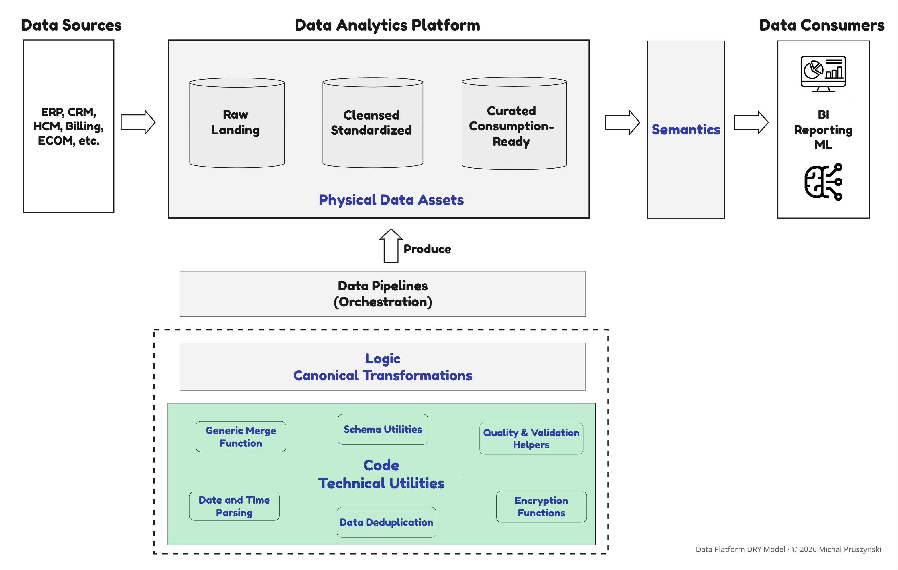
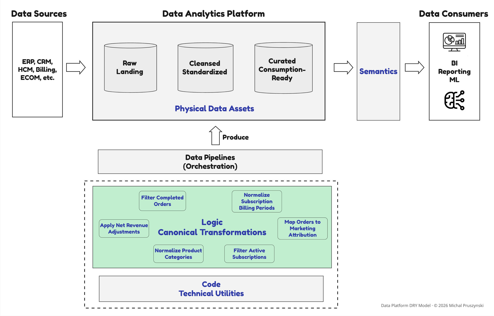
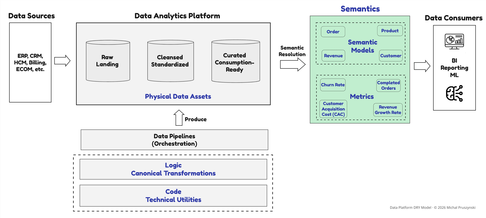

# Code Examples: DRY Layers in Practice

## Order Completion Example Across The DRY Layers

### Consider a simple recurring example determining when an order is "completed." The specific language or framework is irrelevant here. What matters is that at the organizational level, this is how the same concept often gets encoded differently across teams.


#### DRY in Code: Reusable Technical Utilities (Necessary, Not Sufficient)

This addresses the most familiar form of duplication: avoiding copy-pasted boilerplate logic and repeated technical patterns across pipelines and queries.



The following PySpark helper illustrates this technical reuse pattern. All PySpark examples below assume `from pyspark.sql import functions as F`.

**Example in PySpark:**

```python
def with_boolean_flag(df, flag_name, condition):
    return df.withColumn(
        flag_name,
        F.when(condition, F.lit(True)).otherwise(F.lit(False))
    )
```

A function that adds a boolean flag based on a condition is agnostic to whether that flag represents order completion, customer activation, or contract expiration. It encapsulates *how* to build a flag, not *what* the flag means.

This function prevents teams from rewriting `CASE WHEN` expressions across multiple pipelines. It is reusable, testable, and generic. Because it does not define what "completed" means, different teams can invoke it with different predicates. For example, Team A may use `status.isin("shipped", "delivered")`, while Team B may use `status != "cancelled"`.

The code is technically DRY: if enforced, no one is rewriting the flag logic. It improves developer productivity and reduces maintenance surface. It is foundational, but insufficient on its own.

### DRY in Logic: Reusable Canonical Data Transformations

**Where Business Rule Duplication Shrinks**

DRY in Data Transformation Logic moves **one level up** the abstraction stack. This is where reuse starts to affect data correctness and consistency across teams. Instead of reusing generic helpers, it **centralizes business-specific transformations** that define canonical datasets or attributes.

#### DRY in Logic: Centralizing Canonical Rules


In our example, rather than allowing each pipeline to define 'completed order,' the rule is encoded once as a shared transformation. This is essential for building governed data products. 

There are **two common patterns** in data platforms, and both are valid. The key design choice is where to allow flexibility and where to enforce consistency.

- **Attribute-level canonical logic**

In this pattern, the full entity is exposed, and a canonical attribute (e.g., `Order.is_completed`) is defined as part of a shared transformation and attached to the full entity (e.g. `Orders`), enabling downstream composition. Consumers can filter, group, or aggregate using this attribute as needed. The trade-off is that misuse remains possible, for example, consumers may forget to apply the flag when filtering.

This is a simplified snippet to illustrate the pattern.

**Example in PySpark:**

```python
def orders_with_completion_flag(orders_df):
    return with_boolean_flag(
        orders_df,
        flag_name="is_completed",
        condition=F.col("status").isin("shipped", "delivered")
    )
```

- **Dataset-level canonical logic**

In this pattern, the derived dataset itself is exposed, embedding the business rule directly in the transformation. Consumers receive an already filtered dataset, containing only completed orders in our example, trading flexibility for safety. The `is_completed` flag is dropped from the output — it is an internal filtering step, not part of the exposed interface.

**Example in PySpark:**

```python
def completed_orders_df(orders_df):
    return (
        with_boolean_flag(
            orders_df,
            flag_name="is_completed",
            condition=F.col("status").isin("shipped", "delivered")
        )
        .filter(F.col("is_completed"))
        .drop("is_completed")
    )
```

The above patterns establish **a canonical definition**: an order is considered completed when its status is "shipped" or "delivered." If this business rule changes, for example, "returns" should be excluded, the logic is updated in one place, and all downstream consumers automatically inherit the change on the next deployment or refresh cycle.

Even when teams reuse canonical data transformations, misuse remains possible. Consumers may apply additional filters or aggregate differently while still labeling the result "completed orders". As a result, an organization can achieve perfect DRY in Logic (a single reusable `completed_orders` function or view), yet still fail at the organizational level because interpretation remains decentralized. Engineering and logic reuse do not translate into organizational semantic alignment.

The root cause is simple: **neither a function nor a view is a metric**. One team may count rows, another may count distinct orders, and a third may filter on different dates. All reuse the same logic, yet produce different results. This gap leads to the next layer — DRY in Semantics.

### DRY in Semantics: Reusable Governed Meaning

**Where reuse becomes a business concern rather than a technical one.**

Even with perfect DRY in Logic, teams still disagree on numbers. The semantic contract removes this ambiguity: it makes the definition of a metric explicit and governed, so the aggregation function, filter population, grain, and time dimension are declared once and enforced consistently at query time.

#### DRY in Semantics: Enforcing Consistent Meaning of Data


Organizations achieve DRY in Semantics by centralizing interpretation, most commonly through a semantic layer, or alternatively through strongly governed metric definitions embedded in canonical data products.

A semantic layer allows embedding business meaning as governed, discoverable objects, instead of embedding meaning in views or functions:
- **Semantic models** define entities with grain and relationships.
- **Metrics** define canonical KPI logic, including filters, aggregation rules, and time semantics.

In this model, "completed orders" is no longer just a flag or a dataset. It becomes a governed, discoverable semantic object: a metric defined on a specific entity, with rules enforced consistently at query time.

**Conceptual semantic contract (illustrative pseudo-definition):**

```yaml
entity: Order
grain: order_id

attributes:
  is_completed:
    type: boolean
    expr: status IN ('shipped', 'delivered')

metrics:
  completed_orders:
    agg: count_distinct
    expr: order_id
    filter: is_completed = true
```

Consumers no longer write SQL to calculate "completed orders." Instead, they reference the metric by name, and the **semantic engine resolves the logic consistently at runtime** across dashboards, notebooks, and APIs. When the business definition changes, it is updated once in the semantic layer and resolved consistently by the semantic layer on the next refresh or cache invalidation cycle. This is DRY enforcement using interfaces, not only convention or training.

Summing up, the key distinction that needs to be stated again: **a view, a table, or a function is not a metric**. Raw SQL views do not define aggregation rules, time semantics, grain, or allowed filters. **Semantic DRY enforces consistent business meaning across teams and tools**, extending beyond engineering into analytics and decision-making.

A dedicated semantic layer is not the only way to achieve semantic consistency. Some organizations enforce shared meaning through tightly governed data products, for example metric stores that expose controlled metric definitions. The architectural requirement is not a specific implementation, but the existence of a governed interface that enforces consistent data interpretation.

---

For patterns covering artifact registry manifests, CI/CD promotion gates, and behavioral telemetry, see the [DRY reference repository](../dry-reference-repository/README.md) and [templates](../templates/README.md).
