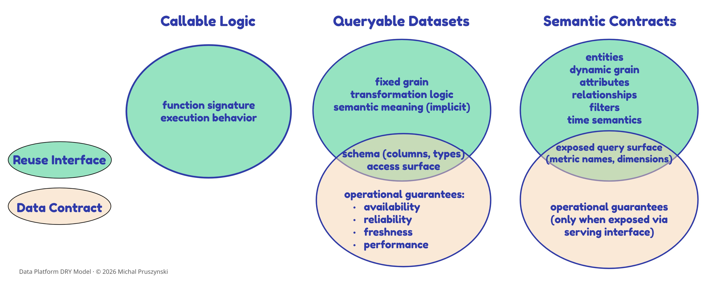

# Platform artifacts and reuse interfaces

The DRY Model identifies three groups of common reusable artifacts that map directly to the three reuse interfaces through which DRY is achieved: callable logic, queryable datasets, and semantic contracts. This document describes the common platform artifacts within each group, summarizes how they map across the three interface types, and covers the key considerations for reuse, governance, and limitations.

## Artifact Descriptions

A short description of each common platform artifact, grouped by artifact type.

<table>
  <thead>
    <tr>
      <th>Artifact Group</th>
      <th>Artifact</th>
      <th>Description</th>
    </tr>
  </thead>
  <tbody>
    <tr>
      <td rowspan="9"><strong>Reusable Logic Artifacts</strong></td>
      <td>Built-in Functions</td>
      <td>Reusable built-in logic provided by the warehouse engine; promotes DRY at the expression level but cannot encapsulate custom business logic. As canonical, immutable primitives they offer the strongest reuse enforceability of any artifact (users cannot redefine or fork behavior) and execute efficiently in native compiled code. Their weaknesses are vendor-specific syntax that limits cross-platform portability, and the fact that they carry no business semantics.</td>
    </tr>
    <tr>
      <td>Scalar SQL UDFs</td>
      <td>Developer-defined scalar functions that centralize repeated SQL expressions, returning scalar results embeddable in SQL clauses. They offer strong reusability, abstraction, and composability within a vendor ecosystem and can be version-controlled through external CI/CD, but portability is weak across dialects and row-wise scalar execution rarely scales for big-data workloads. Reuse is only encouraged, not enforced (nothing prevents parallel overlapping UDFs or in-query re-implementation), business meaning stays hidden in code with limited catalog discoverability, and they cannot produce datasets.</td>
    </tr>
    <tr>
      <td>Scalar External UDFs</td>
      <td>Scalar functions in external languages (Python, JavaScript, Java) that extend SQL with custom logic and accept complex parameter types (arrays, JSON) beyond SQL UDFs. They handle algorithms SQL cannot express, but run in sandboxed, often non-vectorized runtimes that bottleneck on large datasets, have very low portability (typically a full rewrite per vendor), and are harder to test and discover. Their non-transparent execution discourages reuse in favor of re-implementation, and they expose no governed semantics and cannot produce datasets.</td>
    </tr>
    <tr>
      <td>CTEs</td>
      <td>Improve query readability inside one SQL statement; useful locally but cause repetition across queries. Being query-scoped, they cannot accept parameters, be referenced from other queries, be version-controlled as objects, or appear in catalogs and lineage, and they are often re-executed per reference, weakening performance versus views or temp tables. They are query-local by design, so they structurally encourage re-implementation and contribute nothing to shared or governed business meaning.</td>
    </tr>
    <tr>
      <td>Python Functions</td>
      <td>Encapsulate reusable procedural logic for ETL/ELT processes, with excellent generalization (flexible parameterization, composability, modular packages) and the strongest testability of the logic artifacts through mature frameworks like pytest. They are more portable across platforms than SQL-based logic artifacts and version-control cleanly with Git and CI/CD, but native Python is single-threaded and slower than compiled SQL engines, scaling out only via distributed frameworks (PySpark, Dask, Snowpark). Semantics stay buried in code with low cross-team discoverability, and reuse is encouraged but not technically enforced, leaving logic easy to duplicate inline or across scripts.</td>
    </tr>
    <tr>
      <td>PySpark Functions</td>
      <td>Reusable distributed transformation logic built on Apache Spark, with strong reusability, flexible parameterization, and highly composable, lazily evaluated DataFrame pipelines. They abstract distributed computing behind a high-level API and scale horizontally with excellent performance when tuned. Pipelines often mix imperative Python with declarative Spark SQL, making centralized reusable logic harder. Portability is good within the Spark ecosystem (clusters, clouds, and managed platforms like Databricks, EMR, and Synapse) but not seamless beyond it, and integration testing is heavier due to cluster spin-up. Like Python functions, semantic meaning remains buried in code with weak catalog and semantic-tool integration, and reuse is encouraged but not technically enforced.</td>
    </tr>
    <tr>
      <td>SQL Macros (SQL Templating Functions)</td>
      <td>SQL code generation and abstraction layer for reusable SQL templates such as dbt macros, SQLMesh macros, and Jinja templates. They provide strong abstraction and high parameterization with zero execution overhead, since they expand into raw SQL at compile time, and offer good cross-warehouse portability when used to abstract dialect differences. However, they do not appear in lineage graphs, catalogs, or semantic registries, carry no semantic meaning, and enforce reuse only at authoring time because users can still inline equivalent SQL freely.</td>
    </tr>
    <tr>
      <td>Table-Valued SQL UDFs</td>
      <td>SQL table-valued functions that encapsulate parameterized transformation logic and return queryable datasets via the <code>FROM</code> clause, useful for canonical business rules and context-dependent entity definitions; inline TVFs can be optimized like views. They straddle two interfaces (callable logic and queryable dataset), scaling better than scalar UDFs and exposing parameterized datasets to BI, notebooks, and SQL queries, though portability is limited by vendor DDL and return-type differences.</td>
    </tr>
    <tr>
      <td>Table-Valued External UDFs</td>
      <td>Table-valued functions in external languages returning queryable datasets via the <code>FROM</code> clause, enabling complex logic (ML scoring, text processing) beyond SQL with the most flexible parameterization of the UDF types. Batched processing scales better than scalar external UDFs, but sandboxed execution adds overhead, portability is very low (full rewrites per vendor), and the external-language boundary makes them opaque, harder to test, and harder to govern. Their non-transparent execution weakens both reuse enforceability and service exposure, and they encode no governed business semantics.</td>
    </tr>
    <tr>
      <td rowspan="5"><strong>Canonical Dataset Artifacts</strong></td>
      <td>Views</td>
      <td>Encapsulate shared logic into a reusable SQL object; useful for standardization but may hide performance issues and create dependency chains. As named, queryable schema objects they strongly encourage reuse and offer solid service exposure, lifecycle management, and isolated testability, but they cannot accept parameters and are expanded at runtime, so deeply nested views degrade performance and complicate testing. Cross-vendor portability is poor due to SQL-dialect and catalog coupling, and their business semantics remain implicit and weakly governed.</td>
    </tr>
    <tr>
      <td>Materialized Views</td>
      <td>Persist precomputed results for performance reuse; strong for execution efficiency but weak for DRY in logic, testing, and portability. Persisted results accelerate recurring workloads and offer strong service exposure optimized for repeated consumption, with reuse further reinforced by performance incentives, but they cannot be parameterized and add storage cost plus refresh scheduling, dependency handling, and failure monitoring to their lifecycle. Cross-vendor portability is limited by differing refresh and indexing semantics, and any embedded business meaning stays implicit and ungoverned.</td>
    </tr>
    <tr>
      <td>SQL Transformation Models</td>
      <td>Declarative <code>SELECT</code>-based transformation models (e.g., dbt models, SQLMesh models) that define shared canonical datasets. They are first-class modular units with explicit dependency graphs, giving them the strongest lifecycle management and discoverability among dataset artifacts (tied with SQL Dynamic Transformation Models), version-controlled as code with CI/CD, environments, and incremental/partitioned execution that runs fully in the warehouse. Portability is good when macros abstract dialect differences, and named datasets encourage reuse.</td>
    </tr>
    <tr>
      <td>SQL Dynamic Transformation Models</td>
      <td>Execution-time parameterized transformation models that defer context resolution (tenant, time window, environment) to pipeline execution, so one canonical definition generates many context-specific outputs without code duplication. They inherit the modularity, lifecycle, discoverability, and service-exposure strengths of static models while adding runtime parameterization that eliminates tenant- or time-specific forks and enables context-aware testing. Portability is slightly lower than static models because runtime parameter binding introduces framework- and warehouse-specific dependencies, and semantics remain implicit in SQL and orchestration configuration.</td>
    </tr>
    <tr>
      <td>Curated Tables</td>
      <td>Persistent canonical datasets serving as the primary data product surface, with the strongest and most universal service exposure (standard SQL, BI connectors, data sharing, and SQL Execution REST APIs) and first-class catalog discoverability. Physically persisted and engine-optimized (partition pruning, clustering, statistics), they deliver excellent execution efficiency and make reuse the easiest path, but they are not parameterizable and their physical design makes cross-vendor portability costly.</td>
    </tr>
    <tr>
      <td rowspan="4"><strong>Semantic Layer Artifacts</strong></td>
      <td>Headless / Universal Semantic Models</td>
      <td>BI-agnostic semantic models that define canonical entities, relationships, keys, and grain on top of warehouse tables, dynamically generating SQL for entity-level queries (e.g., dbt semantic models, Cube schemas, AtScale virtual semantic layer). They abstract SQL complexity behind business terms and, through constrained query interfaces, make correct reuse the natural path; one of the strongest foundations for organizational semantic alignment, with high discoverability via semantic catalogs and APIs. They are version-controlled as code and largely portable across warehouses, though versioning is code-level rather than semantic-aware and runtime service exposure varies by tool (executable endpoints in Looker/Cube/AtScale vs. metadata-only in dbt).</td>
    </tr>
    <tr>
      <td>Headless / Universal Metrics</td>
      <td>Logical, reusable KPI definitions built on universal semantic models that encode calculations (aggregations, filters, time windows) and are computed on demand. They deliver the highest organizational semantic alignment of any artifact; enforced at execution time through named, runtime-resolvable objects that make re-implementation structurally hard, with strong discoverability and service exposure via APIs and BI connectors. They are portable and version-controlled as code; the main trade-off is on-demand computation cost at large scale unless results are cached or materialized, and versioning is not yet semantic-aware.</td>
    </tr>
    <tr>
      <td>Headless / Universal Metrics Materializations</td>
      <td>Physical warehouse-level materializations of headless metric definitions, persisted as tables or views with managed refresh policies (e.g., Cube pre-aggregations, AtScale aggregates). Purpose-built for performance, they deliver the best execution efficiency in the semantic group through pre-aggregation and pushdown, while their contract validity is inherited: it holds only while the governing definition remains the build origin. Once queried physically outside semantic execution paths they no longer enforce semantic constraints (valid dimensions, grain, metric compatibility), and they add refresh scheduling, backfill, and rebuild-driven portability overhead.</td>
    </tr>
    <tr>
      <td>BI-Embedded Semantic Layer</td>
      <td>Bundles entity/relationship modeling and metric logic into a single BI-tool-native artifact (e.g., Power BI semantic models with DAX measures, Tableau published sources, Qlik master measures). It provides strong abstraction and good semantic alignment within its own platform, encouraging reuse through visual drag-and-drop interfaces, but alignment, discoverability, and reuse all stop at the tool boundary. Portability is low (migration means reimplementing semantics, relationships, and calculations), automated testing is immature and mostly manual, and cross-tool consumption generally forces re-implementation, so multi-BI organizations tend to replicate semantics per tool.</td>
    </tr>
  </tbody>
</table>

## Platform Artifacts Across Reuse Interfaces

#### 18 Common Platform Artifacts* Evaluated Across 3 Interface Types

<table>
  <thead>
    <tr>
      <th>Artifact Group</th>
      <th>Artifact</th>
      <th align="center">Callable Logic</th>
      <th align="center">Queryable Datasets</th>
      <th align="center">Semantic Contracts</th>
    </tr>
  </thead>
  <tbody>
    <tr>
      <td rowspan="7"><strong>Reusable Logic Artifacts</strong></td>
      <td>Built-in Functions</td>
      <td align="center">✅</td>
      <td align="center">❌</td>
      <td align="center">❌</td>
    </tr>
    <tr>
      <td>Scalar UDFs (SQL &amp; External)</td>
      <td align="center">✅</td>
      <td align="center">❌</td>
      <td align="center">❌</td>
    </tr>
    <tr>
      <td>CTEs</td>
      <td align="center">⚠️ <small>Query-local</small></td>
      <td align="center">❌</td>
      <td align="center">❌</td>
    </tr>
    <tr>
      <td>Python and PySpark Functions</td>
      <td align="center">✅</td>
      <td align="center">❌</td>
      <td align="center">❌</td>
    </tr>
    <tr>
      <td>SQL Macros</td>
      <td align="center">✅</td>
      <td align="center">❌</td>
      <td align="center">❌</td>
    </tr>
    <tr>
      <td>Table-Valued UDFs (SQL)</td>
      <td align="center">✅ <small>Relation-returning</small></td>
      <td align="center">✅ <small>Query-time parameterized</small></td>
      <td align="center">⚠️ <small>Anti-pattern</small></td>
    </tr>
    <tr>
      <td>Table-Valued UDFs (External)</td>
      <td align="center">✅ <small>Relation-returning</small></td>
      <td align="center">✅ <small>Query-time parameterized, procedural</small></td>
      <td align="center">⚠️ <small>Anti-pattern</small></td>
    </tr>
    <tr>
      <td rowspan="4"><strong>Canonical Dataset Artifacts</strong></td>
      <td>Views / Materialized Views</td>
      <td align="center">❌</td>
      <td align="center">✅ <small>Static</small></td>
      <td align="center">⚠️ <small>Weak implicit</small></td>
    </tr>
    <tr>
      <td>SQL Transformation Models</td>
      <td align="center">❌</td>
      <td align="center">✅ <small>Static</small></td>
      <td align="center">✅ <small>Implicit</small></td>
    </tr>
    <tr>
      <td>SQL Dynamic Transformation Models</td>
      <td align="center">❌</td>
      <td align="center">✅ <small>Runtime parameterized</small></td>
      <td align="center">✅ <small>Implicit</small></td>
    </tr>
    <tr>
      <td>Curated Tables</td>
      <td align="center">❌</td>
      <td align="center">✅ <small>Static</small></td>
      <td align="center">✅ <small>Implicit</small></td>
    </tr>
    <tr>
      <td rowspan="4"><strong>Semantic Layer Artifacts</strong></td>
      <td>Headless / Universal Semantic Models</td>
      <td align="center">❌</td>
      <td align="center">❌</td>
      <td align="center">✅ <small>Explicit</small></td>
    </tr>
    <tr>
      <td>Headless / Universal Metrics</td>
      <td align="center">❌</td>
      <td align="center">❌</td>
      <td align="center">✅ <small>Explicit</small></td>
    </tr>
    <tr>
      <td>Headless / Universal Metrics Materializations</td>
      <td align="center">❌</td>
      <td align="center">✅</td>
      <td align="center">✅ <small>Derived</small></td>
    </tr>
    <tr>
      <td>BI-Embedded Semantic Layer</td>
      <td align="center">❌</td>
      <td align="center">❌</td>
      <td align="center">⚠️ <small>Vendor-bound</small></td>
    </tr>
  </tbody>
</table>

*Caveat: Execution frameworks and orchestration constructs (such as workflows, DAGs, and stored procedures) and application-level interfaces are intentionally excluded from this comparison, as they do not directly encode or enforce reusable logic or shared definitions.

## 1) Artifacts That Expose Multiple Interfaces

Some artifacts, most notably table-valued UDFs, expose multiple interfaces. They are implemented as callable logic but consumed as datasets through SQL `FROM` clauses, which often leads them to be misused as governed data assets.

Similarly, although semantic models and metrics produce runtime query results, they are evaluated separately from queryable datasets because their primary role is semantic governance, not data access.

## 2) Where Semantic Meaning Lives In Data Platforms

- **Explicit semantic contracts**  
  Headless, platform-level semantic models and metrics, where business meaning is formally defined and enforced at query time.
- **Derived semantic contracts**  
  Metrics materializations - the physical output (table or view) of a governed metric. Their contract validity is inherited, not intrinsic: it holds only while the governed definition remains the build origin. A materialization rebuilt or edited outside that definition degrades to an implicit contract, like any canonical dataset.
- **Implicit semantic contracts (semantic by convention)**  
  Canonical dataset artifacts where meaning is encoded in structure and usage patterns rather than formal contracts.
- **Weak implicit contracts**  
  Views and materialized views that standardize access patterns but provide limited governance capabilities.
- **Anti-pattern: procedural semantic contracts**  
  Table-valued UDFs become an anti-pattern when treated as governed semantic contracts. Although they produce dataset-shaped outputs, they lack the ownership, discoverability, and lifecycle controls required to govern shared business meaning.

## 3) Semantic Contracts Within Canonical Data Products

It is important to distinguish between implicit and explicit semantic contracts within canonical data products.

- In implicit semantic contracts, business meaning is inferred from dataset structure, naming, and usage patterns, without formal definition or enforcement.
- In contrast, some platforms embed explicit, governed metric definitions within canonical data products, for example through standardized KPI tables. While this approach improves consistency compared to purely implicit semantics, it does not provide the same level of enforcement as a semantic layer, as consumers can still reinterpret or bypass the underlying data.

As a result, semantic models and metrics provide one of the strongest structural mechanisms for aligning business definitions across the organization and preventing semantic drift.

## 4) Feature Stores and Machine Learning

Although the Data Platform DRY Model is introduced in the context of analytical workloads, the same three reuse interfaces apply beyond them. In machine learning, feature stores are a concrete implementation: feature logic and definitions are registered once, versioned, and reused across offline training and online serving, helping prevent training-serving skew through the same lifecycle and interface discipline described for analytical platforms.

Feature stores express the same three reuse interfaces in ML-specific form:

| Reuse Interface | Feature Store Component | What It Enforces | Typical Platform Support |
| --- | --- | --- | --- |
| **Callable logic** | Reusable feature functions and transformations | Feature engineering logic is defined once and reused across training and serving paths, preventing reimplementation in multiple pipelines. | Platform-dependent;  Not universal |
| **Queryable datasets** | Offline feature datasets, feature views, and training-set SQL models | Stable query interfaces expose reusable feature datasets whether implemented as materialized datasets, views, or SQL models, preventing teams from rebuilding the same point-in-time logic. | Broad;  The primary reuse interface in most feature stores |
| **Semantic contracts** | Feature catalog and semantic layer (e.g., dbt Semantic Layer, MetricFlow) | The semantic layer defines each feature's entity association, business meaning, and governing rules as a shared versioned definition that feature pipelines consume rather than reimplement, preventing competing interpretations of the same feature across models. | Uncommon;  Typically requires additional tooling beyond the core feature store |

The same lifecycle applies: features move from local experimentation to shared registered definitions to certified interfaces used across production models. Without it, ML platforms reproduce the same failure modes as analytical platforms - duplicated transformation logic, repeated point-in-time dataset construction, and competing definitions of the same feature across models.

Feature definitions and metric definitions are parallel semantic surfaces; aligning them, that is, ensuring that a feature and a metric over the same concept do not encode conflicting meaning, is an additional governance concern that most feature stores do not solve natively.

## 5) Reuse Interfaces and Data Contracts

Data contracts and reuse-interface governance solve different problems on the same interface.

A data contract protects producer-consumer reliability: schema, freshness, availability, and other operational guarantees.

Reuse-interface governance protects reuse consistency: the transformation logic, grain, and business meaning that consumers depend on.

Modern data contract specifications may include semantic descriptors, but in most platforms the enforceable boundary is still interface stability. A schema-compatible change can still break reuse if it changes the meaning of a dataset or metric.

In practice, this means one physical interface can carry two governance lenses: the data contract governs structural and operational guarantees; reuse-interface governance governs transformation logic, grain, and semantic stability.

### Compatibility Model: Reuse Interfaces and Data Contracts

Compatibility in this model is defined at the level of the reuse interface: what aspects of a reusable artifact must remain stable so that downstream reuse remains safe. Both reuse-interface governance and data contract governance often operate on the same surface (particularly for datasets) and require backward compatibility, but they address different concerns.

| Type | Compatibility Surface |
| --- | --- |
| Reuse Interfaces | Define what is exposed for reuse and how artifacts can evolve safely without breaking consumers. |
| Data Contracts | Define guarantees associated with that same interface surface, especially structure and operational reliability. |

### Reuse Interfaces and Data Contracts

Compatibility is defined at the level of the reuse interface, specifying what aspects of an artifact must remain stable:

- For callable logic, compatibility is defined by the stability of the interface signature and behavior, including function name, input parameters, output schema or type, and expected behavior (for example, a SQL UDF, a dbt macro, or a Python function).
- For queryable datasets, compatibility is defined over a shared interface surface that includes schema and the access surface through which the dataset is consumed, such as a table, view, or API endpoint (for example, a curated table, a shared view, or a dataset API endpoint).
- Reuse interfaces extend beyond this surface to include transformation logic, fixed grain, and the intended semantic meaning of the data, ensuring that the dataset remains a stable and reusable dependency over time.
- Data contracts operate on the same exposed surface, governing structural compatibility and operational guarantees. As a result, changes that preserve schema but alter semantics may remain compatible under a data contract, while still breaking reuse and requiring governance under the DRY model.
- For semantic contracts, compatibility is defined over a shared semantic interface, including the exposed query surface through which business definitions are consumed, such as metric names and dimensions (for example, a metric API or a semantic query layer).
- The reuse interface extends to the full semantic model, including entities, relationships, filters, time logic, and grain.
- Data contracts apply when semantic definitions are exposed via a serving interface, governing the interaction surface and operational guarantees, but not the full semantic model.

### Reuse Breaking Change Reference

| Change Type | Breaking? | Rationale |
| --- | :---: | --- |
| Interface identity changed (model, metric or function renamed) | ❌ Breaking | All consumers referencing by name are broken. |
| Metric calculation semantics changed (filter population, time grain, numerator/denominator, or aggregation rules) | ❌ Breaking | Metric values change across historical periods; comparability is broken regardless of interface shape. |
| Entity structure changed (grain, SCD type, or relationship keys) | ❌ Breaking | Row-level semantics change; joins, counts, and point-in-time interpretation may produce different results. |
| Metric, dimension, or entity deprecated or removed | ❌ Breaking | Consumers depending on it by name or schema position break immediately. |
| New dimension added | ⚠️ Non-breaking if additive | Existing queries are unaffected; new slicers are available but not required. |
| Implementation change, interface stable (underlying table renamed, source swapped) | ✅ Non-breaking | The interface contract is preserved; only the implementation detail changes. |
