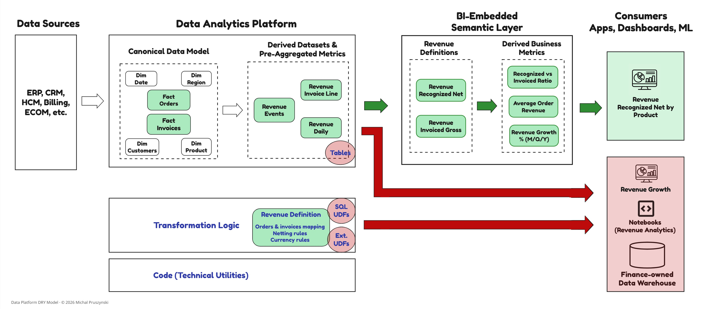

# Operational Maturity Assessment

This model guide turns the M0-M3 maturity definitions into a practical assessment method.

Operational Maturity answers: **does the organization actually achieve reuse in practice?**

## When to use this

Use this assessment when you need to:

- evaluate a current platform or domain against the Data Platform DRY Model
- identify the weakest constraint preventing reuse from propagating
- compare maturity across DRY layers and reuse interfaces
- define target maturity for business-critical assets
- build an investment roadmap for registry, lifecycle, CI/CD, telemetry, or semantic-layer work

## Assessment unit

Assess maturity by **DRY layer and reuse interface**, not as a single platform-wide average.

Each maturity score reflects how the interface is *operated* (the artifact, the surrounding platform capabilities, and the operationalization practice together), not the artifact alone. Where one layer uses multiple interfaces, score them separately. The lowest-maturity interface is usually the binding constraint.

## Maturity levels by quality attribute

No explicit weights are assigned to individual Quality Attributes. Required maturity levels depend on the specific use case. For example, building shared transformation modules across platforms makes Portability a must-have attribute.

Maturity should be assessed at the DRY layer level, using only the Quality Attributes relevant to the interfaces that implement that layer.

This single grid mirrors the whitepaper's maturity-levels table. Maturity levels are defined independently for each Quality Attribute, and each interface type within a layer is assessed separately using only the attributes relevant to it.

<table style="width:100%; table-layout:fixed">
  <colgroup>
    <col style="width:4%"/>
    <col style="width:18%"/>
    <col style="width:24%"/>
    <col style="width:54%"/>
  </colgroup>
  <thead>
    <tr>
      <th width="4%">#</th>
      <th width="18%">Quality Attribute</th>
      <th width="24%">Group / Subgroup</th>
      <th width="54%">Maturity Levels</th>
    </tr>
  </thead>
  <tbody>
    <tr>
      <td align="center">1</td>
      <td><strong>Reusability</strong></td>
      <td rowspan="4" align="center">Engineering Enablement / Reusability Mechanisms</td>
      <td><strong>M0:</strong> No native reuse <strong>M1:</strong> Pattern-based, informal reuse <strong>M2:</strong> Reusable components with explicit references <strong>M3:</strong> First-class reusable constructs</td>
    </tr>
    <tr>
      <td align="center">2</td>
      <td><strong>Abstraction</strong></td>
      <td><strong>M0:</strong> Inline complexity <strong>M1:</strong> Partial abstractions <strong>M2:</strong> Clear interfaces enforced <strong>M3:</strong> Standardized abstraction layers</td>
    </tr>
    <tr>
      <td align="center">3</td>
      <td><strong>Parametrization</strong></td>
      <td><strong>M0:</strong> Hardcoded logic <strong>M1:</strong> Manually supplied parameters <strong>M2:</strong> Validated and constrained configs <strong>M3:</strong> Policy-driven config</td>
    </tr>
    <tr>
      <td align="center">4</td>
      <td><strong>Composability</strong></td>
      <td><strong>M0:</strong> Monolithic logic <strong>M1:</strong> Partial composition <strong>M2:</strong> Modular composition <strong>M3:</strong> Ecosystem of composable units</td>
    </tr>
    <tr>
      <td align="center">5</td>
      <td><strong>Structure &amp; Modularity</strong></td>
      <td rowspan="4" align="center">Engineering Enablement / Engineering Quality &amp; Maintainability</td>
      <td><strong>M0:</strong> Flat scripts <strong>M1:</strong> Logical grouping <strong>M2:</strong> Strong module boundaries <strong>M3:</strong> Domain-aligned modular arch.</td>
    </tr>
    <tr>
      <td align="center">6</td>
      <td><strong>Testability</strong></td>
      <td><strong>M0:</strong> No tests <strong>M1:</strong> Manual testing <strong>M2:</strong> Automated tests run in CI <strong>M3:</strong> Automated tests protect correctness and gate promotion</td>
    </tr>
    <tr>
      <td align="center">7</td>
      <td><strong>Portability</strong></td>
      <td><strong>M0:</strong> Platform-locked (rewrites needed) <strong>M1:</strong> Minor refactors needed <strong>M2:</strong> Multi-platform ready <strong>M3:</strong> Platform-agnostic by design</td>
    </tr>
    <tr>
      <td align="center">8</td>
      <td><strong>Execution Efficiency &amp; Scalability</strong></td>
      <td><strong>M0:</strong> Structural execution inefficiencies <strong>M1:</strong> Suboptimal execution <strong>M2:</strong> Clean engine/optimizer integration <strong>M3:</strong> Execution efficiency stable at scale</td>
    </tr>
    <tr>
      <td align="center">9</td>
      <td><strong>Reuse Enforceability</strong></td>
      <td align="center">Engineering Enablement / Reuse Enforceability Mechanisms</td>
      <td><strong>M0:</strong> No enforcement; duplication is the default <strong>M1:</strong> Reuse encouraged through guidance and best practices <strong>M2:</strong> Enforced interfaces exist; reuse remains optional <strong>M3:</strong> Structural enforcement; reuse is the default path; platform or CI/CD controls use artifact interfaces and metadata to detect high-confidence duplication and route it to required review or exception approval</td>
    </tr>
    <tr>
      <td align="center">10</td>
      <td><strong>Versioning and Lifecycle Management</strong></td>
      <td rowspan="3" align="center">Governance &amp; Operability</td>
      <td><strong>M0:</strong> Manual changes <strong>M1:</strong> Version control only <strong>M2:</strong> CI/CD enforced <strong>M3:</strong> Consumer-aware evolution prevents breaking changes and semantic forks</td>
    </tr>
    <tr>
      <td align="center">11</td>
      <td><strong>Discoverability &amp; Metadata Visibility</strong></td>
      <td><strong>M0:</strong> Tribal knowledge <strong>M1:</strong> Basic documentation <strong>M2:</strong> Catalog + lineage <strong>M3:</strong> Contextual discovery at design and consumption time</td>
    </tr>
    <tr>
      <td align="center">12</td>
      <td><strong>Service Exposure Capability</strong></td>
      <td><strong>M0:</strong> Not exposed <strong>M1:</strong> Ad-hoc, tool-specific exposure <strong>M2:</strong> Standardized service layer <strong>M3:</strong> Productized, governed consumption interfaces</td>
    </tr>
    <tr>
      <td align="center">13</td>
      <td><strong>Semantic Alignment</strong></td>
      <td align="center">Organizational Semantic Alignment</td>
      <td><strong>M0:</strong> Team-specific meaning <strong>M1:</strong> Shared definitions exist, reuse is optional <strong>M2:</strong> Enforceable semantics, adoption is optional <strong>M3:</strong> Mandatory semantic contracts for Tier-1 use cases (exceptions require approval)</td>
    </tr>
  </tbody>
</table>

## Interpreting DRY maturity

Strong reuse in one DRY layer cannot compensate for weakness in another. Maturity must be evaluated by layer, not inferred from high reuse counts or the presence of modern tooling.

**The binding constraint principle**: a single missing capability, such as Portability, Execution Efficiency, or Discoverability, can prevent otherwise well-designed artifacts from being adopted. Where a layer is implemented through multiple interface types (for example, the Logic layer spans both callable logic and queryable datasets), assess each interface separately. The binding constraint is the lowest-maturity interface, not the average across them.

Example: an organization may have M3 maturity for callable logic (versioned macros, enforced through CI/CD), while queryable dataset maturity within the same Logic layer sits at M0 because transformation models are ungoverned and bypassed. Averaging these into a single layer score makes the failure pattern invisible.

Attribute-level scores are diagnostic inputs. Maturity assessed per interface, within each DRY layer, is the structural outcome.

## Scoring guide

Level labels and descriptions follow the maturity-levels diagram in the whitepaper.

| Level | Operational interpretation |
|---|---|
| M0: Ad Hoc | Manual, copy-paste reuse. |
| M1: Available | Reusable artifacts exist; discovery and adoption are manual and inconsistent. |
| M2: Enforceable | Technical mechanisms can guide and enforce correct reuse; bypass remains possible. |
| M3: Systemic | Reuse is default platform behavior; automated controls prevent duplication and govern semantic drift; reuse scales without proportional overhead. |

## Typical DRY maturity profiles

This table mirrors the whitepaper's *Typical DRY Maturity Profiles* so the two documents are not maintained separately. The first four rows are the whitepaper profiles; the last two (marked *doc extension*) are patterns surfaced by this assessment that the whitepaper does not list.

| Pattern | Typical maturity profile | Weakest constraint | What it looks like | Systemic impact |
|---|---|---|---|---|
| **Modern Stack, Voluntary Reuse** | Reusability M1-M2 Discovery & Metadata M1-M2 Reuse Enforceability M0-M1 | Reuse Enforceability | Tools such as dbt and catalogs exist, but shared models, macros, datasets, or metrics can be bypassed without detection or review. | Reuse remains optional; duplicate implementations multiply, and the platform cannot tell which version consumers use. |
| **Good Tools, Chaotic Process** | Reusability M2-M3 Reuse Enforceability M2 Lifecycle Mgmt M0-M1 | Versioning & Lifecycle Management | Duplication is routed to review, but artifact evolution is poorly governed and consumers defensively fork. | Trust in shared assets declines over time. |
| **Reusable Code, Inconsistent Meaning** | Reusability M3 Testability M2-M3 Semantic Alignment M0-M1 | Semantic Alignment | Pipelines are modular, reusable, and tested, but teams define concepts such as revenue, active customer, or completed order differently. | Clean implementations produce conflicting KPIs, reconciliation cycles, and lower trust in reporting. |
| **Governed but Hard to Consume** | Reuse Enforceability M2-M3 Semantic Alignment M2-M3 Service Exposure Cap. M0-M1 | Service Exposure Capability | Certified assets exist, but they are not exposed through standardized consumption interfaces; teams use direct tables, one-off extracts, or local workarounds. | Governance intent erodes as certified assets are bypassed, undermining reuse, lineage, and policy enforcement. |
| **Governed but Rigid** *(doc extension)* | Reuse Enforceability M2-M3 Composability M1 Parametrization M1 | Composability & Parametrization | Certified, governed assets exist but are too rigid to adapt; teams fork or work around them to fit local needs. | A safe platform with low velocity; reuse is bypassed for flexibility, eroding the governance it enforces. |
| **Strong Build-Time Controls, Blind Runtime** *(doc extension)* | Reuse Enforceability M2 (build-time) Discoverability & Metadata M1-M2 Behavioral signals absent | Behavioral visibility (adoption / bypass telemetry) | CI/CD blocks some duplication at build time, but runtime bypass (direct table queries, out-of-band consumption) stays invisible. | Duplication and bypass persist undetected; the platform cannot measure actual reuse or attribute consumption. |

## Target maturity guidance

Maturity measures a **capability**: how well a DRY layer and reuse interface is *operated* so that reuse is actually achievable. It is a property of the platform, assessed per layer and interface (see [Assessment unit](#assessment-unit)), and it acts as a **ceiling** on the reuse that any artifact on that interface can achieve. An organization cannot operate dependable, governed reuse on top of a layer whose capabilities sit at M0-M1; the capability caps what reuse is possible there.

Because the **same capabilities serve every artifact** on an interface, there is no separate, lower target for less critical assets and a higher one for the rest. Calibrate the single target by **asset criticality**, consistent with the whitepaper's *"calibrate by asset criticality"* principle: size each layer/interface capability to the **most demanding population it must serve**. If the platform must support business-critical executive or regulated definitions, the relevant attributes (Semantic Alignment, Reuse Enforceability, Versioning & Lifecycle) must reach M2-M3, and that same capability then serves everything else at no extra cost. The population that warrants the highest bar should be intentionally small: *observe broadly, enforce narrowly*.

Maturity sets the capability ceiling; it does not decide which artifacts are governed against it. That scoping is the role of an artifact's [lifecycle state](06-lifecycle-versioning.md), which determines where the capability is enforced rather than how mature it must be.

## Worked example: Revenue platform maturity scorecards

This worked example applies the assessment method end to end. It scores the **three reuse interfaces** of a single platform (callable logic, queryable datasets, and semantic contracts), then rolls the results up into per-layer binding constraints. One scorecard is produced per interface (not per layer): where the same interface serves two layers at different maturity, the affected cell carries **two scores** (for example, `DRY in Code` vs `DRY in Logic`); otherwise a single score is shown.

### Scenario

**Platform landscape.** The analytics platform is standardized on a primary cloud data warehouse, fed from operational source systems (Orders, Invoices, Refunds) through SQL and Spark pipelines. Shared SQL expressions, Python, and PySpark logic are version-controlled in Git and promoted through CI/CD. Governed datasets are consumed by analytics teams, notebooks, and data applications, with several BI tools sitting on top. A separate **Finance-owned data warehouse runs on a different vendor**. At the time of this assessment the platform is *pre-remediation*: there is **no warehouse-portable SQL transformation framework, no DRY artifact registry, and no platform-level (headless) semantic layer** in place. Shared SQL logic is hand-written per warehouse dialect, reuse is uninstrumented, and business semantics live inside a single BI tool.

To eliminate conflicting definitions of "Revenue", the analytics engineering team consolidated revenue logic on top of the standardized Orders, Invoices, and Refunds tables. Core revenue recognition rules were encoded as a table-valued SQL UDF and materialized into a governed Revenue Events dataset. On top of that, a BI-embedded semantic layer exposed certified metrics such as Net Recognized and Invoiced Revenue. Structurally, the platform appeared to satisfy DRY in Logic and DRY in Semantics; on paper, the problem was solved. In practice, reuse fragmented:

#### Case Study

*Illustrative composite scenario: synthesized from common failure patterns, not a specific organization.*

- A Finance-owned data warehouse running on a different vendor couldn't reuse the UDFs, due to runtime and packaging constraints, and rebuilt revenue calculations directly from source systems.
- Several analytics teams consuming data outside the BI tool queried the Revenue tables directly and extended them downstream, reintroducing divergent logic.
- Some engineering teams embedded the callable logic directly in their own pipelines, re-materializing slightly modified revenue tables.
- Within the BI tool, some dashboards reused certified metrics, while others queried underlying tables directly to avoid semantic version changes. No backward compatibility contracts or deprecation windows existed.

No pipelines failed, yet executive dashboards diverged, and the platform could not answer a simple sponsor question: *how widely is canonical Revenue actually reused?*

### Reference platform (minimal detail needed to justify the scores)

The scores below are grounded in the artifacts actually in use and in how they are operated: maturity is an *operational* judgement, not an artifact-strength rating. The detail is intentionally minimal, just enough to trace each maturity level to an observable fact. For background on the structural characteristics of each artifact type, see the companion reference: [Platform Artifacts and Reuse Interfaces](02-platform-artifacts-and-reuse-interfaces.md).

| Interface | Artifacts in use | Realizes layer | Current operationalization |
|---|---|---|---|
| **Callable logic** | Hand-written shared SQL expressions for currency normalization and fiscal-period bucketing (copied between queries, no portable templating); a **table-valued SQL UDF** encoding revenue recognition rules; **PySpark functions** reused by a separate Spark pipeline; a few Python scalar UDFs for enrichment | Code (utilities) + Logic (business rules) | SQL and Python/PySpark logic in Git with CI/CD; partial unit tests (Python/PySpark) and ad-hoc SQL checks; UDF DDL promoted manually; no transformation framework and no artifact registry; discovery relies on tribal knowledge |
| **Queryable datasets** | **Revenue Events** materialized to a curated table by a warehouse-specific SQL pipeline (built on the revenue UDF); supporting views and curated tables consumed directly by analytics teams | Logic (+ Physical Data Assets) | Build SQL version-controlled with CI/CD; lineage in the catalog; only ad-hoc/manual data checks (no transformation-framework test harness); no canonical-status registry; no consumer-aware change process; direct table access is uncontrolled |
| **Semantic contracts** | A **BI-embedded semantic layer** with **certified metrics** (Net Recognized, Invoiced Revenue) defined as BI-tool-native measures, used by the central BI team and replicated by Finance in its own BI tool | Semantics | Measures defined in the BI tool and promoted through its CI/CD path, but versioning is code-level, not semantic-aware; no deprecation windows; enforcement and discovery confined to one BI tool; notebooks and data apps consume underlying tables directly |

Two platform facts shape several scores: (1) analytics is standardized on the primary warehouse, so dataset portability is not exercised in day-to-day use; however, **without a portable transformation framework the dataset build itself is warehouse-specific**, and because Finance runs a different vendor warehouse, cross-platform reuse of the **callable revenue logic** is a real, unmet requirement; (2) the organization is **multi-BI**, so the vendor-bound BI-embedded semantic layer forces semantic replication.

### How to read the scorecards

- **Maturity ladder**: M0 Ad Hoc · M1 Available · M2 Enforceable · M3 Systemic (see [Maturity levels by quality attribute](#maturity-levels-by-quality-attribute)).
- **Single vs split score**: a single score is shown unless the artifact population materially diverges by layer, in which case both are shown (e.g., `M1 (DRY in Code) · M0 (DRY in Logic)`).
- **⚠ flags** mark an anti-pattern or a true gap on a use-case-critical attribute, not merely a low operational score.
- **N/A** marks attributes that do not apply to the interface (per §3.3 of the whitepaper).
- Each scorecard ends with its **binding constraint**: the capability whose absence most constrains reuse propagation for that interface.

### Scorecard 1: Callable logic interface

Attributes #12 (Service Exposure) and #13 (Semantic Alignment) are **N/A (Reusable Logic Artifacts)**.

| # | Quality Attribute | Maturity | Evidence (from the scenario) |
|---|---|:---:|---|
| 1 | Reusability | M2 | The revenue UDF and shared PySpark functions are referenced explicitly across code; reuse is real but copy-paste of SQL into pipelines still occurs. |
| 2 | Abstraction | M2 | Logic is hidden behind named callable interfaces (the UDF and PySpark functions). |
| 3 | Parametrization | M1 | Parameters are supplied manually (UDF arguments, function parameters); no validated/constrained or policy-driven configuration. |
| 4 | Composability | M2 | Modular composition via SQL/CTEs and chained PySpark transformations. |
| 5 | Structure & Modularity | **M2 (DRY in Code)** **M1 (DRY in Logic)** | Python/PySpark utilities are organized in the project with clear boundaries; the in-warehouse revenue UDF is an isolated schema object grouped only by naming convention. |
| 6 | Testability | **M2 (DRY in Code)** **M1 (DRY in Logic)** | Python/PySpark utilities have unit tests in CI; the revenue UDF is validated manually, outside CI. |
| 7 | Portability | **M1 (DRY in Code)** **M0 (DRY in Logic)** ⚠ | Python/PySpark functions are runtime-portable; the in-warehouse SQL, including the **revenue UDF, is dialect-locked, and Finance rebuilt it on another vendor warehouse**. Cross-platform reuse is a real requirement here, so this is a true gap, not a situational waiver. |
| 8 | Execution Efficiency & Scalability | M2 | The SQL UDF and PySpark integrate cleanly with their engines; the few Python scalar UDFs are suboptimal but not dominant. |
| 9 | Reuse Enforceability | M1 | Reuse is encouraged by convention, but duplication is undetected and teams freely re-implement logic in pipelines. The gap is **operational, not inherent**: with no registry-backed discovery and no CI/CD duplication detection, reuse stays opt-in. Callable logic can reach higher enforceability once those controls exist (versioned, CI/CD-enforced shared logic with duplication detection); promoting business rules to the dataset and semantic interfaces is the complementary path. |
| 10 | Versioning & Lifecycle Management | **M2 (DRY in Code)** **M1 (DRY in Logic)** | Python/PySpark functions are version-controlled and deployed via CI/CD; the revenue UDF is version-controlled but its DDL is promoted manually. No consumer-aware evolution. |
| 11 | Discoverability & Metadata Visibility | M1 | No registry and only scattered docs; finding the canonical revenue logic relies on tribal knowledge. |
| 12 | Service Exposure Capability | N/A ⚠ | The table-valued UDF can be consumed via `FROM`, but treating it as a governed data asset is an **anti-pattern**: it declares no grain, contract, or canonical status. |
| 13 | Semantic Alignment | N/A ⚠ | Business meaning encoded in the UDF is **implicit**; it must not be treated as the semantic source of truth. |

**Binding constraint:** **Portability M0 (DRY in Logic / revenue UDF)**, which directly blocked Finance reuse, compounded by Discoverability M1 (no registry). Reuse Enforceability is held at M1 by the absence of registry/CI duplication controls, not by an inherent limit; the dataset and semantic interfaces remain the stronger home for the business rule.

### Scorecard 2: Queryable datasets interface

| # | Quality Attribute | Maturity | Evidence (from the scenario) |
|---|---|:---:|---|
| 1 | Reusability | M2 | Revenue Events is reused widely as a dataset, though some teams fork it downstream. |
| 2 | Abstraction | M2 | The dataset exposes a logical surface that hides upstream query complexity. |
| 3 | Parametrization | M1 | The canonical dataset is static; runtime context is handled by forked copies. A parameterized build would raise this to M2+. |
| 4 | Composability | M2 | Composes via joins as a stable input to downstream pipelines and BI. |
| 5 | Structure & Modularity | M1 | Revenue Events is produced by a warehouse-specific SQL pipeline rather than a modular transformation model; boundaries and dependencies are implicit. Without a transformation framework, modularity stops at the table. |
| 6 | Testability | M1 | Only ad-hoc/manual data checks; with no transformation-framework test harness, dataset correctness is not protected in CI. |
| 7 | Portability | M0 | The build SQL is warehouse-specific (no portable templating), so rebuilding the dataset on another vendor would need full rewrites, platform-locked by the M0 definition. This is **situational and non-binding**: analytics deliberately stays on the primary warehouse, and consuming the materialized table is standard SQL. |
| 8 | Execution Efficiency & Scalability | M2 | Persisted, optimized canonical table; efficient repeated consumption. |
| 9 | Reuse Enforceability | **M0** ⚠ | The dataset interface is well-suited to reuse, yet reuse is **not enforced**: teams query and extend the tables directly, silently reintroducing divergent logic. A consumable interface masks an operational floor. |
| 10 | Versioning & Lifecycle Management | M1 | Build SQL is version-controlled, but without a transformation framework there is no dependency-managed dataset lifecycle and no consumer-aware evolution, so breaking changes are allowed. |
| 11 | Discoverability & Metadata Visibility | M2 | Catalog and lineage exist; the dataset lacks a registered **canonical status**, so consumers cannot tell the governed dataset from a fork. |
| 12 | Service Exposure Capability | M2 | Consumable through standard SQL and BI connectors as a named dataset. |
| 13 | Semantic Alignment | M1 ⚠ | Meaning is **implicit** in structure and naming. Downstream teams use the dataset as a **de facto semantic contract**, an anti-pattern that caps semantic alignment and leaks divergent definitions. |

**Binding constraint:** **Reuse Enforceability M0**: a readily consumable interface is silently bypassed, which also drives the Semantic Alignment leakage (M1). This is the constraint that governs the Logic layer below.

### Scorecard 3: Semantic contracts interface

At assessment time the only semantic-contract artifact is the **BI-embedded semantic layer** (BI-tool-native certified metrics). The platform-level headless semantic layer does not exist yet (it arrives later as a remediation), so this scorecard reflects a single, tool-bound semantic interface.

| # | Quality Attribute | Maturity | Evidence (from the scenario) |
|---|---|:---:|---|
| 1 | Reusability | M2 | Certified metrics are reused across dashboards within the BI tool, though bypass to underlying tables remains possible and non-BI consumers cannot reuse them. |
| 2 | Abstraction | M2 | Consumers query business terms (metrics/entities) in the BI tool; the underlying SQL is hidden. |
| 3 | Parametrization | M2 | Time grains, filters, and dimensions are constrained by the measure interface. |
| 4 | Composability | M2 | Derived measures compose from base measures on shared entities and grains, within the tool. |
| 5 | Structure & Modularity | M2 | Measures are modular, named objects grouped by domain inside the BI semantic model. |
| 6 | Testability | M1 | The BI-embedded layer is validated manually through the UI; no automated semantic/data tests run in CI. |
| 7 | Portability | M0 ⚠ | The BI-embedded layer is **vendor-bound and tool-locked**; it cannot serve other warehouses or non-BI consumers, so Finance replicated the semantics in its own tool. Multi-BI makes cross-tool portability a real requirement, so this is a true gap. |
| 8 | Execution Efficiency & Scalability | M2 | Semantic queries push down to the warehouse; the BI engine caches and optimizes hot measures. |
| 9 | Reuse Enforceability | M1 ⚠ | The measure interface encourages reuse, but enforcement is confined to one BI tool: power users bypass it with direct table queries, and notebooks and data apps fall entirely outside its scope. |
| 10 | Versioning & Lifecycle Management | M2 ⚠ | Measures are version-controlled and promoted via CI/CD, but versioning is **not semantic-aware**: **no deprecation windows or consumer-aware evolution**, so version changes drove defensive forks. The missing M3 capability is the failure here. |
| 11 | Discoverability & Metadata Visibility | M2 | Certified metrics are discoverable in the BI tool's catalog, but there is no org-wide registry spanning BI tools, notebooks, and data apps. |
| 12 | Service Exposure Capability | M1 ⚠ | The layer is reachable only through BI-native paths, leaving notebooks, data apps, and other warehouses without a governed consumption interface. |
| 13 | Semantic Alignment | M2 ⚠ | Definitions are enforceable within the BI tool but adoption is optional and confined to that tool. For a **Tier-1 executive metric**, the target is M3 (mandatory contract, exceptions by approval); this is the alignment gap. |

**Binding constraint:** **Portability M0 (tool-bound BI-embedded layer).** Because the semantic layer cannot reach other warehouses or non-BI consumers, Finance replicated it and notebooks/data apps bypassed it, which is the structural reason canonical meaning did not propagate. Confined Reuse Enforceability (M1), tool-only Service Exposure (M1), and the missing semantic-aware lifecycle (Versioning M2→M3) compound it. This is precisely the gap a platform-level headless semantic layer is later introduced to close.

### Gaps per DRY layer (binding-constraint roll-up)

Maturity is read per layer by taking the **lowest-maturity interface** that implements it, not the average. The same callable-logic and queryable-dataset scorecards above feed multiple layers.

| DRY layer | In-scope interface(s) | Per-interface binding attribute | Layer binding constraint |
|---|---|---|---|
| **DRY in Code** | Callable logic (utilities) | Discoverability M1; Reuse Enforceability M1 (no registry/CI controls) | **Discoverability M1**: no registry, so reuse of shared utilities stays optional and informal. |
| **DRY in Logic** | Callable logic (business rules) **+** Queryable datasets | Callable logic Portability M0; Queryable datasets Reuse Enforceability M0 | **Both interfaces cap Logic at M0**: callable-logic Portability M0 (Finance rebuilt the revenue UDF cross-vendor) and queryable-dataset Reuse Enforceability M0 (in-platform teams bypass the canonical table). The dataset constraint is the more systemic: it affects every in-platform consumer, whereas the callable gap bites only the cross-vendor path. (Dataset Portability M0 is situational, analytics is warehouse-standardized, so it is not counted as a Logic binding attribute.) |
| **DRY in Semantics** | Semantic contracts (BI-embedded) | Portability M0 (tool-bound); Service Exposure M1; Versioning & Lifecycle M2→M3 gap | **Portability M0 / tool confinement**: the BI-embedded layer cannot serve non-BI consumers or other warehouses, so semantics replicate and bypass; the missing semantic-aware lifecycle (M2→M3) compounds it. |

> **Scope note:** This example scores the three primary reuse interfaces. DRY in Materialization / Physical Data Assets is realized here through the same Revenue Events dataset (a governed, materialized copy) and is not scored separately, because the scenario surfaces no materialization-specific failure (one canonical materialization, no latency/grain/refresh fan-out).

### What the worked example demonstrates

A platform-wide average would have reported "healthy" reuse. Per interface, within each layer, the failure pattern is explicit: **DRY in Logic is capped at M0 by two interfaces on different attributes**: callable-logic Portability (cross-vendor) and queryable-dataset Reuse Enforceability (in-platform bypass), with the dataset constraint the more systemic. This is the binding-constraint *principle* the model describes: a layer takes its lowest-maturity interface, not the average, now shown on a filled grid. A consumable, well-formed interface does not survive contact with weak operational enforcement and non-semantic-aware lifecycle management.

## Recommended outputs

At the end of an assessment, produce:

- one score table per interface
- a list of binding constraints
- a target maturity profile by asset criticality
- a prioritized remediation backlog
- a short statement of which duplication is justified, tolerated, or uncontrolled

These outputs are the **Evaluation (Phase I)** result of the Data Platform DRY Model: clarity on structural gaps and where to invest, not implementation. They feed the **Operationalization (Phase II)** phase, where binding constraints become enforcement work: the prioritized remediation backlog becomes the operationalization roadmap, and the target maturity profile sets the enforcement bar per asset criticality. See [Artifact Registry spec](05-artifact-registry-spec.md), [Lifecycle & Versioning](06-lifecycle-versioning.md), and [Reuse Enforcement](07-reuse-enforcement.md).
