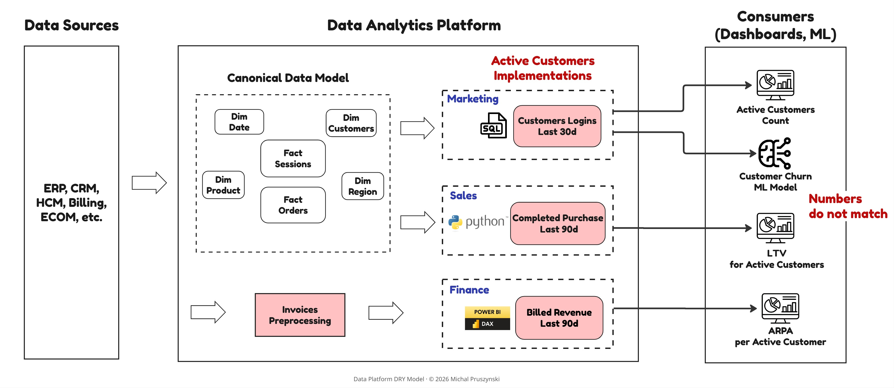
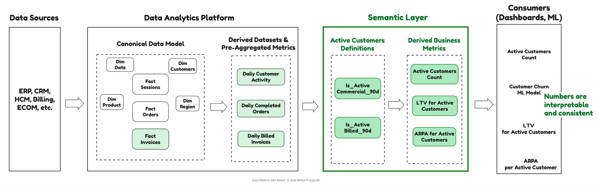
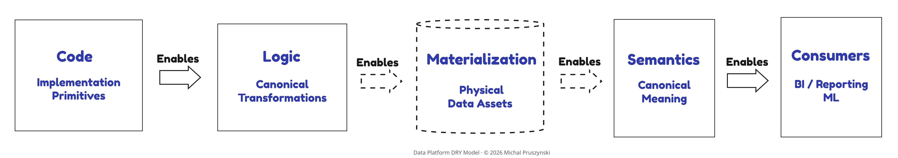
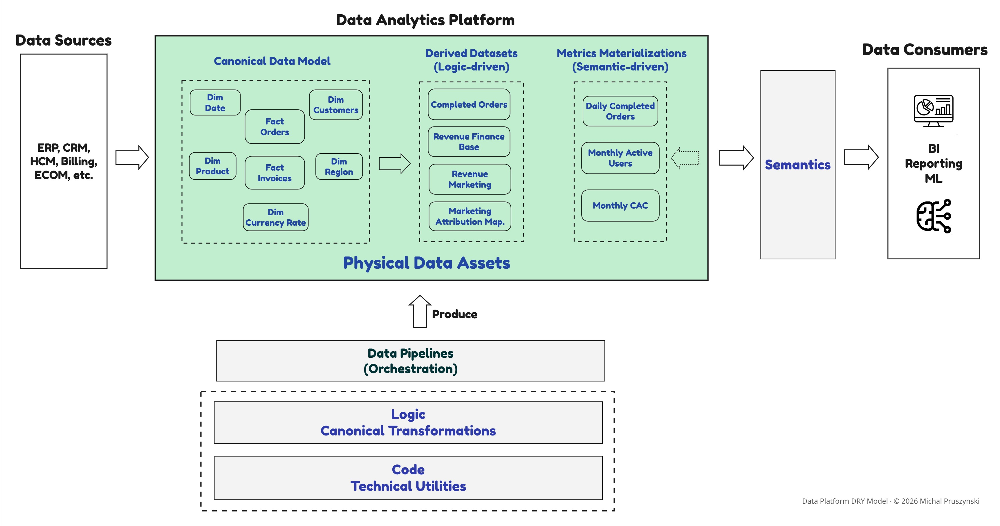
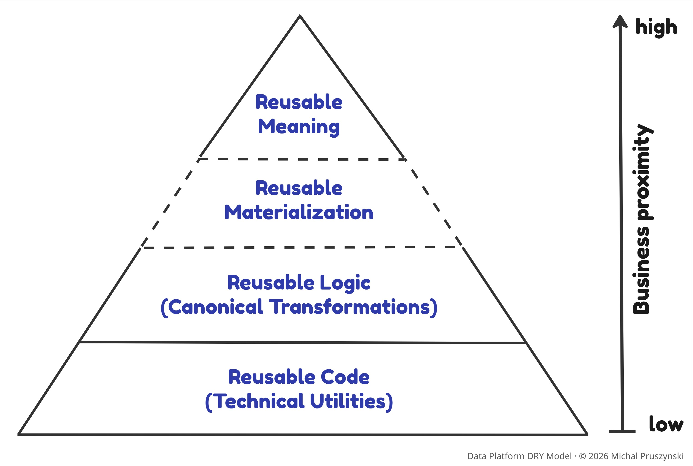
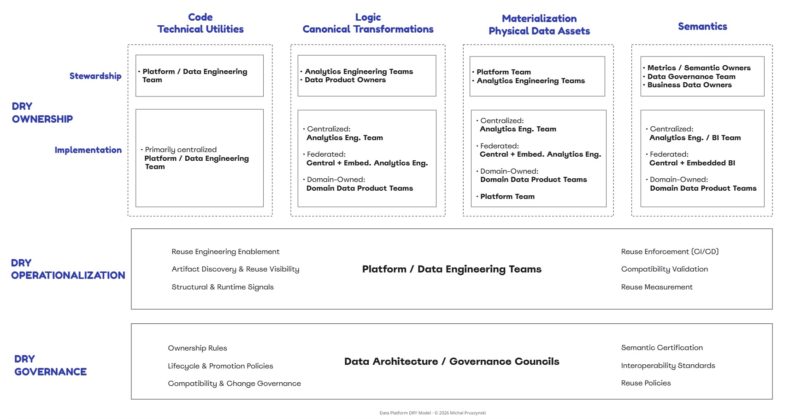

# Why Reuse Breaks at Scale in Data Platforms

*DRY is not only a coding principle. How duplicated logic, fragmented semantics, and uncontrolled materialization reveal that an operating model is missing.*

*Version 1.0.1 · July 2026*

The term "DRY", *Don't Repeat Yourself*, is a familiar principle in software development, where it primarily applies to code reuse. In data analytics platforms, DRY has a broader strategic role, often determining whether a platform succeeds or fails. That broader role is **a deliberate extension of DRY**, a unifying lens for reuse across data platform surfaces that code-level DRY does not address: **business logic, semantics, and physical materialization**. The extension is not a redefinition of DRY; it applies the same structural discipline: define once, reuse everywhere, change in one place.

## 1. When Reuse Fails, Metrics Fail

### How Duplication Turns Data Platforms Into Reconciliation Engines

**The numbers in the leadership dashboard don't agree.**

Marketing reports a growing number of Active Customers. Sales shows a decline.
Finance presents ARPA that doesn't align with other KPIs.
The churn rate appears to improve within the model, but executive metrics are calculated over a different definition of Active Customer.
Leadership cannot determine whether CAC and LTV refer to the same customer population.

This triggers **recurring reconciliation**. Data teams spend days before executive reviews tracing which logic, data source, and time window each KPI relied on, not to fix wrong data, but to **understand which definition had been used where**.

Over time, trust in data erodes.

Most organizations initially diagnose this as only a data quality issue or a tooling gap. It rarely is.
**What's actually breaking is reuse.** 

This failure pattern is not accidental, but it is structural.

### One Business Concept, Many Different Truths

Consider a familiar scenario: a company with several valid, but competing definitions of "Active Customer", each implemented independently by different teams:

- **Marketing** defines Active Customers as those who logged in within the last 30 days. The logic lives in a SQL view powering a Marketing KPI dashboard and is reused as an eligibility filter when retraining a churn ML model.
- **Sales** defines Active Customers as customers who completed a purchase within the last 90 days. This logic is implemented in a Python notebook, producing a table derived from the orders fact, and reused downstream to calculate LTV for Active Customers.
- **Finance** calculates ARPA (Avg. Revenue per Active Customer) using their own definition: those who were billed in the last 90 days. This definition is embedded directly in BI calculations.

#### Duplicated or Inconsistent Definitions of Active Customer


Each definition makes sense within its own context. None is "wrong". The issue surfaces when executives ask for a **leadership KPI dashboard** containing:

- Active Customers Count
- Churn rate
- LTV for Active Customers
- ARPA
…and expect the numbers to be comparable month over month. 

They aren't.

At the same time, changes are happening quietly. Marketing updates the SQL view to exclude test accounts. Finance BI calculations miss several manually adjusted rebate and FX files stored on SharePoint. Because **each implementation is duplicated and isolated**, no downstream consumer has visibility into these changes.

This is not just a technical inconsistency. **It is one of the structural failures of reuse**: these domain-specific definitions are brought together in a single executive view without an explicit cross-domain semantic reconciliation contract. 

The sections ahead generalize beyond this example to the other surfaces where duplication breaks data platforms.


## 2. Why Code-Level DRY Is Not Enough

Code-level DRY is necessary, but not sufficient. Data platforms are not single applications but ecosystems of interdependent data transformation and analytical workloads. They integrate multiple source systems, apply business logic, and produce data products consumed across domains. In this environment, duplication appears **not only in low-level code, but in transformation logic, semantic definitions, materialized datasets, and the orchestration pipelines that generate them**. Any duplication or reimplementation of the same logic introduces inconsistency risk, higher long-term maintenance costs, and fragmented truths across the organization.

**SQL adds another layer of complexity.** While it is powerful for retrieving and manipulating data, standard ANSI SQL has **limited first-class support for abstraction and modular composition**. Features such as packages, dependency-managed imports, and unit-testable pure functions are not language-native compared to general-purpose programming languages. 
This limitation becomes critical when SQL is used to build data transformations and analytical workloads (ETL/ELT), making it **a high-risk surface for code duplication.** In practice, these limitations are mainly addressed using vendor-specific procedural extensions and templating frameworks based on SQL macros. These tools introduce an ecosystem dependency, however this trade-off is often worthwhile.

A clean, modular codebase, engineering standards, and modern tooling that provide abstractions over raw SQL are necessary foundations, but they are not sufficient, as the primary failure at scale is duplicated definitions, not duplicated syntax.


## 3. From Duplication to Semantic Drift At Scale

The problem compounds as platforms scale. **In enterprise data environments, business rules such as "revenue", "order completion", or "active customer" are used across hundreds of transformations: in ETL jobs, notebooks, dashboards, and ML pipelines.**

If these business rules are reimplemented, even a small change requires identifying every affected pipeline and propagating independent updates in many places (often unknown), which is hard to manage and often takes weeks.

This pattern leads to inconsistent definitions and semantic drift, even in technically functional data platforms. The challenge amplifies when organizations operate multiple data warehouses or when departments maintain their own analytics solutions. Platforms intended to generate insights ultimately become warehouses rich in data, but lacking shared meaning.

### When DRY Works: Shifting From Reconciliation To Decisions

After addressing the root cause, the organization moved from ungoverned implementations to explicit, shared semantic definitions for leadership-level metrics.

**DRY in semantics can be enforced through several mechanisms**: a dedicated semantic layer, or canonical governed models in the data warehouse. In this case, the semantic layer exposed two agreed 'Active Customer' definitions:
- one aligned to commercial use cases (Marketing and Sales), and
- one aligned to financial reporting.

These semantic definitions were reused consistently across all business metrics. Core metrics, such as LTV for Active Customers or ARPA, were defined once and reused downstream. Additionally, a canonical `fact_invoices` table brought financial logic into the warehouse, eliminating BI-layer workarounds and logic duplication.

#### Shared Semantic Definitions of Active Customer


With DRY in semantics, when Marketing later requested a change (exclude trial accounts), the definition was updated once and became available consistently through governed consumption paths across dashboards, notebooks, ML pipelines, and executive reports.

The impact was immediate:
- Monthly KPI reviews shifted from debating definitions to making decisions.
- Metrics became comparable over time, with changes clearly traceable.
- Engineering effort dropped as logic was implemented once and reused, reducing rework and downstream regressions.
- Trust in data increased because business logic was transparent, owned, and reusable.

**When metrics reconciliation takes days, the root cause is usually semantic drift.**

<br />

The inconsistent-metrics scenario with semantic-governance remediation is just one of several reuse failures this article examines.

To reason about reuse at scale, leaders need to recognize that **duplication appears at different surfaces of a data platform.**
Each surface is implemented through different platform artifacts, consumed by different users, and enforced through different mechanisms.


## 4. DRY Layers as Reuse Surfaces in Data Platforms

| DRY Layer   | What is reused                             | Primary risk if broken                          |
|-------------|--------------------------------------------|-------------------------------------------------|
| **Code**        | Technical utilities                        | Technical debt, data engineering rework         |
| **Logic**       | Business rules                             | Inconsistent transformations                    |
| **Semantics**   | Meaning & aggregation logic                | Metrics / KPIs drift                            |
| **Materialization *(Physical Data Assets)*** | Physical tables, files, materialized views | Uncontrolled duplication of physical outputs; rising cost, ambiguous canonical dataset |

When we say duplication appears across code, logic, or semantics, all of these components are **ultimately implemented as code**, however they occur at **different layers of abstraction**. They are reuse surfaces, not data-state stages: medallion (bronze/silver/gold) progressions describe how data matures; DRY layers describe what is reused.

Materialization is a different reuse surface: it governs **reusing an existing physical copy at the grain, or refresh frequency a consumer needs, instead of rebuilding it**, while keeping every copy traced to a single canonical source.

### DRY Layer Relationships

Lower layers enable higher ones, but do not create them automatically. Semantics can be governed over logical models or virtualized query layers without mandatory physical materialization first. Materialization is an optimization and operationalization layer, not a universal prerequisite.

---

### DRY in Code: Reuse of Technical Utilities (Necessary, Not Sufficient)

This addresses the most familiar form of duplication: avoiding copy-pasted boilerplate logic and repeated technical patterns across pipelines and queries.

#### DRY in Code: Reusable Technical Utilities

*Here are the DRY layers mapped into a Data Platform view where code utilities and transformation logic define reusable building blocks, while pipelines orchestrate their execution to produce physical data assets. DRY layers represent reuse surfaces, not execution order.*

Shared, generic technical utilities, such as **standardized merge mechanisms, data deduplication, or data hashing functions, must be implemented once and reused across pipelines**. Shared schema validation methods also prevent upstream drift from breaking canonical transformations and enabling scalable DRY adoption. Without this discipline, platforms quickly accumulate technical debt, increase maintenance overhead, and slow the delivery of new data workloads.

All these functions are intentionally **agnostic to business meaning**. They define *how* to do something, not *what* the data represents.

It improves developer productivity and reduces maintenance surface. It is foundational, but insufficient on its own.

**Even perfect code reuse doesn't prevent data transformation sprawl.**

---

### DRY in Logic: Reusable Canonical Data Transformations

**Where Business Rule Duplication Shrinks**

DRY in Data Transformation Logic moves **one level up** the abstraction stack. This is where reuse starts to affect data correctness and consistency across teams. Instead of reusing generic helpers, it **centralizes business-specific transformations** that define canonical datasets or attributes. This is essential for building governed data products. 

#### DRY in Logic: Centralizing Canonical Rules


There are **two common patterns** in data platforms, and both are valid. The key design choice is where to allow flexibility and where to enforce consistency. 
Consider a simple example determining when an order is "completed"

- **Attribute-level canonical logic** : In this pattern, the full entity is exposed, and a canonical attribute (e.g., `Order.is_completed`) is defined as part of a shared transformation and attached to the full entity (e.g. `Orders`), enabling downstream composition. Consumers can filter, group, or aggregate using this attribute as needed. The trade-off is that misuse remains possible, for example, consumers may forget to apply the flag when filtering.

- **Dataset-level canonical logic** : In this pattern, the derived dataset itself is exposed, embedding the business rule directly in the transformation. Consumers receive an already filtered dataset, containing only completed orders in our example, trading flexibility for safety.

The above patterns establish **a canonical definition**: an order is considered completed when e.g. its status is "shipped" or "delivered." If this business rule changes, for example, "returns" should be excluded, the logic is updated in one place, and downstream consumers using the governed interface receive the updated definition consistently.

Even when teams reuse canonical data transformations, misuse remains possible. Consumers may apply additional filters or aggregate differently while still labeling the result "completed orders". As a result, an organization can achieve perfect DRY in Logic (a single reusable `completed_orders` function or view), yet still fail at the organizational level because interpretation remains decentralized. Engineering and logic reuse do not translate into organizational semantic alignment.

The root cause is simple: **neither a function nor a view is a metric**. It carries no declared aggregation rule, grain, or filter contract, so reusing it is not a semantic guarantee. One team may count rows, another may count distinct orders, and a third may filter on different dates. All reuse the same logic, yet produce different results. This gap leads to the next layer: DRY in Semantics.

---

### DRY in Semantics: Reusable Governed Meaning

**This layer is where reuse becomes a business concern rather than a technical one.**

DRY in Semantics eliminates duplication of interpretation. It defines:
- what data means,
- how it should be aggregated, and
- how it should be consumed.

#### DRY in Semantics: Enforcing Consistent Meaning of Data


Organizations achieve DRY in Semantics by centralizing interpretation, most commonly through a semantic layer, or alternatively through strongly governed metric definitions embedded in canonical data products.

A semantic layer allows embedding business meaning as governed, discoverable objects, instead of embedding meaning in views or functions:
- **Semantic models** define entities with grain and relationships.
- **Metrics** define canonical KPI logic, including filters, aggregation rules, and time semantics.

In this model, "completed orders" is no longer just a flag or a dataset. It becomes a governed, discoverable semantic object: a metric defined on a specific entity, with rules enforced consistently at query time.

**Conceptual semantic contract (illustrative pseudo-definition):**

```yaml
entity: Order
grain: order_id

attributes:
  is_completed:
    type: boolean
    expr: status IN ('shipped', 'delivered')

metrics:
  completed_orders:
    agg: count_distinct
    expr: order_id
    filter: is_completed = true
```

Consumers no longer write SQL to calculate "completed orders." Instead, they reference the metric by name, and the **semantic engine resolves the logic consistently at runtime** across dashboards, notebooks, and APIs. When the business definition changes, it is updated once in the semantic layer and becomes available consistently through governed consumption paths. This is DRY enforcement using interfaces, not only convention or training.

Summing up, the key distinction that needs to be stated again: **a view, a table, or a function is not a metric**. Raw SQL views do not define aggregation rules, time semantics, grain, or allowed filters. **Semantic DRY enforces consistent business meaning across teams and tools**, extending beyond engineering into analytics and decision-making.

**A dedicated semantic layer is not the only way to achieve semantic consistency**. Some organizations enforce shared meaning through tightly governed data products, for example metric stores that expose controlled metric definitions. The architectural requirement is not a specific implementation, but the existence of a governed interface that enforces consistent data interpretation.

The code examples are provided here: [Order Completion Example Across The DRY Layers](https://github.com/michalpru/data-platform-dry-model/blob/main/code-examples/code-example-across-dry-layers.md)

---

### DRY Is Not an Absolute: When Physical Duplication Is the Right Move

**Where the previous layers address reuse of code and definitions introduced as code, this layer addresses reuse of materialized outputs.** 

Even with clean, reusable transformation logic and minimal code duplication, a data platform must still balance reuse with execution efficiency at scale.

Reusable artifacts, such as views, macros, or semantic definitions, often expand into complex SQL statements at query time. While modern cloud data warehouses provide powerful query optimizers, deeply layered transformations or nested views can produce operationally expensive queries, increasing latency and compute costs. **Intentional, governed materialization of additional physical copies**, such as tables, is sometimes necessary to address these challenges and support **different grains, partitions, or refresh frequencies**. The intent of DRY in Materialization is to reuse an existing materialization that already satisfies those requirements, since rebuilding what can be reused multiplies cost and blurs which dataset is canonical.
Each materialization should itself be a governed, observable, owned artifact that is either a declared canonical source or traces to one.

#### DRY in Materialization (*Physical Data Assets*) 


Logic-first architectures define canonical transformations as code rather than tables, allowing consumers to materialize outputs as needed. **Cost reduction opportunities** are brought by computing joins and transformations once, and reading results many times. When reuse is low, on-demand queries are often cheaper. This reflects a deliberate trade-off:

- **Core canonical entities** (e.g., Customers or Sales) are typically materialized once and exposed as governed physical datasets, because they are foundational, widely reused, and expensive to recompute for every consumer.
- **Derived entities** are increasingly defined logic-first, as governed transformation models, and are often materialized into physical tables to meet performance and operational requirements.
- **Metrics** are defined declaratively in the semantic layer and materialized only when reuse frequency or performance constraints justify it.

DRY failure here is invisible and uncoordinated duplication of physical outputs, not just a materialization strategy question. Then costs multiply, pipelines proliferate, data freshness is not guaranteed, and consumers lose confidence in which dataset is authoritative.


## 5. Where Reuse Systematically Breaks

In practice, DRY failures emerge when reuse is optimized locally within a layer, but not reinforced across layers through compatible abstractions and consumption patterns. **The lack of reuse propagation is a recurring structural pattern in data platforms**. A platform may rely on clean, modular SQL macros or PySpark functions, yet still produce duplicated logic and inconsistent metrics at scale.


### DRY Dependency Map


Use this diagram to diagnose why DRY initiatives fail

*Read as a dependency map, not an implementation sequence: higher layers depend on capabilities below them, but they do not emerge automatically or have to be built in order.*

### When organizations optimize one DRY layer while neglecting others, predictable failure patterns emerge:

- **Code DRY without Logic DRY:** reusable code utilities exist, but business rules are repeatedly re-implemented across pipelines, leading to transformation sprawl.
- **Logic DRY without Semantic DRY:** canonical transformations are bypassed or inconsistently consumed, causing metrics drift.
- **Semantic DRY without Canonical Materialization:** abstractions that appear clean but can become operationally expensive as usage scales.
- **Over-abstraction and misaligned materialization strategy:** deep view chains that obscure logic, complicate debugging, and degrade performance.

Understanding this is critical for leaders when making decisions about platform investment, governance, and operating models. Many organizations invest heavily in execution layers: data pipelines, transformations, and platform infrastructure, while semantic layers and reuse enforcement lag behind, leaving reuse structurally incomplete and causing reuse programs to fail.


### Recognizable Anti-Patterns: What DRY Failure Looks Like in Practice

Abstract failure modes become concrete when you recognize the artifacts that carry them. These patterns are common across data platforms at scale. The names are satirical. The damage is real.

| Failure Name | Failure Description | DRY Layer |
|---|---|---|
| **The `final_v2` table** | The orders table that started as `orders_clean`, became `orders_clean_final`, then `orders_clean_final_USE_THIS` after someone's hotfix, and eventually `orders_clean_final_finance_2026Q1` when Finance needed a slightly different version for their reporting period. Each variant encodes a marginally different business rule. None is deprecated. All are actively queried in production pipelines. No one can answer which is authoritative. | DRY failure in Logic, Materialization, and Semantics: reimplemented rules, uncontrolled materialization, no authoritative definition, and no lifecycle governance. |
| **The superior view** | A SQL view referenced by 40 downstream queries, 5 dashboards, and 2 ML pipelines. It began as a simple filter on the orders table. Over three years it accumulated JOINs, CASE WHEN blocks, and some business rules no one remembers writing. It is now a 700-line SQL statement. Every data engineer knows not to touch it. Nobody is certain what it actually computes. | DRY failure in Logic: an ungoverned transformation that became the de facto canonical entity by accident. No testability, no owner, no deprecation path. |
| **The `ingest_*.py`** | The CRM team builds a REST API ingestion pipeline for Salesforce: OAuth token refresh, retry with exponential backoff, pagination handling, response deserialization, and error classification. The product team, unaware that this exists, builds the same for Zendesk. Then another team for Stripe. No shared ingestion module exists because no team had visibility into what the others had already built. Every source-specific concern is genuinely different. None of the surrounding code needed to be. | DRY failure in Code: authentication, pagination, retry, and error handling reimplemented per source rather than parametrized once into a shared, testable ingestion module. |
| **The notebook that became production** | An analyst calculates LTV ratio one weekend by connecting to both data warehouse and source datasets directly. Leadership referenced the numbers in a board deck. Six months later, the notebook runs on a scheduled job, and its outputs are used by the entire organization. The job references a table that was silently renamed in the meantime without anyone noticing the breakage. Nobody owns it. Nobody tests it. | DRY failure in Logic and Semantics: no canonical transformation, no governed definition, no change propagation. |
| **The business rule implemented in the dashboard** | Net Revenue as a calculated field inside a Power BI report. Not in the semantic layer. Not in a transformation model. It exists because it was faster to define it there. Now it appears in the executive dashboard. Three other teams have built their own versions in their own reports. When the definition changes, there is no canonical location to update and no way to know how many copies exist. | DRY failure in Logic and Semantics: reimplemented calculation, no canonical home, no governed definition. |

---

## 6. Organizing for Reuse: DRY Operating Model and Enabling Capabilities

The above patterns are not team-level failures but systemic outcomes of how data platforms are organized and owned.

### 6.1. Reuse Requires Explicit Operating Models

In practice, unclear or fragmented ownership is one of the most common root causes of DRY failures in data platforms.

A critical governance gap often emerges at the foundation of the DRY Dependency Map: shared utility code and data transformation frameworks are frequently labeled as "platform concerns", lacking an explicitly accountable owner. Without clear stewardship, shared artifacts degrade over time, and teams revert to local reimplementation and copy-paste patterns.

**Respect domain boundaries.** Explicit ownership does not mean centralizing every definition. Canonical definitions within a domain do not automatically become enterprise-wide truth, and over-centralization creates unnecessary coupling and slows delivery. Domain-local canonicals should be reused only within a particular domain unless they encode business concepts that truly require cross-domain alignment and are deliberately promoted enterprise-wide. Other artifacts are not reuse candidates at all: local helpers, one-off transformations, and implementation details private to a single consumer. The discipline lies in separating them from shared meaning, which is itself scoped: whether domain-level or enterprise-wide.

### DRY Operating Model


The operating model separates four responsibilities:
- **Stewardship**: defines who is accountable for reusable assets over time, including quality, lifecycle, and change management
- **Implementation**: defines who builds, maintains, and operates reusable assets. Implementation ownership may be centralized, federated, or domain-oriented
- **Platform operationalization**: provides foundations and shared capabilities that make reuse discoverable, measurable, and enforceable 
- **Organizational governance**: defines the policies, standards, and accountability structures through which the organization coordinates reuse across teams and domains

One effective pattern observed in practice is an **InnerSource** (internal open-source) **operating model**, where shared artifacts are centrally governed but openly contributed to. Platform or Data Engineering Teams steward repositories and documentation, approve contributions, and manage compatibility and versioning. This enables safe reuse and encourages analytics engineering teams to depend on shared packages rather than duplicating logic locally.

### How DRY Maps to Data Mesh 
Data Mesh does not eliminate the need for DRY; it federates it. Canonical entities may be expressed as domain-owned data products with explicit ownership, contracts, and service interfaces. DRY in Logic and DRY in Semantics are expressed through domain boundaries rather than central warehouses.

Contracts may include semantic descriptors, but by themselves they usually do not resolve cross-domain semantic alignment. That still requires ownership, certification, and interoperability rules.

The risk appears when multiple domains independently define the same shared concept. In that case, **reconciliation still surfaces unless cross-domain interoperability rules govern shared logic and meaning**. DRY in Code remains a platform concern: generic technical utilities should still be provided once and reused across domains.


Most enterprise organizations ultimately combine centralized, federated, and domain-oriented responsibilities across different reuse layers and platform capabilities. The purpose of the DRY Operating Model is not to prescribe a single organizational structure, but to show how stewardship, implementation, operationalization, and governance evolve across different organizational structures and reuse layers.


### 6.2. What Organizations Build to Sustain Reuse

Implementing DRY at scale requires more than modern tooling; it requires platform operationalization and governance capabilities that make reuse discoverable, measurable, and enforceable. The challenge is rarely a lack of engineering skill within teams, but underdeveloped reuse capabilities and fragmented governance.

### DRY Operationalization
Organizations that sustain reuse typically build a dedicated **reuse operationalization layer**, most often managed by Platform or Data Engineering Teams. Its job is to build reusable foundations and make reuse visible, measurable, and enforceable.

This layer usually includes:
- reuse engineering enablement through shared utilities, frameworks, libraries, and CI/CD foundations;
- artifact discovery and reuse visibility through catalogs (e.g., Collibra, Alation, Atlan, DataHub), registries, lineage, and observability;
- structural and runtime reuse signals derived from DAG analysis, warehouse metadata, and semantic telemetry;
- reuse measurement through adoption metrics and duplication hotspot detection;
- reuse enforcement through CI/CD controls, compatibility validation, duplication detection, policy enforcement, and lifecycle validation.

In practice, **transformation frameworks** such as dbt and SQLMesh operationalize DRY in Code and Logic through macros, models, and dependency management. **Semantic layer tools** such as dbt Semantic Layer, Cube, and MetricFlow extend this into DRY in Semantics, exposing governed metric definitions consistently across BI tools, notebooks, and APIs.

### DRY Governance
Sustainable DRY adoption also requires **organizational governance** capabilities, typically coordinated by Data Architecture or Governance Councils.

These capabilities define:
- ownership rules and decision rights;
- lifecycle and promotion policies governing reuse maturity and certification;
- compatibility and change governance enabling safe evolution and version control;
- semantic certification for trusted business definitions;
- interoperability standards enabling cross-domain consistency;
- reuse policies defining canonical adoption expectations across teams.

### Capabilities Alignment
Sustaining DRY at scale requires alignment between platform and data engineering, analytics engineering, BI development, and governance capabilities. Reuse becomes scalable only when stewardship, implementation, operationalization, and governance are consistently applied across all reuse layers.

**When these capabilities are weak or inconsistently applied, adding tools or increasing engineering headcount rarely resolves the issue. Instead, organizations accelerate duplication by enabling faster local optimization without shared constraints, visibility, or governance.**

### AI Authoring Capabilities Cut Both Ways
AI coding assistants, such as GitHub Copilot, Cursor, and emerging MCP-enabled tooling, have changed the economics of duplication in data platforms, and the direction depends on what reuse context those tools can see.

Without reuse context, AI assistants are a duplication amplifier. They generate plausible SQL and Python transformations from local context alone, with no awareness that a canonical model or metric may already exist elsewhere in the organization. That makes reimplementation easier than discovery. CI/CD gates still matter, but they act later in the lifecycle, after the logic has already been written.

The same tools become a reuse accelerator when the platform surfaces *governed* canonical definitions (not just similar implementations of uncertain authority) directly in the authoring environment, so the assistant steers developers toward referencing the certified artifact rather than recreating it.

### 6.3. DRY Across Analytical and Operational Boundaries
Reuse boundaries do not stop at analytics. Although the DRY layers and patterns in this article are introduced primarily through analytical use cases, they apply across operational use cases as well.

In **machine learning workflows**, feature stores apply the same discipline: feature definitions are registered once, versioned, and reused across offline training and online serving, preventing the same feature from being computed differently in training and production inference. Semantic consistency, what each feature means, still requires explicit ownership and governance beyond what the store itself provides.

---

## 7. Closing Thoughts: Reuse as a First-Class Concern in Data Analytics Platforms

In data platforms, DRY is not primarily a coding concern; it is a structural property of how platforms operate at scale. Duplication rarely shows up as messy code or as a named line on a budget, but it surfaces as engineering effort reimplementing shared technical utilities, rising platform cost, inconsistent metrics, and declining trust in data.

The core insight is simple: **business users reuse meaning, not implementation details**. Clean, modular code is foundational, but not sufficient. When numbers in dashboards disagree or KPIs change without explanation, the root cause is usually a reuse failure higher in the stack, most often weak or implicit semantic contracts, or fragmented canonical logic. These failures are not caused by teams "doing it wrong", and optimizing reuse in individual tools or frameworks cannot fix them.

DRY requires explicit design strategy, operating models, clear contracts, ownership of shared artifacts, and incentives that make reuse the default path.

**For leaders, the next steps are concrete.**
- Decide where canonical logic and metrics definitions live and separate them from low-level technical helpers. Define who owns them. 
- Focus on building and aligning foundational reuse operationalization and governance capabilities. 
- Accept that reuse cannot be governed by convention alone: if shared assets are hard to find, inconvenient to use, or easy to bypass, teams will re-implement logic by default. 
- Define a data materialization strategy that reuses existing physical copies before creating new ones and traces each materialization to a canonical definition; DRY is about controlled materialization, not about never materializing data.

**If you are unsure whether DRY failures are limiting your platform today, consider these questions:**
- What structurally prevents teams from re-implementing the same business rules across pipelines, notebooks, and dashboards?
- What is the actual adoption level of your governed, certified datasets and metrics, and how is that measured?
- When numbers disagree, can you trace the exact logic and semantics behind them, or does reconciliation rely on tribal knowledge?

If these questions are difficult to answer, the cost is already being paid: in rework, delayed decisions, and eroded confidence in data.

To move beyond intent and best practices, leaders and architects need a structural approach to evaluating, measuring, and enforcing reuse at scale.

To take that next step, explore the **Data Platform DRY Model** — a practical framework for **evaluating reuse** with quality attributes, scoring it through operational maturity levels, and **enforcing it** with an artifact registry and CI/CD controls.

👉 Read the whitepaper: [The Data Platform DRY Model](https://michalpru.github.io/data-platform-dry-model/)

---

*Author's note: This article reflects my independent professional perspective, not that of any current or former employer, client, or vendor. Examples are illustrative. All text and diagrams are my own original work.*
