# The Data Platform DRY Model

## Evaluating and Operationalizing Reuse at Scale

*Version 1.0.0 · June 2026*

## Abstract

Data analytics platforms fail in a predictable pattern. Metrics diverge across teams. Reconciliation cycles consume engineering capacity before every leadership dashboard review. Shared business rules are reimplemented independently in pipelines, notebooks, dashboards, and ML models, leading to inconsistent definitions and semantic drift, even in technically functional data platforms.<br> 
Organizations diagnose this only as a data quality problem or a tooling gap, but the root cause is a structural failure of reuse.

The term "DRY", **Don't Repeat Yourself**, is a familiar principle in software development, where it primarily applies to code reuse. In data analytics platforms, DRY has a broader strategic role. **This model extends DRY deliberately**, as a unifying lens for reuse across data platform surfaces that code-level DRY does not address: **business logic, semantics, and physical materialization**. The extension is not a redefinition of DRY; it applies the same structural discipline: define once, reuse everywhere, change in one place.

Reuse in data platforms operates across four distinct layers. Lower layers enable higher ones, but none emerges automatically from the others. These layers are reuse surfaces, **not** data-state stages: medallion (bronze/silver/gold) and staging/intermediate/mart progressions describe how data matures; DRY layers describe what is reused.

- **DRY in Code** addresses technical utilities reuse that prevents the most familiar form of duplication: avoiding copy-pasted boilerplate logic, and repeated technical patterns across pipelines and queries.
- **DRY in Logic** addresses the reuse of business-specific data transformations that define canonical datasets or attributes, such as "completed order" or "active customer".
- **DRY in Semantics** addresses shared business meaning using governed objects, such as metric definitions that enforce consistent interpretation of KPIs across tools and teams.
- and **DRY in Materialization** *(Physical Data Assets)* that addresses reusing an existing physical dataset that meets grain or refresh-frequency requirements, instead of rebuilding it, while keeping every materialization traced to a single canonical source.

#### DRY Layers in Data Analytics Platform
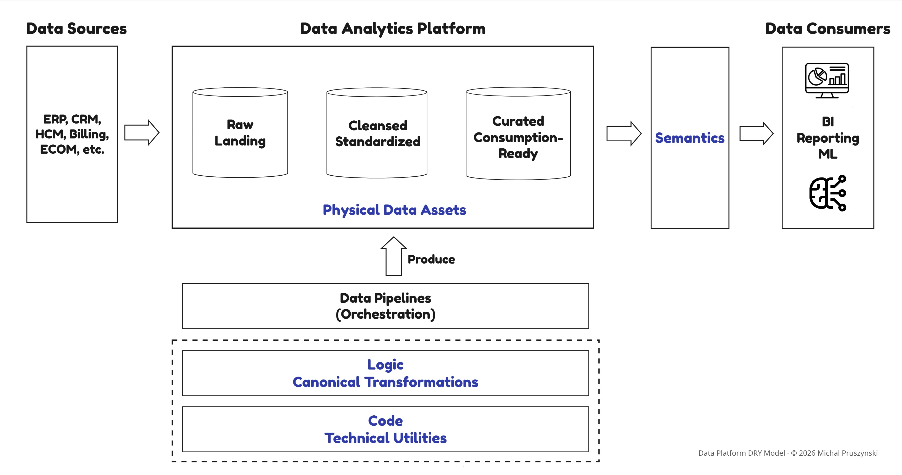

*DRY layers represent reuse surfaces, not execution order.*

The strategic context for these layers: why reuse breaks organizationally, how failure patterns manifest, and what operating models sustain reuse at scale, is covered in the companion article on Medium: "Why Reuse Breaks at Scale in Data Platforms" 

However, understanding failure modes is not enough. To design and govern reuse, we need a more operational lens that allows us to evaluate concrete platform decisions.

This document defines the **Data Platform DRY Model**:

- the **quality attributes** used to evaluate reuse,
- the **Maturity Levels** that describe how reuse behaves in practice, and
- the **enforcement patterns**: artifact registry, lifecycle governance, and CI/CD controls, that make reuse observable and enforceable at scale.

It is a standalone reference intended for engineering leaders, platform architects, and data practitioners responsible for designing and governing data analytics platforms.

--- 

## 1. When a “DRY Initiative” Doesn’t Deliver (Use Case)

### Canonical Logic and Governed Meaning Still Don’t Reconcile

To eliminate conflicting definitions of "Revenue", the analytics engineering team implemented a shared transformation module built on standardized Orders, Invoices, and Refunds tables. Core revenue recognition rules were encoded as a table-valued SQL UDF and materialized into a governed Revenue Events dataset. On top of that, a semantic model exposed certified metrics such as Net Recognized and Invoiced Revenue.

Structurally, the platform appeared to satisfy DRY in Logic and DRY in Semantics.

On paper, the problem was solved.

In practice, reuse fragmented.

#### Case Study


*Illustrative composite scenario: synthesized from common failure patterns, not a specific organization.*

### What Actually Happened

- A Finance-owned data warehouse running on a different vendor couldn't reuse the UDFs, due to runtime and packaging constraints. Revenue calculations were rebuilt directly from source systems.
- Several analytics teams consuming data outside the BI tool queried the Revenue tables directly and extended them downstream, reintroducing divergent logic.
- Some engineering teams embedded the callable logic directly in their own pipelines, re-materializing slightly modified revenue tables.
- Within the BI tool, some dashboards reused certified metrics, while others queried underlying tables directly to avoid semantic version changes. No backward compatibility contracts or deprecation windows existed.

No pipelines failed.

Yet executive dashboards began to diverge. “Revenue” matched in some contexts and not in others.

The platform lacked critical capabilities: visibility into reuse adoption and mechanisms to enforce it. As a result, canonical definitions existed but were not the default path for consumption.

When the executive sponsor asked a simple question: ”How widely is our canonical Revenue actually reused?”, the platform and analytics engineering teams could not answer.

They had no visibility into:

- What percentage of production ETL pipelines reused canonical logic.
- Whether Tier-1 dashboards depended on certified semantic metrics.
- How many parallel revenue definitions existed across repositories and warehouses.

The issue was the absence of architectural observability and enforcement mechanisms.

### From ”Best Practice” to Measurable Enforcement

The turning point came when the platform team inventoried shared callable logic, queryable datasets, and semantic contracts, and assessed them against comprehensive DRY Quality Attributes. Several structural gaps emerged:

- Portability constraints prevented seamless cross-platform reuse of callable logic.
- Lifecycle management and versioning allowed breaking changes, creating incentives to bypass shared definitions.
- Curated tables encouraged reuse, but their static structure and lack of formal semantic contracts led to unintended extensions and reinterpretations.
- Semantic enforcement was limited to a single BI tool, leaving data applications and notebooks outside its scope.

### Three Structural Initiatives To Make Reuse The Default Path

The remediation was addressed with 3 structural initiatives incrementally delivered:

### 1. Warehouse-Portable SQL Data Transformation Framework  
  This introduced multi-warehouse compatible SQL templating functions and transformation models, providing modularity, testability, and lifecycle management on top of SQL code. It made it possible to shift reusable logic from runtime-specific UDFs into portable, modular, dependency-managed artifacts.
### 2. DRY Artifact Registry Integrated into CI/CD  
   A lightweight artifact registry was introduced to make reuse measurable and enforceable. New pull requests were evaluated against existing revenue definitions using structural comparison and semantic similarity analysis. Reimplementations were flagged before merge. Consumption-time telemetry exposed which dashboards and queries bypassed governed semantic metrics. For the first time, reuse adoption became visible.
### 3. Headless Semantic Layer for Business-Critical Metrics  
   Implemented headless, platform-level semantic layer (instead of the BI-embedded one), beginning with Tier-1 executive metrics, to enable consistent, tool-agnostic reuse across the BI tools, data applications, and multiple warehouses.

### The Outcome

Within two quarters, metric reconciliation cycles shortened dramatically. Forked revenue definitions were consolidated or explicitly justified.

More importantly, the organization could finally answer a foundational question:<br>
Not just: "Do we have a canonical Revenue definition?"<br>
But: "Is the platform structurally designed so that using it is the default path?"

--- 

## 2. The Data Platform DRY Model
The use case above shows that canonical logic and semantic layers are not enough when reuse is not visible, governed, or enforceable.

**The Data Platform DRY Model provides the operational lens for evaluating and operationalizing reuse at scale.**

#### Data Platform DRY Model
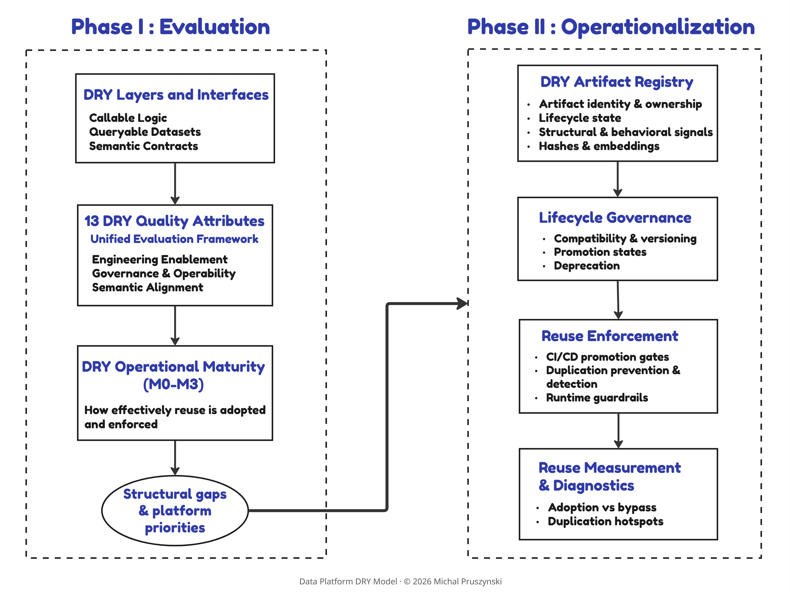

### Phase I: Evaluation

The Data Platform DRY Model introduces a structural evaluation framework.

It provides:

- **Primary reuse interfaces: Callable logic, Queryable datasets, and Semantic contracts**, and the common data platform artifacts are evaluated across these interface types.
- **13 DRY Quality Attributes**: A set of evaluative criteria organized into three groups: Engineering Enablement, Governance and Operability, and Organizational Semantic Alignment. These address the full spectrum of platform concerns, from abstraction and composability to lifecycle management and discoverability.
- **Operational Maturity (M0–M3)**: How effectively an organization achieves reuse in practice. Maturity Levels are described for each Quality Attribute, enabling structural comparison and gap identification across layers and reuse interfaces. Operational maturity can be applied to platform design, DRY readiness assessments, and governance gates.

The output of the “Phase I” is not implementation, but it is clarity: identifying structural gaps and prioritizing where investment is required.

### Phase II: Operationalization

In this phase, the Data Platform DRY Model explains how reuse becomes observable, measurable, and enforceable in practice. It introduces:

- **DRY Artifact Registry** - an advanced operating pattern for a lightweight reuse-control index across transformation logic, queryable datasets, and semantic contracts
- **Reuse Enforcement Model** that includes build-time duplication detection embedded into CI/CD workflows
- **Reuse Measurement Patterns** covering both structural reuse and consumption-time behavioral reuse
- **A pragmatic staged adoption path** for implementing the model incrementally

--- 

## 3. Reuse Evaluation 

### 3.1. Data Platform Artifacts and Reuse Interfaces
### Where DRY Is Achieved

**Model navigation map**<br> 
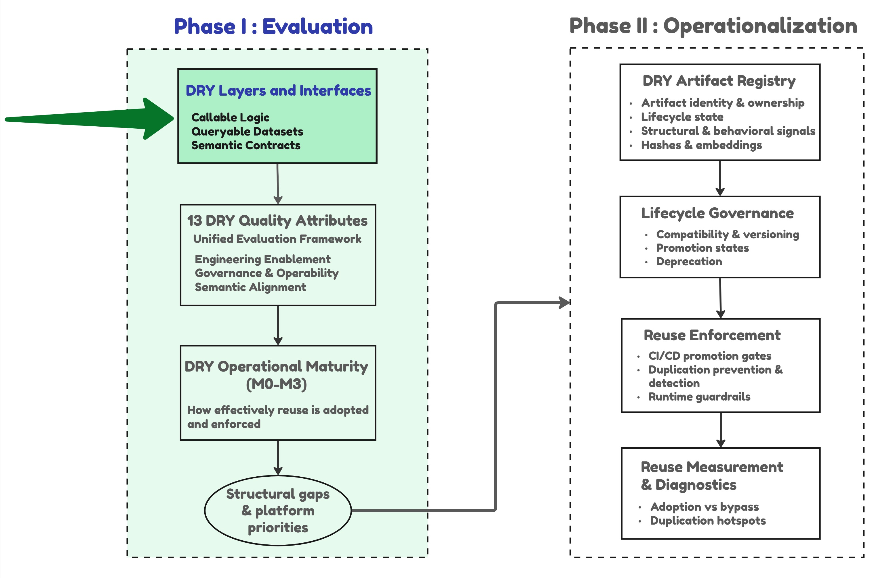

Although platform artifacts vary widely in form, within data transformation and analytical workloads they ultimately expose 3 primary reuse interfaces:
### 1. Callable logic
Reused by engineers inside pipelines. Callable logic artifacts are consumed through code rather than exposed as services
### 2. Queryable datasets
Reused through SQL. Queryable datasets enable platform-level reuse through stable query interfaces. The reuse interface remains the same regardless of the access mechanism (direct access to a table or view in a warehouse, or an API or service endpoint exposing the same dataset)
### 3. Semantic contracts
Reused through governed business definitions. Semantic contracts provide one of the strongest mechanisms for enforcing shared business meaning across tools and teams

**This distinction is critical because reuse is governed at the interface through which it occurs, not at the level of implementation.** Each interface type has different enforcement mechanisms, governance surfaces, failure modes, and organizational impact. Some artifacts expose more than one interface: for example, table-valued UDFs are implemented as callable logic but consumed as datasets through SQL `FROM` clauses, which often leads them to be misused as governed data assets.

#### 18 Common Platform Artifacts* Evaluated Across 3 Interface Types

<table>
  <thead>
    <tr>
      <th>Artifact Group</th>
      <th>Artifact</th>
      <th align="center">Callable Logic</th>
      <th align="center">Queryable Datasets</th>
      <th align="center">Semantic Contracts</th>
    </tr>
  </thead>
  <tbody>
    <tr>
      <td rowspan="7"><strong>Reusable Logic Artifacts</strong></td>
      <td>Built-in Functions</td>
      <td align="center">✅</td>
      <td align="center">❌</td>
      <td align="center">❌</td>
    </tr>
    <tr>
      <td>Scalar UDFs (SQL &amp; External)</td>
      <td align="center">✅</td>
      <td align="center">❌</td>
      <td align="center">❌</td>
    </tr>
    <tr>
      <td>CTEs</td>
      <td align="center">⚠️<br><small>Query-local</small></td>
      <td align="center">❌</td>
      <td align="center">❌</td>
    </tr>
    <tr>
      <td>Python and PySpark Functions</td>
      <td align="center">✅</td>
      <td align="center">❌</td>
      <td align="center">❌</td>
    </tr>
    <tr>
      <td>SQL Macros</td>
      <td align="center">✅</td>
      <td align="center">❌</td>
      <td align="center">❌</td>
    </tr>
    <tr>
      <td>Table-Valued UDFs (SQL)</td>
      <td align="center">✅<br><small>Relation-returning</small></td>
      <td align="center">✅<br><small>Query-time parameterized</small></td>
      <td align="center">⚠️<br><small>Anti-pattern</small></td>
    </tr>
    <tr>
      <td>Table-Valued UDFs (External)</td>
      <td align="center">✅<br><small>Relation-returning</small></td>
      <td align="center">✅<br><small>Query-time parameterized, procedural</small></td>
      <td align="center">⚠️<br><small>Anti-pattern</small></td>
    </tr>
    <tr>
      <td rowspan="4"><strong>Canonical Dataset Artifacts</strong></td>
      <td>Views / Materialized Views</td>
      <td align="center">❌</td>
      <td align="center">✅<br><small>Static</small></td>
      <td align="center">⚠️<br><small>Weak implicit</small></td>
    </tr>
    <tr>
      <td>SQL Transformation Models</td>
      <td align="center">❌</td>
      <td align="center">✅<br><small>Static</small></td>
      <td align="center">✅<br><small>Implicit</small></td>
    </tr>
    <tr>
      <td>SQL Dynamic Transformation Models</td>
      <td align="center">❌</td>
      <td align="center">✅<br><small>Runtime parameterized</small></td>
      <td align="center">✅<br><small>Implicit</small></td>
    </tr>
    <tr>
      <td>Curated Tables</td>
      <td align="center">❌</td>
      <td align="center">✅<br><small>Static</small></td>
      <td align="center">✅<br><small>Implicit</small></td>
    </tr>
    <tr>
      <td rowspan="4"><strong>Semantic Layer Artifacts</strong></td>
      <td>Headless / Universal Semantic Models</td>
      <td align="center">❌</td>
      <td align="center">❌</td>
      <td align="center">✅<br><small>Explicit</small></td>
    </tr>
    <tr>
      <td>Headless / Universal Metrics</td>
      <td align="center">❌</td>
      <td align="center">❌</td>
      <td align="center">✅<br><small>Explicit</small></td>
    </tr>
    <tr>
      <td>Headless / Universal Metrics Materializations</td>
      <td align="center">❌</td>
      <td align="center">✅</td>
      <td align="center">✅<br><small>Derived</small></td>
    </tr>
    <tr>
      <td>BI-Embedded Semantic Layer</td>
      <td align="center">❌</td>
      <td align="center">❌</td>
      <td align="center">⚠️<br><small>Vendor-bound</small></td>
    </tr>
  </tbody>
</table>

*Caveat: Execution frameworks and orchestration constructs (such as workflows, DAGs, and stored procedures) and application-level interfaces are intentionally excluded from this comparison, as they do not directly encode or enforce reusable logic or shared definitions.

### Structural Reuse Strength Across Common Platform Artifacts

These are complementary artifact types.

- **Callable logic artifacts** <br> 
  Provide strong generalization mechanisms required to build reusable ETL/ELT pipelines, however they primarily depend on engineering discipline and conventions, offering limited reuse enforceability. Particularly the SQL macros and Python/PySpark functions provide strong abstraction, parametrization, composability, and modularity, making them the primary mechanisms for eliminating duplication in code and transformation logic.
- **Queryable canonical datasets** <br> 
  Provide stronger enforceability and service exposure, shifting reuse towards the default consumption path. Especially static and dynamic SQL transformation models achieve a solid overall balance by combining dataset-level reuse with strong lifecycle management, dependency tracking, and service exposure.
- **Semantic layer artifacts** <br> 
  Typically built on top of queryable canonical datasets, providing shared business meaning, including aggregation rules, time semantics, or grain. They differ mainly in governance strength: from procedural (anti-pattern) and implicit contracts to explicit semantic models and metrics. 
  - **Procedural semantic contracts (table-valued UDFs)** are a callable shape consumed as a dataset (via SQL `FROM`), not a semantic contract: they declare no grain, aggregation rule, or metric metadata, and offer no governed query-time resolution, so they should not be treated as the semantic source of truth.
  - **Canonical datasets** carry only implicit meaning through structure and naming; explicit semantic contracts govern more strongly because definitions are declared and enforced at the interface. 
  - **Platform-level semantic models and metrics** strongly support organizational semantic alignment, as they explicitly define and govern business meaning, and increasingly expose these definitions through SQL and API interfaces (e.g., dbt Semantic Layer, Cube, AtScale) for consistent consumption across BI tools, notebooks, and operational applications. 
  - **BI-embedded semantic layers** can govern definitions well within a tool's ecosystem, but offer weaker generalization, testability, and cross-platform portability.
  
Platform artifacts, including a taxonomy of where semantic meaning lives, are detailed in the companion reference: [Platform Artifacts and Reuse Interfaces](../model-docs/02-platform-artifacts-and-reuse-interfaces.md).

### Extension to Machine Learning and Operational Data Products
The same three reuse interfaces apply beyond analytical workloads. In machine learning, feature stores are a concrete implementation: feature logic and definitions are registered once, versioned, and reused across offline training and online serving, helping prevent training-serving skew through the same lifecycle and interface discipline described for analytical platforms.
The detailed mapping of reuse interfaces to ML feature stores is provided in the companion reference: [Feature Stores and Machine Learning](../model-docs/02-platform-artifacts-and-reuse-interfaces.md#4-feature-stores-and-machine-learning).


### Mapping Interface Types to DRY Layers and Beneficiaries
| Interface Type | Executive Question It Answers | Primary Users | Primary DRY Enabler | Secondary DRY Enabler |
| --- | --- | --- | --- | --- |
| **Callable logic** | How do we prevent engineers from re-implementing the same logic? | Data Engineers, Analytics Engineers | **DRY in Code** | **DRY in Logic (if encoding business rules)**  |
| **Queryable datasets** | What is the canonical dataset we expect teams to build on? | Analytics Engineers | **DRY in Logic** | **DRY in Materialization** |
| **Semantic contracts** | How do we ensure the organization agrees on meaning? | BI Developers, Analytics Engineers | **DRY in Semantics** | **DRY in Materialization (via materialized metrics)** |

Across all artifact types, the goal is not to enforce a specific implementation pattern, but to ensure that reusable interfaces are governed and consistently consumed, preventing uncontrolled reimplementation across code, transformation logic, and semantic definitions. 


### 3.2. Reuse-Interface Governance and Data Contracts: Complementary Disciplines

Reuse-interface governance and data contracts operate on overlapping interface surfaces, but they protect different concerns. 
- **Reuse-interface governance** protects reuse consistency: transformation logic, grain, business meaning, and semantic stability.
- **Data contract** protects producer-consumer reliability: schema, freshness, availability, and other operational guarantees. 
While modern data-contract specifications increasingly include semantic descriptors, contract enforcement focuses on producer-consumer interface stability rather than cross-team interpretation alignment, which remains a reuse-interface governance concern.

Both disciplines may govern the same physical interface. A schema-compatible change can still break reuse if it changes the meaning of a dataset or metric, while an operationally reliable interface can still allow duplicated logic or semantic drift.

#### Reuse Interfaces and Data Contracts


The detailed compatibility model and breaking-change reference are provided in the companion reference: [Reuse Interfaces and Data Contracts](../model-docs/02-platform-artifacts-and-reuse-interfaces.md#5-reuse-interfaces-and-data-contracts).

--- 

### 3.3. DRY Quality Attributes
### How DRY Is Evaluated
**Model navigation map**<br> 
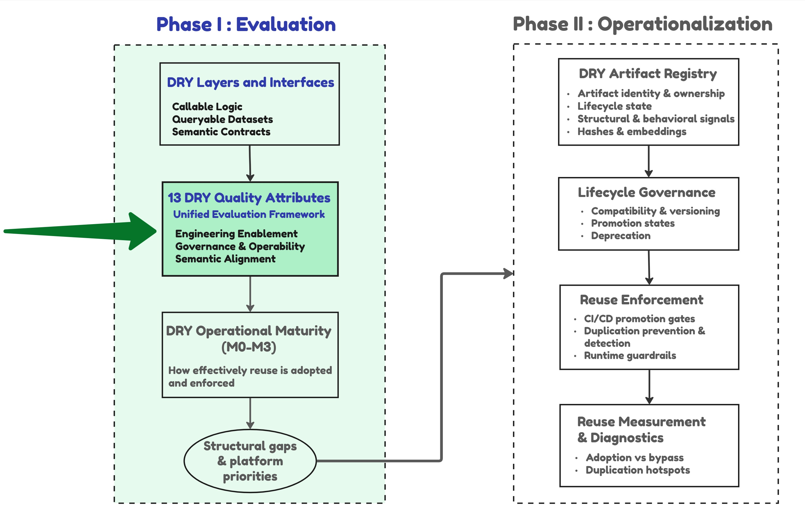

Data Platforms are evaluated against **the unified set of 13 DRY Quality Attributes**, organized into 3 groups:
- **Engineering Enablement**  
  Purpose: Ability to support safe and scalable reuse.
- **Governance & Operability**  
  Purpose: Ensure that reuse remains visible, controlled, and sustainable at scale.
- **Organizational Semantic Alignment**  
  Purpose: Enforce governed, consistent business meaning.

Each attribute's *Expected Capability* describes an operational capability jointly enabled by the artifact's structure and the platform, and realized through engineering and governance practice.

<table style="width:100%; table-layout:fixed">
  <colgroup>
    <col style="width:4%"/>
    <col style="width:18%"/>
    <col style="width:22%"/>
    <col style="width:40%"/>
    <col style="width:16%"/>
  </colgroup>
  <thead>
    <tr>
      <th width="4%">#</th>
      <th width="18%">Quality Attribute</th>
      <th width="22%">Group / Subgroup</th>
      <th width="40%">Expected Capability</th>
      <th width="16%">Artifacts It Applies To</th>
    </tr>
  </thead>
  <tbody>
    <tr>
      <td align="center">1</td>
      <td><strong>Reusability</strong></td>
      <td rowspan="4" align="center">Engineering Enablement /<br>Reusability Mechanisms</td>
      <td>Logic can be defined once and referenced across multiple contexts by design.</td>
      <td>All</td>
    </tr>
    <tr>
      <td align="center">2</td>
      <td><strong>Abstraction</strong></td>
      <td>Implementation complexity, including how business meaning is operationalized, is encapsulated behind stable, well-defined interfaces.</td>
      <td>All</td>
    </tr>
    <tr>
      <td align="center">3</td>
      <td><strong>Parametrization</strong></td>
      <td>Behavior can be configured via parameters without requiring code changes.</td>
      <td>All; strength varies by interface type</td>
    </tr>
    <tr>
      <td align="center">4</td>
      <td><strong>Composability</strong></td>
      <td>Small, reusable units can be combined into higher-order solutions without duplicating logic or redefining meaning.</td>
      <td>All</td>
    </tr>
    <tr>
      <td align="center">5</td>
      <td><strong>Structure &amp; Modularity</strong></td>
      <td rowspan="4" align="center">Engineering Enablement /<br>Engineering Quality &amp; Maintainability</td>
      <td>Logic is organized into clear and logically cohesive units.</td>
      <td>All</td>
    </tr>
    <tr>
      <td align="center">6</td>
      <td><strong>Testability</strong></td>
      <td>Correctness can be validated through automated tests, including data and semantic validation where relevant.</td>
      <td>All</td>
    </tr>
    <tr>
      <td align="center">7</td>
      <td><strong>Portability</strong></td>
      <td>Artifacts are portable across platforms with minimal refactoring required to preserve behavior.</td>
      <td>All</td>
    </tr>
    <tr>
      <td align="center">8</td>
      <td><strong>Execution Efficiency &amp; Scalability</strong></td>
      <td>The reuse mechanism integrates cleanly with the execution engine and optimizer, without forcing structural inefficiencies.</td>
      <td>All</td>
    </tr>
    <tr>
      <td align="center">9</td>
      <td><strong>Reuse Enforceability</strong></td>
      <td align="center">Engineering Enablement /<br>Reuse Enforceability Mechanisms</td>
      <td>Artifacts and their interfaces make correct reuse the natural or lowest-friction path, while making duplication harder, more visible, or easier to govern. This is a structural property of the artifact and its interface, distinct from Reuse Enforcement (Phase II), the operational layer that acts on it.</td>
      <td>All</td>
    </tr>
    <tr>
      <td align="center">10</td>
      <td><strong>Versioning and Lifecycle Management</strong></td>
      <td rowspan="3" align="center">Governance &amp; Operability</td>
      <td>Artifacts are version-controlled and deployed via CI/CD, with dependency tracking and impact analysis.</td>
      <td>All</td>
    </tr>
    <tr>
      <td align="center">11</td>
      <td><strong>Discoverability &amp; Metadata Visibility</strong></td>
      <td>Artifacts are searchable and contextually visible via catalogs, lineage, and semantic discovery mechanisms.</td>
      <td>All</td>
    </tr>
    <tr>
      <td align="center">12</td>
      <td><strong>Service Exposure Capability</strong></td>
      <td>Artifacts can be exposed through a standardized consumption interface such as SQL, a semantic layer, or an API.</td>
      <td>N/A — Reusable Logic Artifacts</td>
    </tr>
    <tr>
      <td align="center">13</td>
      <td><strong>Semantic Alignment</strong></td>
      <td align="center">Organizational Semantic Alignment</td>
      <td>Artifacts encode and enforce consistent business meaning across teams and tools through explicit, governed semantic contracts.</td>
      <td>N/A — Reusable Logic Artifacts</td>
    </tr>
  </tbody>
</table>

These attributes are not invented from scratch. Reuse, abstraction, modularity, portability, testability, and metadata visibility are long-standing concerns in software and data architecture, with related concepts in ISO/IEC 25010 product quality and DAMA-DMBOK practice. **The contribution is not these individual concerns but their collection, classification, and definition through a reuse lens as a unified DRY evaluation framework.**

#### Out-of-Scope Quality Attributes
Security, cost efficiency, and runtime observability are first-class platform concerns governed by adjacent disciplines: data security, cloud cost management (FinOps), and data observability. The DRY Model intentionally excludes them and focuses on reuse-specific attributes.

#### Interpreting and Applying the Quality Attributes
The DRY Quality Attributes outlined above serve as evaluation criteria. They can be used to define data platforms Maturity Levels for each reuse layer, but they can also be applied to evaluate particular tools implementation, such as SQL Data Transformation Frameworks or BI tools from the reuse capabilities standpoint. Using one unified set of attributes ensures structural consistency: even semantic contracts, whose primary value is alignment, become brittle without testability or lifecycle management.

Not all DRY Quality Attributes carry equal weight in every platform. In particular, portability is a situational concern. Many enterprise platforms deliberately optimize for a specific data warehouse or execution engine to maximize performance, reliability, and operational simplicity. In such environments, portability is a trade-off rather than a goal. The framework surfaces portability as a structural characteristic, but it should be interpreted in the context of platform strategy, not as a universal requirement.

Companion references provide the detailed evaluation vocabulary: [DRY Quality Attributes](../model-docs/03-quality-attributes.md).

--- 

### 3.4. DRY Maturity Levels
### From Expected Capability to Operational Reality

**Model navigation map**<br> 
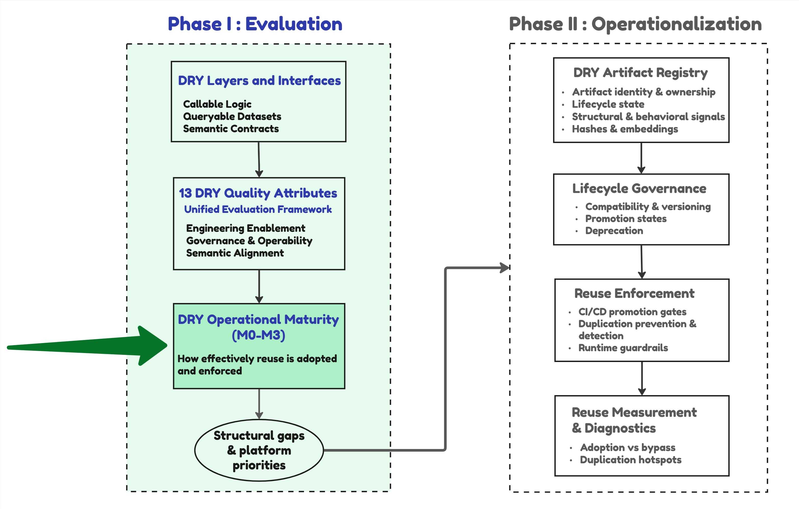

Maturity describes how reuse behaves operationally in practice, not which tools are present. An organization can use SQL Data Transformation Frameworks and SQL macros that enable reusability, abstraction, and parametrization, but if teams copy and paste the generated SQL instead of referencing the macro, Operational Maturity remains M0. The framework separates the expected capabilities described by the reuse-specific quality attributes from the operational reality measured by the Maturity Levels, precisely to surface this gap.

No explicit weights are assigned to individual DRY Quality Attributes. Required Maturity Levels depend on the specific use case, for example building shared transformation modules across platforms makes portability a must-have attribute.

#### Maturity Levels For DRY Quality Attributes
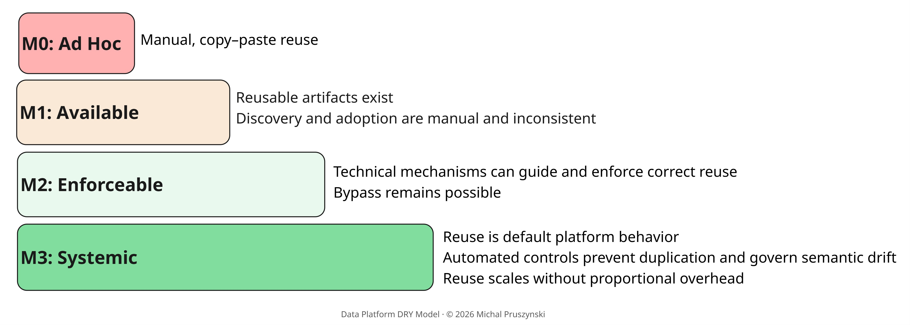

#### Maturity Assessment Scope

Maturity should be evaluated using the following scope rules:

- **Per Quality Attribute**: Maturity Levels are defined independently for each DRY Quality Attribute.
- **Per DRY layer and interface type**: Assessment uses only the quality attributes relevant to the interfaces that implement a given layer, and each interface type within that layer is assessed separately.

<table style="width:100%; table-layout:fixed">
  <colgroup>
    <col style="width:4%"/>
    <col style="width:18%"/>
    <col style="width:24%"/>
    <col style="width:54%"/>
  </colgroup>
  <thead>
    <tr>
      <th width="4%">#</th>
      <th width="18%">Quality Attribute</th>
      <th width="24%">Group / Subgroup</th>
      <th width="54%">Maturity Levels</th>
    </tr>
  </thead>
  <tbody>
    <tr>
      <td align="center">1</td>
      <td><strong>Reusability</strong></td>
      <td rowspan="4" align="center">Engineering Enablement /<br>Reusability Mechanisms</td>
      <td><strong>M0:</strong> No native reuse<br><strong>M1:</strong> Pattern-based, informal reuse<br><strong>M2:</strong> Reusable components with explicit references<br><strong>M3:</strong> First-class reusable constructs</td>
    </tr>
    <tr>
      <td align="center">2</td>
      <td><strong>Abstraction</strong></td>
      <td><strong>M0:</strong> Inline complexity<br><strong>M1:</strong> Partial abstractions<br><strong>M2:</strong> Clear interfaces enforced<br><strong>M3:</strong> Standardized abstraction layers</td>
    </tr>
    <tr>
      <td align="center">3</td>
      <td><strong>Parametrization</strong></td>
      <td><strong>M0:</strong> Hardcoded logic<br><strong>M1:</strong> Manually supplied parameters<br><strong>M2:</strong> Validated and constrained configs<br><strong>M3:</strong> Policy-driven config</td>
    </tr>
    <tr>
      <td align="center">4</td>
      <td><strong>Composability</strong></td>
      <td><strong>M0:</strong> Monolithic logic<br><strong>M1:</strong> Partial composition<br><strong>M2:</strong> Modular composition<br><strong>M3:</strong> Ecosystem of composable units</td>
    </tr>
    <tr>
      <td align="center">5</td>
      <td><strong>Structure &amp; Modularity</strong></td>
      <td rowspan="4" align="center">Engineering Enablement /<br>Engineering Quality &amp; Maintainability</td>
      <td><strong>M0:</strong> Flat scripts<br><strong>M1:</strong> Logical grouping<br><strong>M2:</strong> Strong module boundaries<br><strong>M3:</strong> Domain-aligned modular arch.</td>
    </tr>
    <tr>
      <td align="center">6</td>
      <td><strong>Testability</strong></td>
      <td><strong>M0:</strong> No tests<br><strong>M1:</strong> Manual testing<br><strong>M2:</strong> Automated tests run in CI<br><strong>M3:</strong> Automated tests protect correctness and gate promotion</td>
    </tr>
    <tr>
      <td align="center">7</td>
      <td><strong>Portability</strong></td>
      <td><strong>M0:</strong> Platform-locked (rewrites needed)<br><strong>M1:</strong> Minor refactors needed<br><strong>M2:</strong> Multi-platform ready<br><strong>M3:</strong> Platform-agnostic by design</td>
    </tr>
    <tr>
      <td align="center">8</td>
      <td><strong>Execution Efficiency &amp; Scalability</strong></td>
      <td><strong>M0:</strong> Structural execution inefficiencies<br><strong>M1:</strong> Suboptimal execution<br><strong>M2:</strong> Clean engine/optimizer integration<br><strong>M3:</strong> Execution efficiency stable at scale</td>
    </tr>
    <tr>
      <td align="center">9</td>
      <td><strong>Reuse Enforceability</strong></td>
      <td align="center">Engineering Enablement /<br>Reuse Enforceability Mechanisms</td>
      <td><strong>M0:</strong> No enforcement; duplication is the default<br><strong>M1:</strong> Reuse encouraged through guidance and best practices<br><strong>M2:</strong> Enforced interfaces exist; reuse remains optional<br><strong>M3:</strong> Structural enforcement; reuse is the default path; platform or CI/CD controls use artifact interfaces and metadata to detect high-confidence duplication and route it to required review or exception approval</td>
    </tr>
    <tr>
      <td align="center">10</td>
      <td><strong>Versioning and Lifecycle Management</strong></td>
      <td rowspan="3" align="center">Governance &amp; Operability</td>
      <td><strong>M0:</strong> Manual changes<br><strong>M1:</strong> Version control only<br><strong>M2:</strong> CI/CD enforced<br><strong>M3:</strong> Consumer-aware evolution prevents breaking changes and semantic forks</td>
    </tr>
    <tr>
      <td align="center">11</td>
      <td><strong>Discoverability &amp; Metadata Visibility</strong></td>
      <td><strong>M0:</strong> Tribal knowledge<br><strong>M1:</strong> Basic documentation<br><strong>M2:</strong> Catalog + lineage<br><strong>M3:</strong> Contextual discovery at design and consumption time</td>
    </tr>
    <tr>
      <td align="center">12</td>
      <td><strong>Service Exposure Capability</strong></td>
      <td><strong>M0:</strong> Not exposed<br><strong>M1:</strong> Ad-hoc, tool-specific exposure<br><strong>M2:</strong> Standardized service layer<br><strong>M3:</strong> Productized, governed consumption interfaces</td>
    </tr>
    <tr>
      <td align="center">13</td>
      <td><strong>Semantic Alignment</strong></td>
      <td align="center">Organizational Semantic Alignment</td>
      <td><strong>M0:</strong> Team-specific meaning<br><strong>M1:</strong> Shared definitions exist, reuse is optional<br><strong>M2:</strong> Enforceable semantics, adoption is optional<br><strong>M3:</strong> Mandatory semantic contracts for Tier-1 use cases (exceptions require approval)</td>
    </tr>
  </tbody>
</table>

Companion references provide the detailed evaluation vocabulary: [DRY Operational Maturity](../model-docs/04-operational-maturity-assessment.md), including [worked-example maturity scorecards](../model-docs/04-operational-maturity-assessment.md#worked-example-revenue-platform-maturity-scorecards).

#### Interpreting DRY Maturity

The purpose of this Model is to surface bottlenecks - the specific capabilities whose absence constrains reuse propagation. The binding constraint is the lowest-maturity interface, not the average across them. An organization may have M3 maturity for callable logic: versioned macros, enforced through CI/CD, while queryable dataset maturity within the same layer sits at M0 because transformation models are ungoverned and bypassed. The layer-level assessment blends these into a misleading middle score; the failure pattern becomes invisible.

Maturity results should be interpreted using the following rules:

- **Do not infer maturity from tooling**: Modern tools do not prove operational maturity.
- **Look for constraints, not averages**: Identify the specific interface or capability blocking reuse propagation.
- **A single missing capability can break reuse**: Portability, execution efficiency, or discoverability gaps can prevent otherwise well-designed artifacts from being adopted.
- **Calibrate by asset criticality**: Target maturity thresholds are not uniform. For example, M3 Semantic Alignment is a justified requirement for business-critical metrics; applying the same bar to domain-local exploratory assets is over-engineering. The certified population that warrants M3 enforcement should be intentionally small: observe broadly, enforce narrowly.


#### Typical DRY Maturity Profiles

<table style="width:100%; table-layout:auto;">
  <colgroup>
    <col style="width:10%">
    <col style="width:50%">
    <col style="width:11%">
    <col style="width:17%">
    <col style="width:12%">
  </colgroup>
  <thead>
    <tr>
      <th>Pattern</th>
      <th style="min-width:440px; white-space: nowrap;">Typical Maturity Profile</th>
      <th>Weakest Constraint</th>
      <th>What It Looks Like</th>
      <th>Systemic Impact</th>
    </tr>
  </thead>
  <tbody>
    <tr>
      <td><strong>Modern Stack, Voluntary Reuse</strong></td>
      <td style="min-width:440px; white-space: nowrap;">Reusability&nbsp;M1-M2<br>Discovery&nbsp;&amp;&nbsp;Metadata&nbsp;M1-M2<br>Reuse&nbsp;Enforceability&nbsp;M0-M1</td>
      <td>Reuse Enforceability</td>
      <td>Tools such as dbt and catalogs exist, but shared models, macros, datasets, or metrics can be bypassed without detection or review.</td>
      <td>Reuse remains optional; duplicate implementations multiply, and the platform cannot tell which version consumers use.</td>
    </tr>
    <tr>
      <td><strong>Good Tools, Chaotic Process</strong></td>
      <td style="min-width:440px; white-space: nowrap;">Reusability&nbsp;M2–M3<br>Reuse&nbsp;Enforceability&nbsp;M2<br>Lifecycle&nbsp;Mgmt&nbsp;M0-M1</td>
      <td>Versioning & Lifecycle Mgmt</td>
      <td>Duplication is routed to review, but artifact evolution is poorly governed and consumers defensively fork.</td>
      <td>Trust in shared assets declines over time.</td>
    </tr>
    <tr>
      <td><strong>Reusable Code, Inconsistent Meaning</strong></td>
      <td style="min-width:440px; white-space: nowrap;">Reusability&nbsp;M3<br>Testability&nbsp;M2-M3<br>Semantic&nbsp;Alignment&nbsp;M0-M1</td>
      <td>Semantic Alignment</td>
      <td>Pipelines are modular, reusable, and tested, but teams define concepts such as revenue, active customer, or completed order differently.</td>
      <td>Clean implementations produce conflicting KPIs, reconciliation cycles, and lower trust in reporting.</td>
    </tr>
    <tr>
      <td><strong>Governed but Hard to Consume</strong></td>
      <td style="min-width:440px; white-space: nowrap;">Reuse&nbsp;Enforceability&nbsp;M2-M3<br>Semantic&nbsp;Alignment&nbsp;M2-M3<br>Service&nbsp;Exposure&nbsp;Cap.&nbsp;M0-M1</td>
      <td>Service Exposure Capability</td>
      <td>Certified assets exist, but they are not exposed through standardized consumption interfaces; teams use direct tables, one-off extracts, or local workarounds.</td>
      <td>Governance intent erodes as certified assets are bypassed, undermining reuse, lineage, and policy enforcement.</td>
    </tr>
  </tbody>
</table>

### Output of the Evaluation Phase
Structural gaps and platform priorities are the output of Phase I. They identify which reuse weaknesses require attention and where to invest first, such as missing lifecycle controls, weak discoverability, duplicated logic, insufficient semantic enforcement, or lack of consumption visibility

--- 

## 4. The Data Platform DRY Model - Phase II: Operationalization
## How to Measure and Enforce Reuse at Scale

A platform can support reuse by design and still fail to achieve it in practice.

At scale, DRY becomes an enforcement problem.

To make reuse work, organizations must move beyond defining reusable artifacts, interfaces, and layers, to answering a more difficult set of questions:
- Which definitions and artifacts are actually reused?
- Where is logic being reimplemented instead of resolved to a canonical artifact?
- How do we ensure shared artifacts evolve without breaking their consumers?
- How do we prevent incompatible changes or duplicate implementations before they reach production?

Answering these requires operational capabilities that make reuse observable, measurable, and enforceable across the platform.

Operationalization combines a control plane (artifact registry), enforcement mechanisms (CI/CD), and measurement through structural signals and behavioral signals.

--- 

### 4.1. The Missing Control Plane For Reuse Measurement
### What exists and how it is used

**Model navigation map**<br> 
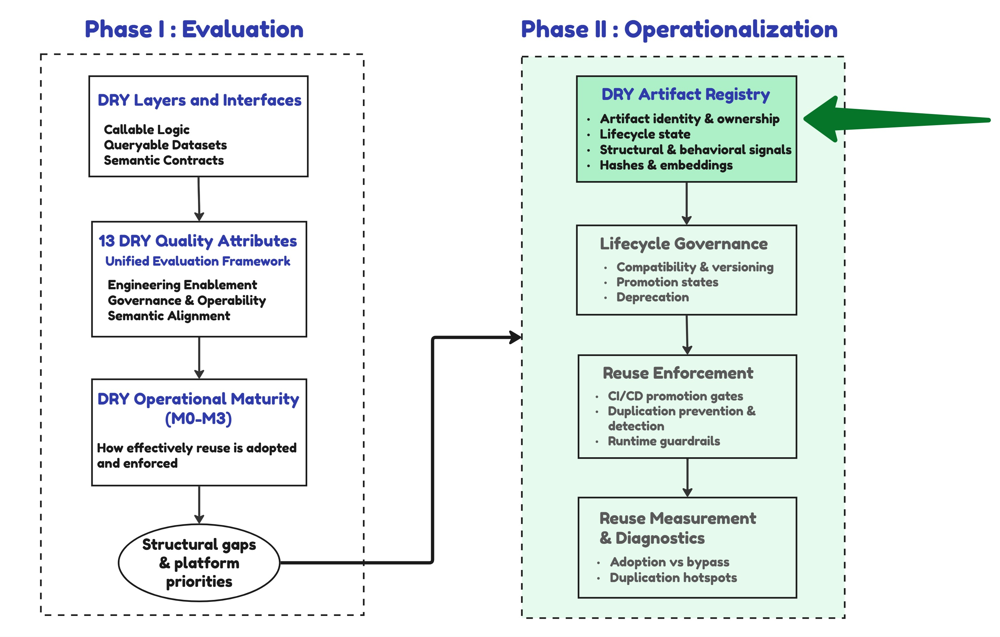

Many organizations already maintain shared "ETL" libraries, reusable transformation models, canonical datasets, and semantic definitions. **Yet these assets remain fragmented across repositories, package registries, warehouse schemas, and BI tools.** As a result, there is no consistent way to understand what is intended to be shared across domains, what is duplicated, and what is actually used.

What is missing is a control plane that makes these artifacts visible, comparable, and governable within a single reuse model.

### DRY Artifact Registry

The DRY Artifact Registry is best treated as an advanced operating pattern for a reuse governance control plane. It is **a logical metadata index over existing platform components**, such as transformation frameworks, catalogs, lineage systems, and warehouse signals, not a new system category or universal system of record. It is *logical* because each artifact's identity is independent of its physical implementations. The registry is lightweight at its core - a thin deployed store with a publishing and observation API, but the work around it is not. The connectors, identity normalization, and attribution that feed it are real engineering. While these components are widely used individually, integrating them into a coherent reuse control plane is still an emerging practice and should be adopted incrementally as a reference architecture. Leading catalog and warehouse vendors are already converging toward governed metric and semantic-model registration, and frameworks such as dbt Mesh add governed model access and cross-project references for the queryable dataset interface. These advances each address a single interface or vendor. The Model generalizes across all three reuse interfaces: callable logic, queryable datasets, and semantic contracts - as **a vendor-neutral target architecture**.

The DRY Artifact Registry tracks whether datasets, transformation logic, and semantic contracts represent canonical, governed definitions: which artifact is canonical for a concept, what its lifecycle state is, and who is bypassing it. **This sets it apart from adjacent tooling:**

- Data observability platforms monitor data quality: anomalies, schema drift, freshness, and pipeline reliability - that is, whether shared datasets are operationally reliable.
- Data catalogs answer what data exists, its lineage, and who owns it. The Registry treats them as a signal source and adds a reuse-governance overlay.

At its core, the registry is a minimal reuse-control index. 
**It stores only the information required to understand and control reuse:**
- **Artifact Identity**: a stable, unique logical identifier (namespace, logical name, interface type, and version)
- **Entry Role**: whether the entry is a reusable artifact (producer) or an observed consumer (e.g. a dashboard); the governance attributes below apply to artifact entries only
- **Reuse Intent**: enterprise-wide canonical | shared utility | domain-scoped canonical; not applicable to observed local or consumer entries
- **Registration Source**: declared | observed 
- **Ownership Domain**: the team or domain accountable for governance, lifecycle, and change approvals
- **Lifecycle State**: shared | certified | deprecated | retired
- **Interface Type**: callable logic | queryable dataset | semantic contract
- **Implementation Bindings**: the physical objects (warehouse tables, transformation models, metrics, code packages) that realize the logical identity, plus the key for attributing behavioral signals to it
- **Declared Dependencies**: upstream artifacts referenced by the artifact, resolved to logical identities for impact analysis
- **Derived Structural Signals**: duplication candidates and dependency edges derived from structural analysis
- **Observed Behavioral Signals**: identified consumer-to-artifact usage edges, plus adoption and bypass aggregates, derived from behavioral feeds

**Each reusable artifact must have a stable logical identity independent of physical implementation**, because the same definition is often realized in multiple warehouses, dialects, or layers (e.g., a transformation model and its materialized table). The registry links that logical identity to those physical bindings across systems and enriches it with Derived Structural Signals and Observed Behavioral Signals, making reuse measurable across repositories, warehouse objects, and semantic layers. 

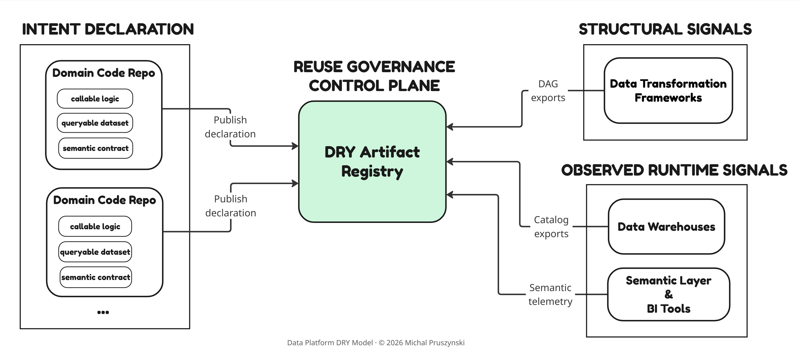

*The Registry is a reuse-governance control plane, not a query-runtime component: it ingests design-time and observed runtime signals but never sits in the query-execution path. It is built on top of existing code repositories, data catalogs, and lineage systems, adding a thin dedicated store for the reuse-governance metadata they do not hold. Its implementation ranges from an `INDEX` file for a single repository to a small relational database and API for cross-repository use, with a vector store only for advanced similarity detection. It is an integration effort, not the purchase of a specific product.*

#### Registry operates through complementary mechanisms:

1. **Intent declaration**  
  Reusable artifacts are declared in source control, typically through one manifest per artifact, and CI/CD workflows use those declarations to populate the registry. These declarations capture reuse intent, ownership, interface type, lifecycle state, and contract references. Because they live alongside code, they are versioned, reviewable, and enforceable through CI/CD.

    ```yaml
    kind: DryArtifact
    metadata:
      fqn: finance.reporting.revenue_events.v1   # stable logical identity
      owner: { team: finance-analytics }
      lifecycle: { state: certified }          
    registry:
      publish: true
      interfaceTypes: [queryable_dataset]
    ```

    See [`templates/`](../templates/) for full per-interface manifests.
2. **Automated Structural Signals**  
  Derived from implementation and dependency metadata: repository scans, transformation DAGs, lineage metadata, and limited warehouse catalog metadata where available. Structural signals identify dependencies, overlap, and reuse candidates. 
3. **Observed Behavioral Signals**  
  Captured from warehouse query history, access metadata, audit logs, and semantic-layer telemetry to surface adoption patterns, bypass behavior, and actively used artifacts that were not intentionally registered. 

Together, these mechanisms make reuse visible and measurable by connecting declared intent, implementation structure, and actual consumption.

The raw feeds shown above (DAG and lineage exports, catalog exports, semantic telemetry, query logs) are processed, not copied. The registry keeps only derived facts keyed to each artifact's logical identity: dependency edges and bindings from structural feeds, and adoption and bypass signals from behavioral feeds.

#### Sources for Reuse Observation

<table>
  <thead>
    <tr>
      <th width="40%">Source</th>
      <th width="30%" align="center">Structural Signals <br> (Design-Time)</th>
      <th width="30%" align="center">Observed Behavioral Signals <br> (Consumption-Time)</th>
    </tr>
  </thead>
  <tbody>
    <tr>
      <td>Data Transformation Frameworks & Lineage Systems</td>
      <td align="center">✅</td>
      <td align="center">❌</td>
    </tr>
    <tr>
      <td>Data Warehouse Catalogs</td>
      <td align="center">⚠️ Partial*</td>
      <td align="center">✅</td>
    </tr>
    <tr>
      <td>Semantic Telemetry</td>
      <td align="center">❌</td>
      <td align="center">✅</td>
    </tr>
  </tbody>
</table>

**Data warehouse catalogs provide limited lineage and dependency information inferred from view definitions, UDFs, and system metadata. Available scope depends on the warehouse platform. Where OpenLineage is adopted, transformation frameworks such as dbt and SQLMesh expose lineage natively.*

This control plane shifts DRY from a best practice to a governable platform property by enabling:

- Visibility: identifying governed reusable artifacts, owners, lifecycle states, and usage.
- Comparison: surfacing similar implementations, duplicated logic, and reuse candidates.
- Enforcement support: supplying metadata that CI/CD checks use to route review, require exceptions, or warn on likely reimplementation.
- Measurement: tracking reuse adoption, bypass patterns, and duplication trends.

The same registry supports governance for declared reusable artifacts and observation for discovered local implementations. Canonical artifacts are explicitly declared and tagged with their intended reuse scope.

- **Enterprise-wide canonicals** define logic, datasets, or metrics intended for reuse across domains and governed at enterprise scope.
- **Shared utilities** ("DRY in Code") are governed engineering assets, such as merge or ingestion helpers, that reduce repetitive engineering work without defining business meaning. 
- **Domain-scoped canonicals** define reusable artifacts intended for repeated use within a specific domain. They use the same registry model, but with domain ownership, domain-scoped policy, and reuse expectations bounded to that domain.
- **Local implementations** remain observation-only unless explicitly promoted into governed reusable artifacts.

#### Passive Observation Without Publication Overhead

Broad observation is best implemented through passive metadata harvesting from transformation framework manifests, warehouse catalogs, lineage events, semantic-layer telemetry, and repository scanning. These signals make local implementations searchable and comparable without adding publication overhead.

In practice, the observation layer can start with scheduled ingestion of dbt or SQLMesh manifests, warehouse metadata crawlers, and OpenLineage events directly or through metadata catalogs such as DataHub or OpenMetadata. AI-assisted repository scanning can enrich this layer by extracting candidate callable logic, SQL transformations, semantic summaries, signatures, and similarity clusters from domain repositories. These agents should flag candidates for promotion review, not assign lifecycle state automatically.


#### How Teams Actually Reuse Artifacts

The DRY Artifact Registry does not distribute code; it surfaces canonical dependencies, such as a package, shared schema object, or semantic definition, so developers can adopt them instead of re-implementing the logic.

Shared utilities are commonly distributed as versioned packages for dbt or SQLMesh projects, Spark clusters, and managed notebook environments. Reuse therefore occurs through dependency management rather than manual coordination between teams.

Companion implementation references expand these operating patterns: [Artifact Registry Specification](../model-docs/05-artifact-registry-spec.md)

--- 

### 4.2. Lifecycle as a Compatibility Guarantee

**Model navigation map**<br> 
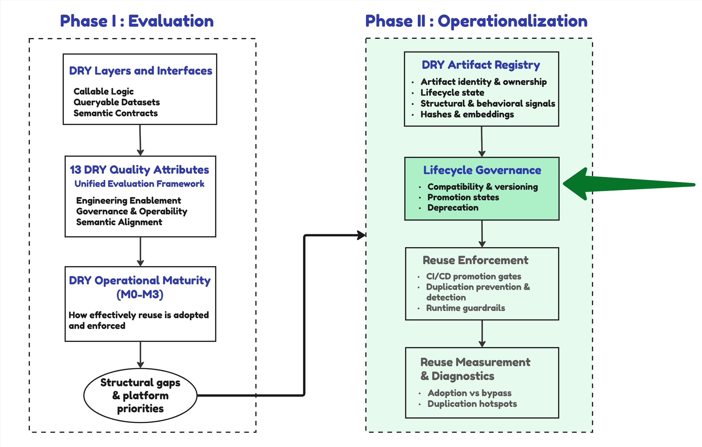

Compatibility reflects whether an artifact can evolve without breaking its consumers. At platform scale, lifecycle turns that compatibility expectation into an enforceable policy: it defines which artifacts may change freely, which expose stable reuse interfaces, which operate as platform contracts, and how consumers are migrated before retirement.

The DRY Artifact Registry does not perform compatibility validation itself. It records the metadata needed to determine which contracts, dependency checks, CI/CD gates, approvals, and runtime guardrails apply to each lifecycle state. Without those structural controls, labels such as "certified" or "canonical" remain descriptive rather than dependable.

#### Lifecycle Progression and State Definitions

| State | Structural Guarantees | Governance Obligations | Authoring-Time Signals | Build-Time Gates | Runtime Guardrails |
| --- | --- | --- | --- | --- | --- |
| Local | None | Team-owned | None | None | None |
| Shared | Stable interface; declared reuse intent | Owner declared; logical identity and versioned surface | Registry-backed reuse candidates surfaced automatically; advisory only | Blocking lifecycle and compatibility checks; high-confidence direct duplicates require review or exception; inferred similarity routes to review | Access guidance toward governed interfaces |
| Certified | Backward compatibility contract; impact analysis | Version policy enforced; change approval required | Registry-backed canonical resolution; high-confidence duplicates flagged at authoring time | Blocking lifecycle, compatibility, and impact-analysis gates; high-confidence direct duplicates require review or exception; inferred similarity routes to review | Access control enforced; consumption guardrails restrict incorrect usage patterns |
| Deprecated | Existing version contract preserved during declared sunset window | Owner declares `deprecated_since`, registered replacement version, `removal_after`, and consumer migration path | Authoring tools warn on new references; migration target surfaced | New adoption blocked; open consumers flagged via registry consumer graph | Existing consumers receive migration signals; new consumption is guided to successor |
| Retired | Immutable historical record and successor link retained | Owner confirms migration or approved exception closure | Authoring tools block new references | Build blocked on any new reference | Runtime use blocked except for approved archival access |

**Lifecycle promotion criteria** require each reusable interface to be defined in a structured form, such as a function signature, schema, or semantic definition. Incompatible interface changes trigger version increments, while dependency and lineage metadata must be published and resolvable for impact analysis. Business-critical assets should be classified for certification before being treated as platform contracts.

Each transition requires an explicit owner and an approval path.

- **Local-to-shared** promotion is declared by the owning team after the artifact has an owner, versioned surface, and stated reuse intent.
- **Shared-to-certified** requires Governance Council approval, which validates compatibility guarantees and confirms that versioning and deprecation policies are in place.
- **Certified-to-deprecated** requires Governance Council approval, a registered replacement, sunset window, and consumer migration plan.
- **Deprecated-to-retired** occurs only after the sunset window closes and open consumer exceptions are resolved or explicitly approved.

Exception requests, such as justified reimplementations instead of canonical adoption, are handled through the reuse enforcement process and tracked in the registry with explicit rationale.

Companion implementation references expand these operating patterns: [Lifecycle and Versioning](../model-docs/06-lifecycle-versioning.md).

--- 

### 4.3. The Reuse Enforcement Model

**Model navigation map**<br> 
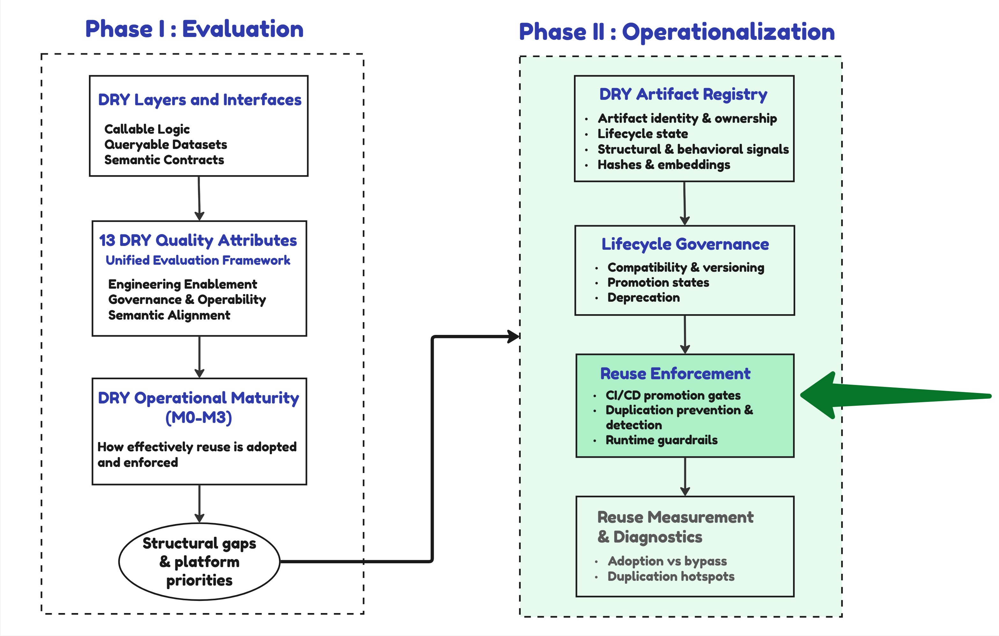

#### 4.3.1. Enforcement Across the Platform Lifecycle

Reuse does not emerge from structure alone, but it must be actively enforced. Without enforcement, teams can bypass intended interfaces, reimplement logic, or introduce divergent definitions. Reuse Enforcement is the operational layer that acts through registry-backed resolution, CI/CD gates, authoring-time signals, and lifecycle policies.

In large-scale data platforms, enforcement operates across the lifecycle of artifacts, from creation and modification to consumption. Different enforcement mechanisms apply at different stages, each addressing distinct failure modes:

- **At build time**, enforcement blocks deterministic lifecycle and compatibility violations and routes suspected duplication to review before it is introduced into the system. This includes duplication signals from AI authoring tools, compatibility checks and CI/CD controls.
- **At runtime**, enforcement shapes how artifacts are consumed, guiding users toward governed interfaces and restricting incorrect usage patterns through mechanisms such as access control and consumption guardrails.
- **At the system level**, enforcement must be calibrated to balance consistency with developer productivity and to respect domain boundaries. Overly strict enforcement introduces friction and leads to shadow implementations.

These mechanisms must operate together as a coordinated system. 

#### 4.3.2. Build-Time Enforcement: CI/CD Gates and Compatibility

The registry metadata defined by lifecycle governance becomes actionable in CI/CD promotion gates. They shift deterministic DRY policy enforcement from post-hoc code review to build-time validation, making governed reuse a structural property of the platform.

#### Structural Reuse Enforcement in CI/CD

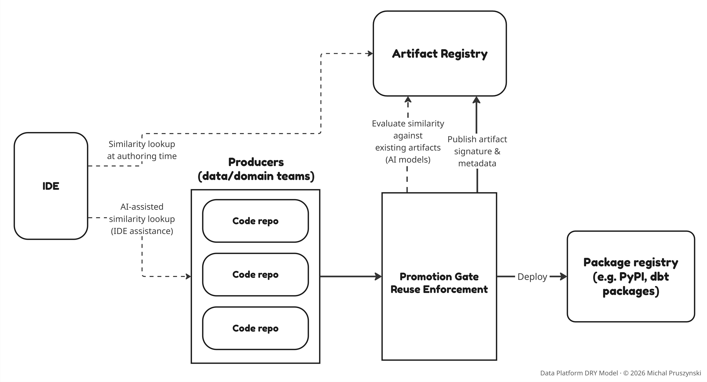

#### Build-Time Enforcement Model
Build-time enforcement applies only to artifacts declared as shared or certified. Within the governed population:
- **Deterministic lifecycle and compatibility checks** may block promotion. 
- **Duplication signals** including high-confidence direct matches, do not block promotion by themselves; they route artifacts to required human review or exception approval, and promotion is blocked only when required review evidence or exception rationale is missing. This distinction is typically implemented through lightweight artifact classification, such as configuration files or directory conventions.

#### Enforcing Compatibility and Versioning
One of the primary barriers to DRY enforcement in enterprise environments is the fear of breaking downstream consumers. Without explicit compatibility governance, teams tend to bypass canonical artifacts to avoid unintended change propagation. Promotion gates must therefore enforce explicit compatibility contracts. Where lineage resolution is available, downstream impact can be evaluated before promotion. 

Version scopes (e.g., `shared.transforms.orders.completed_orders.v1`) define whether a change is backward-compatible or breaking. Breaking changes require adoption of a new version.

Reuse artifact versioning should be distinguished from data contract versioning. Reuse versioning governs the semantic stability of a shared artifact (including transformation logic, grain, and business interpretation), not just its structural interface. Data contract versioning governs the producer-consumer interface, including schema compatibility, reliability expectations, and formal service commitments. A schema-preserving change that alters transformation logic or grain is compatible under a data contract but breaking under reuse versioning; the two version scopes should not be treated as interchangeable.

#### 4.3.3. Duplication Prevention and Detection

**Duplication Detection and Prevention Techniques** *(all detection signals route to review or exception approval and never block promotion by themselves)*
| Technique | Stage | Type | Confidence | Enforcement Role |
| --- | --- | --- | --- | --- |
| AI workspace similarity search (code repositories available to the assistant) | Authoring time | Detection | Low–Medium | Informative only; no enforcement gate |
| Registry-backed canonical resolution (AI coding assistants) | Authoring time | Detection + Prevention | High | Resolves whether a governed canonical exists; routes developer to it, avoiding reimplementation at authoring time |
| Structural fingerprinting (AST) | Build time | Detection | High for direct / near-identical matches | Classifies artifacts for required review or exception approval; does not block promotion by itself |
| Embedding-based similarity | Build time | Detection | Medium | Advisory only; flagged cases route to follow-up review and do not block promotion |
| LLM-based analysis | Build time | Detection | Variable | Advisory only; flagged cases route to follow-up review and do not block promotion |

**Duplication Detection and Prevention Flow**
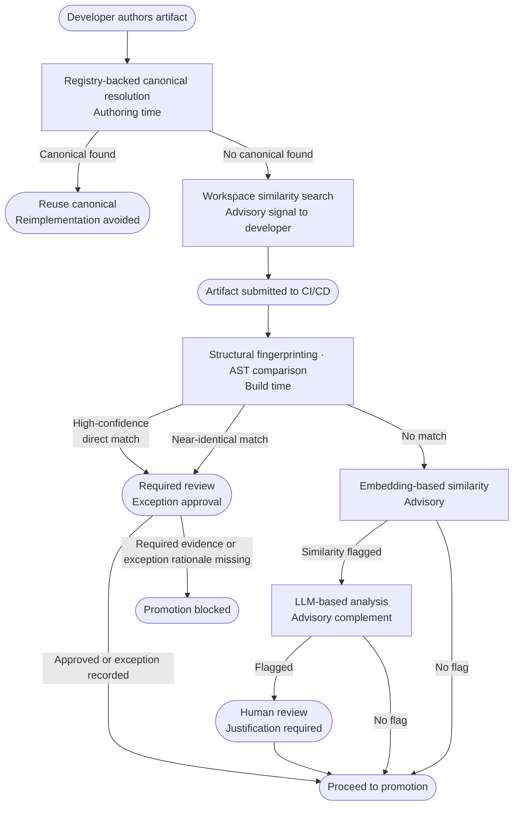

#### Authoring-Time Prevention: AI Coding Assistants and Registry-Backed Resolution

AI coding assistants such as GitHub Copilot and Cursor, and emerging MCP-enabled tooling, change the economics of DRY depending on whether the platform exposes the DRY Artifact Registry as context to those tools.

Without any reuse context, AI assistants are a duplication amplifier. They generate plausible SQL and Python transformations from local file context alone, with no awareness of canonical artifacts that already exist elsewhere in the platform. 
Re-implementing a `completed_orders` transformation or a `net_revenue` calculation becomes cheap, while discovering the canonical version does not. CI/CD gates are reactive: they fire after authoring is complete, meaning duplicated logic is fully written and engineering time spent before a gate can surface it. LLMs can also hallucinate interface contracts, generating plausible but incorrect signatures that silently misuse a governed definition.

The same tools become a reuse accelerator when they can resolve similar logic at authoring time. Each of the two mechanisms below shifts enforcement from CI/CD gates toward authoring time:
- **Workspace-level similarity search.** AI assistants can search across repositories open in the same workspace, surfacing structurally or semantically similar code as a suggestion. This is purely informative: the developer has no visibility into whether a surfaced artifact is a certified canonical definition, or a local implementation never intended for reuse. It detects similarity, not authority.
- **Registry-backed canonical resolution.** When the DRY Artifact Registry is exposed as a first-class context source - via MCP servers or IDE extensions, the assistant resolves *governed* artifacts rather than arbitrary lookalikes, surfacing the certified definition and the correct dependency reference. Authority, lifecycle state, and ownership are preserved end-to-end.

Workspace search reduces accidental re-implementation; registry-backed resolution makes reuse of the canonical artifact the path of lowest friction. In AI-assisted environments, the DRY Artifact Registry is no longer only a governance control plane; it becomes the context substrate that determines whether AI authoring reinforces canonical reuse or fragments it.

#### Build-Time Detection: Structural and Semantic Signals

Build-time duplication detection combines structural and semantic comparison, but enforcement strength depends on signal reliability and artifact type. For semantic contracts, detection applies to declarative definitions such as metric formulas, filters, grain, and naming, rather than to transformation code.

- **Structural fingerprinting.** SQL can be parsed into Abstract Syntax Trees (ASTs) using tools such as SQLGlot and normalized to remove non-semantic differences such as formatting and alias naming; Python transformation logic can use Python’s native AST module. These methods reliably catch copy-paste and near-identical duplication, but they miss semantically equivalent reformulations (the same business logic in a different structure) and cannot guarantee equivalent results across SQL dialects or languages. The reformulations they miss are harder to detect yet often the most consequential, since they drive the cross-domain semantic drift described earlier.
- **Semantic and model-based analysis.** Emerging approaches use **embedding-based similarity** detection to compare candidate logic against canonical artifacts by evaluating their vector similarity. This helps identify business logic expressed through different structures, but is sensitive to code length and how logic is normalized and encoded, and can produce false positives, particularly for short or generic data transformations. Stored vectors are also tied to the embedding model version: upgrading the model invalidates them, so the corpus must be re-embedded before similarity scores are meaningful again. **LLM-based analysis** can complement embedding similarity with deeper semantic reasoning over selected candidates, particularly across languages, but output reliability and model version sensitivity limit it to advisory use. Therefore both approaches should remain advisory signals rather than blocking CI/CD gates. 

Semantic and embedding methods extend detection into the structurally divergent reformulations that structural fingerprinting cannot see. **Neither approach, however, reliably detects arbitrary semantically equivalent rewrites** (e.g., a window function vs. a self-join formulation), since deciding semantic equivalence of arbitrary SQL is undecidable in general.


#### 4.3.4. Runtime Enforcement: Access Control and Consumption Patterns

Runtime enforcement uses access policy to make approved consumption paths the default. By limiting direct access to raw or intermediate datasets, platforms guide consumers toward curated data products exposed through controlled interfaces.

In practice, access policies should apply at both the dataset and semantic interface level: who can query raw tables, and which consumers, such as Tier-1 reporting, regulated use cases, or cross-domain KPI consumers, must use certified definitions.

Access control does not create reuse by itself; it must be paired with discoverability and documentation in catalogs or the DRY Artifact Registry, as well as clear consumption paths, so that using the correct interface is easier than bypassing it.

--- 

### 4.4. Enforcement Calibration and Friction Signals

Enforcement calibration begins with scope: the governed, certified population should be intentionally small - limited to assets whose inconsistency has direct organizational impact. Certified, business-critical assets receive the strongest controls; shared artifacts receive controls appropriate to their declared scope; and local implementations remain observation-only. **The registry observes broadly; it enforces narrowly.**

Every duplication check, compatibility gate, or certification requirement consumes **coordination bandwidth** from platform engineering and data teams. Strict controls increase coupling, slow delivery, and push teams toward shadow implementations. This creates an economic trade-off: governance is justified only where the cost of inconsistency exceeds the coordination overhead.

In practice, reuse enforcement often encounters friction. Delivery pressure leads to **"temporary" exceptions, shared artifacts are forked to avoid upstream change**, and minor variations bypass duplication checks. These behaviors should be treated as signals of architectural gaps rather than policy violations. They often reflect incomplete enforcement coverage, unclear lifecycle guarantees, or controls that create more friction than value. Addressing these issues turns DRY from a governance initiative into a platform capability and prevents governance from devolving into bureaucracy.

Companion implementation references expand these operating patterns: [CI/CD Enforcement](../model-docs/07-reuse-enforcement.md).

--- 

### 4.5. Reuse Measurement

**Model navigation map**<br> 
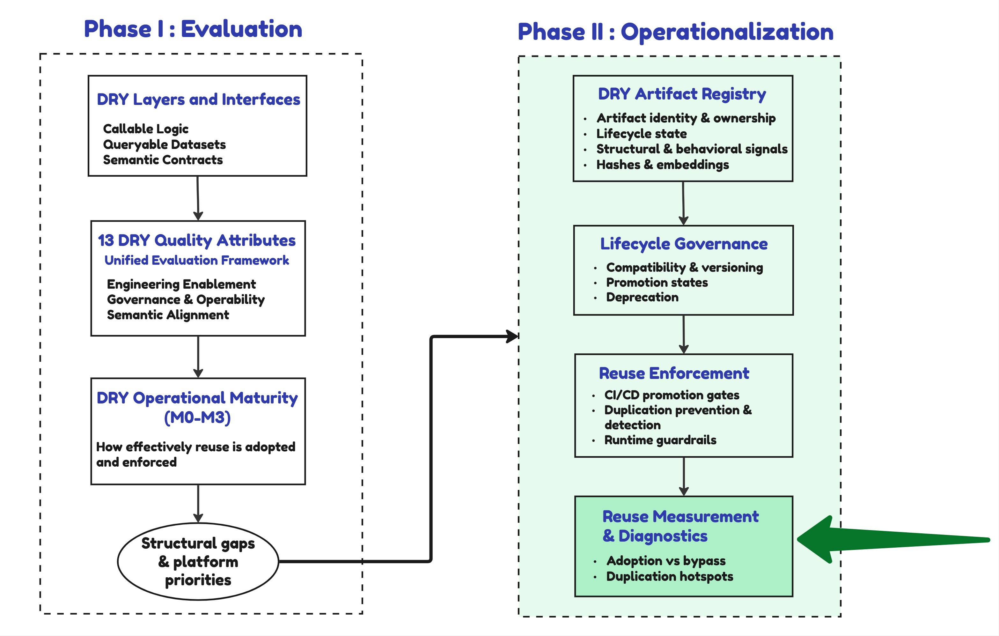

Making DRY observable requires measurement at two complementary levels:

- Structural reuse, reflected in how reusable artifacts are declared, distributed across layers, and referenced by the platform downstream ETL/ELT pipelines.
- Behavioral reuse, reflected in whether runtime consumers adopt approved interfaces or bypass them by re-implementing logic in queries, dashboards, or applications.

#### Measuring Structural Reuse

With the measurement foundation in place, teams assess **portfolio-level structural balance** by examining how reusable artifacts are distributed across DRY layers and interfaces.

| Indicator | What It Measures | Primary Signal Source |
| --- | --- | --- |
| Certified asset count by layer and interface | How many artifacts are governed or certified across layers and interfaces. Team-level counts make shared-asset contributions visible and create organizational incentives | Artifact registry |
| Structural reuse concentration | Percentage of downstream dependencies served by the top N certified assets | Registry plus lineage dependency graph |
| Similarity cluster count by DRY layer | Number of artifact groups per DRY layer where structural fingerprinting detects high similarity, flagging candidates for consolidation or canonical promotion | Registry structural fingerprints plus lineage |
| Cross-layer propagation gap | Certified upstream datasets are reused in ETL/ELT but not exposed through corresponding governed downstream interfaces | Registry plus lineage dependency graph |
| Ungoverned parallel definition count | Number of observed artifacts implementing the same concept outside governed paths | Registry observation plus structural similarity signals |

Interpreting these indicators requires moving from measurement signals to reuse diagnosis:

- Attribute-level divergence: Column-level lineage extends duplication detection below the dataset level, identifying semantically divergent fields before they propagate into metrics or semantic models. Dataset-level cluster analysis may surface multiple "revenue" datasets across domains; column-level lineage can reveal that `revenue_net` is computed differently in several of them, each feeding separate downstream consumers.
- Dependency diagnosis: Dependency graphs and lineage reveal where similar artifacts cluster, where canonical logic is bypassed, and where reuse fails to propagate across layers.
- Cluster interpretation: Similarity clusters are not automatically failures. Some reflect legitimate domain-local variation; others indicate uncontrolled semantic forks. Cluster analysis determines whether to consolidate, promote to canonical status, or explicitly tolerate divergence.

Together, these indicators surface structural imbalance, not just local optimization opportunities. Strong reuse in one DRY layer cannot compensate for weakness in another, so DRY maturity must be assessed per layer and per interface.

#### Measuring Reuse Adoption at Consumption Time (Behavioral Reuse)
A well-balanced DRY portfolio does not guarantee adoption, because consumers may still bypass shared assets. Detecting this requires extending measurement to consumption-time behavioral signals. 

Adoption is typically inferred rather than explicitly registered. Measurement therefore combines consumption-time signals from **semantic runtime telemetry, attributed warehouse query logs, and BI metadata APIs** to determine whether consumers use governed interfaces or bypass them through custom SQL, dashboard-local calculations, or parallel datasets. Semantic telemetry provides the strongest signal when consumption passes through a semantic layer, while attributed query logs and BI metadata help detect usage outside the semantic layer. Because attribution quality varies by tagging, service identity, and dashboard ownership metadata, adoption metrics should report coverage alongside adoption rates.

| Indicator | What It Measures | Primary Signal Source |
| --- | --- | --- |
| Governed interface adoption rate | Percentage of attributed production consumption that uses certified semantic definitions, canonical datasets, or other controlled interfaces | Registry plus semantic runtime telemetry, BI metadata APIs, or attributed warehouse query logs |
| Consumer coverage rate | Percentage of in-scope consumer groups, dashboards, applications, or workloads with enough attribution metadata to classify governed versus non-governed consumption | Service identities, workload tags, BI ownership metadata, and warehouse query logs |
| Bypass pattern distribution | Breakdown of attributed non-governed consumption by consumer group, tool, and bypass pattern, such as custom SQL, dashboard-local calculations, or parallel datasets. | Registry comparison plus BI metadata APIs and warehouse query logs |

Behavioral adoption measurement should follow structural visibility: first identify governed and parallel artifacts, then measure whether production consumption uses the governed interfaces or bypasses them.

Companion implementation references expand these operating patterns: [Adoption Metrics](../model-docs/08-adoption-metrics.md).

--- 
 
### 4.6. A Pragmatic, Staged Adoption Path

DRY governance should be introduced incrementally, demonstrating the value of shared assets before attempting platform-wide enforcement.

#### Staged Adoption
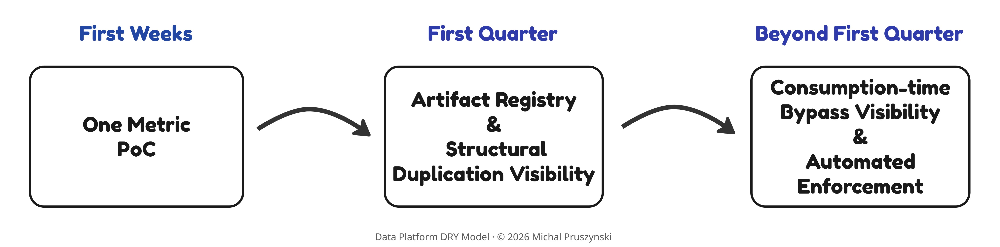


#### Stage 1 - First weeks: One problem, one canonical definition, one adoption baseline

1. Shortlist 3-5 business-critical metrics that appear in executive reporting, feed cross-team decisions, and have known definition disagreements. From these, choose the one with the clearest conflict, an available business sponsor, and a small, known consumer set. 

2. Establish a single shared definition for that metric using the strongest available mechanism: a semantic runtime where one exists, a governed (blessed) dataset, or a transformation model as the temporary contract otherwise. Document it explicitly, then measure adoption for the known consumers identified in the problem statement through manual inspection of those consumers' queries, dashboards, and lineage references - confirming whether they reference the canonical definition. This is a scoped, manual check, not the systematic query-log attribution introduced in Stage 3. Stage 1 does not prevent bypass as no enforcement mechanism exists yet. Visibility is scoped to this one definition and its known consumers; unknown bypass paths across the broader warehouse are not visible at this stage.

3. Document the current reconciliation cost as the before baseline. Once adoption is confirmed for the known consumers, an initial estimate of cost reduction is already available for this metric. This baseline becomes the business case.

#### Stage 2 - First quarter: Structural visibility across layers

1. Introduce a minimal DRY Artifact Registry. Start by formally registering the Stage 1 metric as the first governed artifact - declaring ownership, lifecycle state, and interface type. Add other, already certified or explicitly shared artifacts. If you want to register artifacts that exist in a single code repository, you can start just from building an INDEX.md snapshot in the registry folder. If your artifacts span across many repositories, introduce a lightweight relational store and a simple REST API. Graph databases or vector stores are not required at this stage.

2. Integrate dependency graphs from transformation frameworks, such as dbt DAGs and SQLMesh dependency graphs, and use warehouse catalog metadata as a supplemental source for deployed-object dependencies where source-controlled lineage is incomplete. Run the first structural assessment by comparing these signals with registered shared artifacts. Measure distribution of reusable artifacts by layer and interface type, how widely they are referenced, and where duplication hotspots exist. This extends the Stage 1 structural baseline: these graphs surface whether unknown parallel pipeline implementations of the same metric exist alongside the canonical definition. Whether consumers bypass the canonical definition at consumption time is not visible at this stage; that requires the behavioral signals introduced in Stage 3.


#### Stage 3 - Beyond the first quarter: Behavioral observability and automated enforcement in CI/CD

1. Extend measurement to behavioral signals: semantic telemetry where a runtime exists, query log attribution where it does not. Note that query log attribution requires service identities or workload tags to be established as a prerequisite. This tagging discipline can represent significant platform investment in large organizations.

2. Integrate duplication detection into promotion workflows - structural AST comparison first, embedding-based semantic similarity as an advisory review signal once registry confidence is established. Before enabling blocking gates, establish the governance authority that owns promotion and exception decisions - the body accountable for approving `shared` to `certified` transitions and for adjudicating duplication exceptions. Differentiate enforcement by lifecycle state: only shared and certified artifacts trigger blocking lifecycle and compatibility gates, while duplication signals, including high-confidence direct matches, are routed to lightweight review or an exception path. Surface reuse metrics at a leadership level via a DRY Diagnostic Dashboard, creating visible organizational incentives for teams contributing certified shared assets.

The governing principle across all three stages: make reuse visible before making it mandatory. At every stage, ask whether reuse is visibly easier than duplication for the teams doing the work. If not, the next investment is in discoverability, lifecycle guarantees, or tooling, not in tightening controls.

--- 

### When Duplication Is Justified

Not all duplication reflects a failure of reuse. Legitimate plurality takes two forms: multiple valid *definitions* of the same business concept across domains or analytical contexts, and multiple *materializations or implementations* of a single canonical definition. The goal of DRY is not to enforce one global definition or one physical asset, but to ensure each definition or code utility is explicit, governed, and reused within its intended scope. Effective platforms distinguish uncontrolled duplication from intentional plurality, where the alternative definitions or materializations are clearly named, owned, and contextually bounded.

Common categories of justified duplication include:

- **Domain-local scope**: a definition is intentionally canonical within a single domain but not promoted for cross-domain reuse, either because the concept has no cross-domain relevance, or because the domain owns it within its data product boundary. It stays governed and domain-scoped unless explicitly promoted.
- **Performance materialization**: separate physical assets bound to a *single canonical logical definition* are maintained for different grain, partition strategy, or refresh frequency, where one materialized dataset cannot serve all consumers' operational requirements without unacceptable latency or cost. These are registered as Implementation Bindings (DRY Artifact Registry) of one logical artifact, not as separate definitions.
- **Tool-bound consumption**: a vendor runtime or external warehouse cannot consume a shared artifact without reimplementation due to packaging, dialect, or API constraints, producing a second implementation of the *same* logical definition. This surfaces as a portability gap during evaluation (Quality Attributes) and should be tracked explicitly, as a platform-improvement backlog item or an accepted architectural trade-off with documented rationale.
- **Regulatory definition divergence**: the same business concept is defined differently across jurisdictions by regulation, such as revenue recognition under IFRS vs. US GAAP, requiring separate governed definitions rather than a single canonical one.
- **Lifecycle transition**: a local fork is maintained temporarily during a deprecation window while consumers migrate to the canonical artifact; the fork carries an explicit sunset date.

In each case, the governance obligation is the same: the duplication is named, owned, and registered at its intended scope with explicit rationale. How it is registered depends on what is duplicated: duplicated definitions (domain-local scope, regulatory divergence) register as separate governed artifacts with bounded scope; alternative materializations or implementations of one definition (performance materialization, tool-bound consumption) register as Implementation Bindings of one canonical artifact. Undocumented parallel implementations are uncontrolled duplication regardless of their origin. The distinction is not whether duplication exists, but whether it is visible and intentional.

--- 

### Model Applicability
The Data Platform DRY Model is:
- **Topology-neutral**: it can be applied to a centralized platform, a federated domain ownership model, or a domain-oriented data product topology. In federated and domain-oriented environments, Quality Attributes and Maturity Levels should be assessed at the relevant ownership boundary: per domain and per shared platform capability. The Model does not require central ownership of every reusable artifact.
- **Execution-mode neutral**: reusable logic and semantic definitions may be implemented in batch pipelines, streaming pipelines, or hybrid architectures. The model focuses on reuse interfaces and reuse governance, not the processing mode.

--- 

### Contribution
Many elements of the Data Platform DRY Model, such as consumption interfaces, data contracts, lifecycle management, metadata cataloging, CI/CD controls, access governance, and usage telemetry are **general data-platform architecture concerns**, applicable beyond reuse. The contribution is in applying these mechanisms **through a reuse-governance lens**: **assembling and adapting them into a coherent framework** for making reuse failure visible, assessable, and enforceable at scale.

The prerequisites and known challenges for these mechanisms are documented in [Known implementation risks and open questions](../model-docs/00-overview.md#known-implementation-risks-and-open-questions).

--- 

## Summary and Practical Applications

The goal is not to eliminate all duplication. The goal is to make divergence intentional, visible, and economically rational. DRY does not fail because teams lack discipline or modern tools. It fails because reuse is rarely treated as a structural property of the platform.

The Data Platform DRY Model provides the things practitioners consistently lack:
- The 13 DRY Quality Attributes and M0–M3 Maturity Levels give a common language for assessing reuse - making it possible to compare platforms, identify bottlenecks, and define target states without relying on intuition.
- The DRY Artifact Registry makes reuse visible for the first time: what reusable artifacts exist, who owns them, where they are bypassed, and where duplication has accumulated. The registry observes broadly; it enforces narrowly.
- Lifecycle governance and CI/CD enforcement close the loop: turning visibility into accountability and making reuse the default path rather than the exception.

**Common practical applications include**:
- Platform and tool evaluation: score an existing platform (or a candidate data warehouse, transformation framework, or semantic layer) against the Quality Attributes and their Maturity Levels.
- Operationalizing reuse governance: establish the operating model for reuse (defined ownership, lifecycle states, and enforcement policy), making reuse a governed discipline of the platform.
- AI-assisted authoring: expose the DRY Artifact Registry as a context source to AI coding assistants, so discovering a canonical artifact is easier than re-implementing one, moving reuse enforcement upstream to authoring time.
- Duplication detection in CI/CD: shift it from post-hoc review to a build-time platform property.
- Reuse measurement baseline: establish structural and behavioral reuse metrics across layers and interfaces, turning "we have a canonical definition" into "we can prove it is actually used" and making cost reductions visible to leadership.

The model applies whether you are building a new platform, governing an existing one, or evaluating how a specific tool fits into your reuse architecture.

Implemented pragmatically, DRY stops being a coordination tax and becomes a structural advantage: changes propagate safely, semantics remain consistent, and data platforms scale without proportional increases in cost or complexity.

---

*Author's note: This publication reflects my independent professional perspective. It is not written on behalf of, endorsed by, or based on the internal architecture of any current or former employer, client, or vendor. Scenarios, diagrams, and reference architectures are illustrative and should not be interpreted as describing a specific company's implementation. All text and diagrams in this publication are my own original work.*

