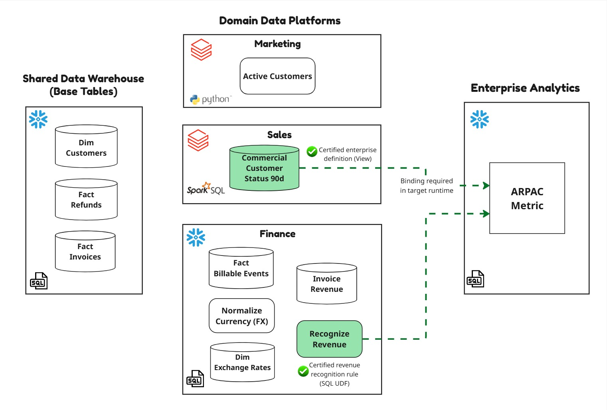
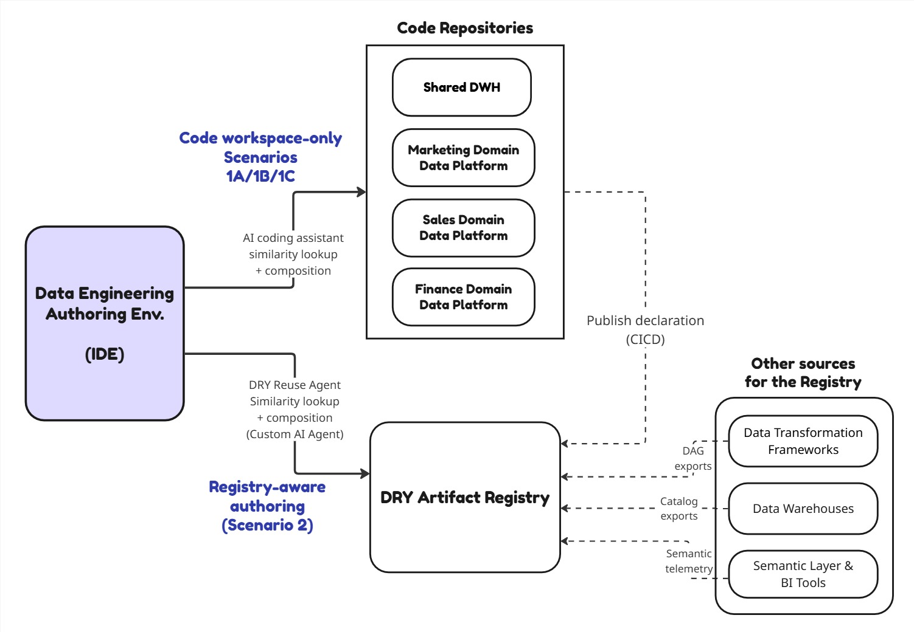
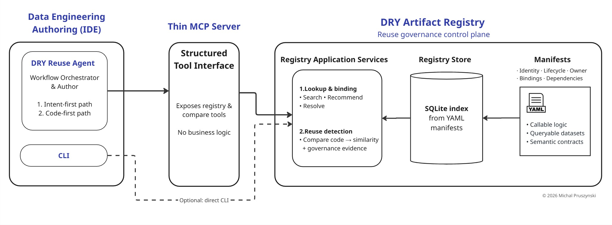

# AI-assisted authoring for governed reuse in data platforms

*A proof of concept implementing the DRY Artifact Registry for AI-assisted authoring — what context is missing, and what changes when you add it.*

*Version 0.1 (draft) · August 2026*

---

## 1. An analytics engineer is asked for one number

An analytics engineer is handed a familiar task: build **ARPAC: Average Revenue per Active Customer** (trailing 90 days) for an executive dashboard. 

They open their IDE, describe the metric to an AI coding assistant and let it draft the SQL.

In this use case ARPAC does not exist yet as a governed metric. But its parts do. **Net recognized revenue** and **active customers** are among the most reused concepts in any company, defined and redefined across warehouses, notebooks, and BI tools. Each typically has several valid but different definitions: some intentionally scoped to a domain like Marketing or Finance rather than approved company-wide, others legacy or retired code still sitting in repositories or warehouses where an AI coding assistant can mistake them for valid reuse candidates.

So the real task is not to write ARPAC from scratch. It is "**compose ARPAC for executive reporting from the relevant functions or datasets already approved as company-wide canonicals**." That is a reuse problem, and it is exactly where AI-assisted authoring is supposed to help.

---

This article reports a small proof of concept that tested how well an AI coding assistant does the job. The result is the interesting part: when it could use only **IDE workspace code**, **none of the models produced the correct governed metric**, even when that codebase was fully exposed. More code improved partial correctness, but it neither identified the governed definition the metric required nor resolved the missing runtime binding for it.

---

## 2. The test: one metric, three models, four setups
The diagram below maps the ARPAC use case across the enterprise data platform, highlighting the artifacts exposed for AI coding assistant and the two certified enterprise definitions (marked green) that the governed metric should reuse. Additionally it has been assumed that the company uses different tools/enignes to test how AI models will handle cross-platform bindings. Snowflake and Databricks have been chosen as examples.

The PoC runs the same ARPAC task through four authoring setups and three current models: **GPT-5.5**, **Claude Sonnet 4.6**, and **Claude Opus 4.8**. In this Poc the GitHub Copilot was used with VS Code IDE. 

This PoC runs the same task under two main setups:
1. **IDE workspace code only** is exposed to the AI assistant: Scenarios 1A/1B/1C
2. **DRY Artifact Registry** is exposed to the AI assistant: Scenario 2

| Authoring setup | Scenario No. | What the AI coding assistant can use |
|---|---|---|
| **IDE workspace code** base tables | **1A** | The shared warehouse base tables: `dim_customers`, `fact_invoices`, and `fact_refunds` |
| **IDE workspace code** base tables + domain repositories | **1B** | The base tables plus chosen Finance and Marketing domain code, so the assistant can find similar existing logic |
| **IDE workspace code** all existing codebase | **1C** | The **entire codebase** across every domain, including the certified recognition logic and active-customer definition as source. This is the most optimistic assumption about IDE workspace code |
| **Registry-aware authoring** | **2** | The **DRY Artifact Registry**, exposed as structured tools over a thin MCP server and driven by the custom **DRY Reuse agent** |

### Authoring-time Reuse Architecture 
This diagram depicts what is exposed to an AI coding assistant when an analytics engineer performs their task:

### Prompt
The prompt is the same business intent in every run: 

"I need a trailing-90-day ARPAC metric for executive reporting...
- Numerator = net recognized revenue in USD, over the trailing 90 days, counting *only* active customers
- Denominator = the count of active customers using the definition used in other executive dashboards... 

Reuse existing definitions, datasets, or functions where appropriate, and explain what was reused."

Full prompts and recorded runs are documented in [demo walkthrough](demo-walkthrough.md). 
Each scenario's repositories are mocked and deliberately scoped, so the **test isolates which context the assistant can reach.**

---

## 3. PoC Results: AI assistant limited to IDE workspace code

### The scoreboard

Scored on one deliberately harsh grading question: **did it deliver the correct, governed ARPAC ?** The setups based on IDE workspace code only fail for every model:

| Model | 1A (base tables) | 1B (base tables + selected domain repos) | 1C (all existing codebase) | 2 (registry-aware) |
|---|:--:|:--:|:--:|:--:|
| **GPT-5.5** | 27% | 40% | 60% | 100% |
| **Claude Sonnet 4.6** | 27% | 33% | 67% | 93% |
| **Claude Opus 4.8** | 27% | 33% | 67% | 93% |

Each percentage is the run's score on a **15-point rubric**, covering the components required for a correct, governed ARPAC: recognition, refund netting, currency, activity window, the certified active-customer definition, and composition/binding. The [full rubric and point-by-point breakdown](poc-results.md#4-scoring-matrix) has the details.

The verdict is the same for every run using only IDE workspace code: **no governed ARPAC.** The climb from 1A (27%) to 1B (33–40%) to 1C (60–67%) shows that more visible code raises both partial correctness and false confidence, and never reaches a correct result.

### The failure modes when AI Assistant uses IDE workspace code
Across the runs four recurring failure modes appear (even when the generated code syntax is correct):
1. **Re-deriving governed logic** from raw tables 
2. **Reusing similar-but-wrong artifacts**: a retired view, or a domain-local rule treated as an enterprise canonical
3. **Cross-engine and composition defects**: combining a Snowflake revenue-recognition UDF with a Databricks active-customer view as if a cross-engine binding existed
4. **False confidence**: a well-commented result presented with no governance caveat

These results are **use-case-specific**, not a benchmark: a different mix of visible artifacts could score higher or lower. What repeats is the tendency — when several plausible definitions exist, code access alone cannot establish which code artifact is authoritative, or how to bind it to the target runtime.

### Scenario 1A: base tables only

This is the baseline. With only base tables visible in IDE and nothing reusable to find, every model builds ARPAC from first principles:
- Silently **re-implements three governed rules**: billable-event assembly, revenue recognition, currency normalization
- Picks the **wrong active-customer definition**: `dim_customers.is_active`, a 12-month order flag, not the certified 90-day commercial status. 
The SQL runs and looks correct, and none of the models flagged the active-customer definition as ungoverned: GPT framed `is_active` as the "executive-aligned", and Opus went further, calling it "the enterprise active-customer definition", so the result reads as trustworthy even as two dashboards quietly diverge. 

That is the **duplication amplifier**: with nothing certified to reuse, the assistant re-derives governed logic and no one notices.

See the [Recorded run](demo-walkthrough.md#scenario-1a--workspace-only-base-tables), and the [Detailed Scenario 1A per-model results](poc-results.md#scenario-1a--base-dwh-tables-only).

### Scenario 1B: base tables + selected domain repositories

The obvious fix is to give the AI coding assistant more to work with, so Scenario 1B adds some artifacts (functions and datasets) from the domain repositories. 

With domain code visible, the models found similar artifacts and reused them, but the wrong ones:
- The Finance repo contains `invoice_revenue`: a **retired** view that skips refunds. Nothing in the code repository says "retired," so models reused it and reproduced a known defect
- The Marketing repo contains a **domain-local**, login-based active-customer rule. Two of the three models translated it to SQL and explicitly labelled it *"the authoritative active-customer definition used by executive dashboards."*
- Meanwhile the composables actually needed (the enterprise-level canonicals) were **invisible to IDE workspace code search**, because they existed only as deployed warehouse objects or in repositories that were never checked out.

This is where the result becomes counter-intuitive. **More context did not fix the answer, but it made the wrong one more convincing.**

See the [Recorded run](demo-walkthrough.md#scenario-1b--workspace-only-base-tables--domain-repositories), and the [Detailed Scenario 1B results and per-model analysis](scenarios/scenario-1b/README.md).

### Scenario 1C: the entire codebase

Scenario 1C grants the **most optimistic assumption about IDE workspace code**: the AI assistant sees the **entire* codebase at once**. Every domain repository is checked out and every warehouse object exposed as source, including the needed composables in this use case: certified `recognize_revenue` UDF and `commercial_customer_status_90d` view.
Even so, **it still does not compose the metric correctly**.
- **What went right**: All models finally get the **numerator** right. They discover and reuse the certified `recognize_revenue`, so revenue recognition, refund netting, and currency normalization are delegated rather than re-derived.
- **What fails again, and more instructively**: Every model chose the plausible Sales-owned look-alike "active customer" definition over the certified view. Both are Databricks views, so the split was not cross-engine: the certified view depends on upstream tables that are not materialized in the IDE workspace, so models rejected it as non-runnable, while the look-alike reads only the always-present shared base tables.

The 1C output only looks more trustworthy than it did in the previous scenarios: a certified numerator, a clean composition, confident commentary, even as it silently uses the wrong denominator, understating the active-customer count and overstating ARPAC. **More visible code bought more convincing output, not a correct one**.

See the [Recorded run](demo-walkthrough.md#scenario-1c--workspace-only-all-existing-codebase), and the [Detailed Scenario 1C results and per-model analysis](scenarios/scenario-1c/poc-results/README.md).

## 4. Why exposing IDE workspace code to an AI coding assistant doesn't deliver governed reuse

Even when an AI coding assistant can search the exposed domain code, IDE workspace code search ranks matches only by textual and structural similarity. The decisive information is **not in the source**. Even with perfect search over every repository, an assistant cannot read off:
1. **Authority**: is this the approved, canonical definition for this scope, or a convincing look-alike?
2. **Reuse intent and scope**: was this built to be reused enterprise-wide, within one domain, or never?
3. **Lifecycle**: is it shared, certified, deprecated, or retired?
4. **Ownership**: who is accountable for it, and can approve a change?
5. **Implementation bindings**: even if the right logic is found, how is it consumed from the engineer's runtime and dialect?

AI-assisted authoring makes it **cheap to write code and to find something that looks reusable**. It does not answer the question the task actually turns on: **what should be reused.** That answer requires governance context that spans the repositories, and typically does not live in any of them.
Expanding the IDE workspace code context does not resolve this; it just adds more places a retired, local, or irrelevant artifact can be picked up with false confidence.

---

## 5. The governance control plane: exposing the Registry to AI coding assistant

### What the Registry is

The PoC uses a small **DRY Artifact Registry**, which is the **reuse-governance control plane** introduced in the [Whitepaper](https://michalpru.github.io/data-platform-dry-model/publications/whitepaper-data-platform-dry-model.html#the-missing-control-plane-for-reuse-measurement). 
It is not a new warehouse, catalog, or code store. Instead, the Registry is a **vendor-neutral metadata layer** that gives each reusable artifact a stable logical identity, lifecycle, reuse scope, owner, and implementation bindings — the pointers to the physical objects. 
It governs three reuse interfaces: **callable logic, queryable datasets, and semantic contracts**. It stores metadata, and derived signals such as structural fingerprints, but never the implementation code and it never sits in the query-execution path.

**The Registry is not RAG:** retrieval can surface registry records, but it cannot by itself establish which one is authoritative.

Warehouse- and catalog-backed **MCP servers** may expose deployed objects, schemas, lineage, and some of these governance facts, potentially closing the reachability gap in Scenarios 1A–1C. This PoC does not compare those tools. **The Registry’s role is to normalize the required reuse-governance metadata from code repositories, warehouses, catalogs, and lineage systems, so an AI assistant doesn't need to infer them from disparate sources.**

### IDE workspace code search vs. Registry resolution

IDE workspace code search answers ”what looks similar?” The registry answers the governed question: **”which artifact is approved for this scope, and how is it consumed from this runtime?”** Both find candidates; only the registry carries authority.

| | Workspace similarity search | Registry-backed resolution |
|---|---|---|
| **Finds** | Structurally/textually similar code | The governed artifact for the intent |
| **Coverage** | Only repositories open in the IDE workspace | Every registered artifact, across engines |
| **Authority signal** | None: lifecycle/owner/scope unknown | Certified vs. retired vs. domain-local, with owner |
| **Runtime fit** | Raw file; consumer resolves it | `resolve_binding` points to the deployed object for the runtime/dialect |
| **Failure mode** | Confident reuse of the wrong artifact | Flags gaps (e.g. missing cross-engine binding) instead of guessing |

IDE workspace code search curbs accidental re-implementation; registry resolution makes reuse of the canonical artifact the lowest-friction path.

### Registry-aware authoring (Scenario 2) provided correct ARPAC metric for all three models

| Scenario | GPT-5.5 | Sonnet 4.6 | Opus 4.8 |
|---|:--:|:--:|:--:|
| 1A | ❌ No | ❌ No | ❌ No |
| 1B | ❌ No | ❌ No | ❌ No |
| 1C | ❌ No | ❌ No | ❌ No |
| 2 | ✅ Yes | ✅ Yes | ✅ Yes |

Across the registry-aware runs, every model produced the governed ARPAC and rejected the decoy artifacts:
- correctly reused the certified `recognize_revenue` (Snowflake UDF; numerator) and `commercial_customer_status_90d` (Databricks view; denominator), authoring **only** the missing ARPAC ratio;
- correctly rejected the retired `invoice_revenue` view and the base-table re-derivation that 1A/1B fell into;
- correctly rejected the two newly registered domain-local look-alikes — the Sales billed proxy and the Marketing login proxy, while retaining the certified enterprise denominator;
- and, when the active-customer status resolved only to Databricks while the target engine was Snowflake, correctly flagged the missing binding as an integration requirement rather than silently shipping a cross-engine join — two of the three invented nothing, while the third flagged the gap but minted a provisional Snowflake name.

The scoreboard jump from ≤67% to ≥93% is not a model-quality effect; it reflects that, in this PoC, the registry surfaced governed authority and the cross-engine binding for each artifact. Scenario 1C and Scenario 2 see the same underlying code, yet only the registry-backed run composed the governed metric: reaching an object is not the same as knowing which definition is authoritative and approved for the intended scope. The two 93% scores (Sonnet and Opus) trail GPT's 100% by a single point each — the reproducible reporting date: both anchored the output to `CURRENT_DATE()` instead of a parameterized as-of date, a production-reproducibility nit rather than a governed-reuse miss.

See the [Recorded run](demo-walkthrough.md#scenario-2--registry-aware-authoring), and the [Detailed Scenario 2 per-model results](poc-results.md#scenario-2--registry-aware-authoring).

### What exactly was implemented in the PoC

The PoC exposes the Registry to the assistant as a thin, layered stack:

- **The Registry**: a local SQLite control plane built from pure-YAML artifact manifests. It holds logical identities, authority, bindings, and dependency edges; each binding points to real code in the IDE workspace but the registry holds none of it
- **Registry service methods**: intent-first discovery and binding resolution: `search_artifacts`, `find_composable_artifacts`, `recommend_composition`, `resolve_binding`
- **Comparison service methods**: code-first verification: `compare_code` fingerprints authored code with a shared AST/feature engine and returns similarity **plus** governance evidence
- **A thin MCP server**: exposes both service groups as structured tools; it holds no business logic
- **The DRY Reuse agent**: a custom Copilot agent whose instructions drive the workflow and read each resolved binding's source to confirm columns and signatures before referencing them

The [Registry source code](registry/) is available in the PoC repository.

Notably, the Python services **never call an LLM**. They return structured evidence; the agent reads that evidence and acts. The determinism lives in the tools; the language understanding lives in the model.

### The agent workflow

The [DRY Reuse agent](../.github/agents/dry-reuse.agent.md) runs **two paths** over the same registry services, chosen by how a data/analytics engineer starts.

### 1. Intent-first agent workflow
The default, when the engineer describes what to build.

**Business intent → Discover → Plan composition → Resolve bindings → Confirm interface → Compose → Verify** 

Agent's system instructions enforce the discipline: search the registry before writing code, prefer a complete artifact over composable parts, resolve each binding for the target runtime, confirm interface contracts from source rather than memory, never fabricate a cross-engine bridge, and compare the finished code back against the registry.

For the ARPAC use case in this PoC, discovery finds no existing metric, so the agent decomposes the formula into its two named components and calls `recommend_composition`, which resolves each to its **enterprise-wide certified** definition and binding — the domain-canonical `fact_billable_events` and the raw `dim_customers.is_active` flag are deliberately **not** selected for an executive metric.

### 2. Code-first agent workflow
When the engineer already has code and asks *"does this already exist?"*

**Compare → Explain evidence → Resolve binding → Recommend reuse** 

The `compare_code` fingerprints the code with a shared AST/feature engine, plus an optional, advisory **embedding** signal for rewrites the AST would miss, and scores it against every registered artifact. It returns not just a similarity number but the **governance evidence** behind each match: the artifact it resembles, its lifecycle and owner, and a recommended action. Similarity is only a candidate; authority still comes from the registry, not the score. These are the whitepaper's  ([Build-time duplication-detection signals](https://michalpru.github.io/data-platform-dry-model/publications/whitepaper-data-platform-dry-model.html#duplication-prevention-and-detection)) brought forward to authoring time. A recorded [code similarity verification suite](scenarios/scenario-2/code-similarity-verification/) confirms the detector both fires on real duplication and stays quiet on correctly-composed reuse.

The same `compare_code` call closes the intent-first path as its Verify step. When it analyzes the SQL produced in Scenario 2, it returns *no strong match, safe to author*: the revenue, netting, currency, and activity-window rules are referenced rather than re-derived. In this PoC, Verify ran through the CLI; wiring the agent to run and persist that verdict for every generated artifact remains open.

### Beyond the agent: the same services from the CLI

The MCP server and the CLI are thin clients over the same Lookup & Compare services, so an engineer does not need the agent to use them. `search`, `recommend`, `resolve-binding`, and `compare` are callable from the command line for an ad-hoc check at authoring time, or as a build-time CI gate so the same comparison fires before merge.

### How the Registry complements existing data tools

The Registry does not replace data transformation frameworks (e.g. dbt) or the semantic layer; they remain the primary mechanisms for implementing reuse. The Registry adds logical identity, lifecycle status, intended reuse scope, and cross-engine mappings between multiple implementations that neither layer spans (see [PoC architecture §10](poc-architecture.md#10-why-not-just-dbt-or-the-semantic-layer)). It also adds code-similarity checks that detect likely duplication and return the governance evidence needed to assess it. The PoC exercises an enterprise-wide canonical, but the same Registry model can also govern domain-scoped canonicals within a single domain.

---

## Conclusions

The proof of concept is small and deliberately narrow — one metric, three models, single runs, but the pattern it reproduces is clear. **AI authoring cuts both ways.** Without reuse context, an assistant is a *duplication amplifier*: it generates plausible code from local files with no awareness that a canonical definition already exists, and it makes reimplementation cheaper than discovery. The same assistant becomes a *reuse accelerator* the moment the platform surfaces governed code artifacts of certain authority, directly in the authoring environment.

The deeper takeaway is that **reuse at authoring time is an authority problem, not only a search problem.** AI answers "what looks similar." Governed reuse needs "what is approved, for what scope, bound to my runtime." Those are governance decisions, not properties of the implementation code, so widening the code context alone does not recover them, and it can make things worse by lending false confidence to retired, domain-local, or look-alike code.

**If you want to move reuse upstream in your own platform**, the shape is small and additive:

1. Certify a small, high-impact set of artifacts first — start where inconsistency already costs you (a Tier-1 metric, a cross-domain definition), not everything
2. Declare each one's identity, owner, lifecycle, reuse scope, contract source, and runtime bindings — generated from the tool manifests you already produce, not hand-maintained
3. Expose intent discovery and binding resolution to the authoring environment, so referencing the certified artifact is the lowest-friction path
4. Require unresolved scope or binding gaps to be explicit — flagged, never guessed
5. Treat similarity signals as review and exception routing, not as proof of authority

If your platform spans multiple engines, repositories, and BI tools, this is worth a look. 

👉 The model and full registry concept: [Whitepaper: The Data Platform DRY Model](https://michalpru.github.io/data-platform-dry-model/)

👉 GitHub: [data-platform-dry-model](https://github.com/michalpru/data-platform-dry-model)

👉 GitHub: [data-platform-dry-model / Registry-aware-authoring PoC](README.md)   

---

*Author's note: This article reflects my independent professional perspective, not that of any current or former employer, client, or vendor. The scenarios, data, and results are from a deliberately illustrative proof of concept. All text and diagrams are my own original work.*
