# Scenario walkthrough: authoring ARPAC

> Task: build **ARPAC = Average Revenue per Active Customer** for the executive dashboard,
> reusing enterprise-certified definitions instead of rebuilding them.

The scenarios map to the authoring-time rows of the whitepaper's *Duplication Detection and
Prevention Techniques* table (§4.3.3). The three **workspace-only** setups — **Scenario 1A (base
tables)**, **Scenario 1B (base tables + domain repositories)**, and **Scenario 1C (all existing
codebase)** — have no registry access. **Scenario 2 — Registry-aware authoring** is
**registry-backed canonical resolution** (high confidence, prevention at authoring time).

> **How this PoC extends the whitepaper.** In the whitepaper, the three *detection techniques* —
> structural fingerprinting (AST), embedding-based similarity, and LLM-based analysis — sit at
> **build time**, inside the CI/CD *Duplication Detection and Prevention Flow*. This PoC brings
> those same techniques **forward to authoring time**: the AST engine that a CI gate would run
> post-hoc is the same engine powering the workspace search and the registry `compare` check here
> — so a likely reimplementation surfaces while the engineer is still typing, not only after the
> PR is opened.
>
> **Two integration surfaces.** The workspace-only scenarios (1A/1B/1C) use standard Copilot with
> workspace file context. Scenario 2 uses a **custom DRY Reuse agent** over a thin MCP server for
> registry-aware authoring.

---

## The scenarios

Two authoring setups are compared — the first split into three workspace-exposure levels:

- **Scenario 1 — workspace-exposed DWH codebase.** The data-warehouse codebase is exposed in the
  VS Code workspace and **standard Copilot** (the AI model) reasons over those files to build the
  metric. No registry, no MCP tools.
  - **Scenario 1A — Workspace-only (base tables).** Only the shared base tables
    (`dim_customers`, `fact_invoices`, `fact_refunds`) are visible.
  - **Scenario 1B — Workspace-only (base tables + domain repositories).** The base tables **plus** the Finance and Marketing
    domain warehouse tables/functions are exposed, so the model can find similar existing code.
  - **Scenario 1C — Workspace-only (all existing codebase).** The *entire* codebase across every
    domain is exposed — including the certified logic as source — the most optimistic workspace
    assumption.
- **Scenario 2 — Registry-aware authoring.** Instead of reasoning over raw files, the engineer works
  through the **DRY Artifact Registry** — its **Lookup & binding** services (intent search + binding
  resolution) and **Reuse detection** service (code verification), implemented as
  `RegistryService`/`BindingService` and `ReuseDetectionService` — reached through a **thin MCP
  server** and driven by the **DRY Reuse agent**. Authority, not similarity, decides what is reused.

---

## The prompt

Three models were tested in each scenario: **GPT-5.5**, **Claude Sonnet 4.6**, and **Claude Opus 4.8**.

### Scenarios 1A, 1B and 1C — base prompt

```
I need a trailing-90-day ARPAC (Average Revenue per Active Customer) metric for executive reporting. Deliver a reusable ARPAC metric definition that other executive dashboards can adopt.
- Reuse existing definitions, datasets, or functions where appropriate, and explain what was reused.
- ARPAC = net recognized revenue in USD (numerator) divided by the number of active customers (denominator).
- Denominator = the distinct count of active customers, using the active-customer definition aligned with the one currently used in other executive dashboards.
- Numerator = net recognized revenue in USD over the trailing 90 days, counting ONLY revenue from the customers in the denominator. Revenue from non-active customers is excluded.

To accomplish this task please use only the code in the /registry-aware-authoring/scenarios/<scenario>/workspace directory. Please ignore all other files from other directories.

Do NOT use the DRY registry or any MCP tools (e.g. search_artifacts, get_artifact, recommend_composition, resolve_binding). Scenarios 1A/1B/1C are standard Copilot with workspace files only — rely solely on the files in that workspace directory.

Generate output into /registry-aware-authoring/scenarios/<scenario>/poc-results/<model_name>/ directory.
```

### Scenario 2 — extended prompt

Scenario 2 uses the same base prompt with registry-specific additions. Open Copilot Chat in VS Code and select the **DRY Reuse** agent before sending — no context files need to be attached.

```
I need a trailing-90-day ARPAC (Average Revenue per Active Customer) metric for executive reporting. Deliver a reusable ARPAC metric definition that other executive dashboards can adopt.
- Reuse existing definitions, datasets, or functions where appropriate, and explain what was reused.
- ARPAC = net recognized revenue in USD (numerator) divided by the number of active customers (denominator).
- Denominator = the distinct count of active customers, using the active-customer definition aligned with the one currently used in other executive dashboards.
- Numerator = net recognized revenue in USD over the trailing 90 days, counting ONLY revenue from the customers in the denominator. Revenue from non-active customers is excluded.

Constraints:
- Do NOT read registry-aware-authoring/poc-architecture.md, registry-aware-authoring/demo-walkthrough.md, or any other documentation file. Derive artifact identity, authority and bindings from what the registry tools return, not from documentation.
- Do NOT read registry-aware-authoring/scenarios/scenario-2/registry-manifests/ directly — query the registry through the MCP tools only.
- DO read a resolved binding's `source` file under registry-aware-authoring/scenarios/scenario-2/workspace/ to confirm exact column names, parameters and function signatures before you reference them — this is the binding's implementation source, NOT the registry-manifests/ directory. Never guess a signature; if a source file cannot be read, mark those identifiers UNCONFIRMED.
- Target runtime is Snowflake SQL warehouse.
- Generate output into registry-aware-authoring/scenarios/scenario-2/poc-results/<model_name>/ directory.
```

---

## Scenario 1A — Workspace-only (base tables)

**Workspace exposed:** `registry-aware-authoring/scenarios/scenario-1a/workspace/` — the shared DWH base tables only
(`dim_customers`, `fact_invoices`, `fact_refunds`).

*VS Code setup (input) — Claude Opus 4.8:*

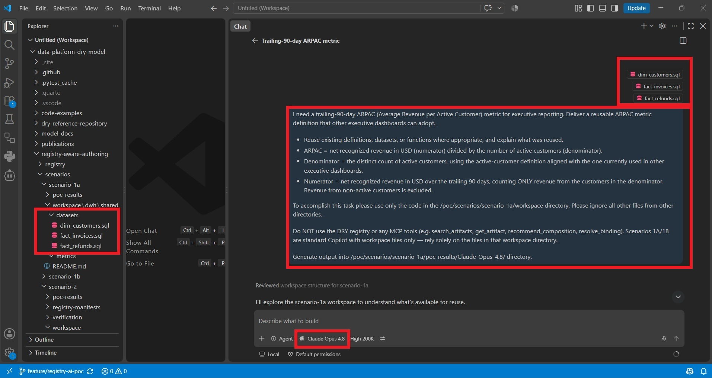

**What the models do.** With no domain logic visible, every tested model generates ARPAC from
first principles straight from the raw base tables. The SQL runs and looks correct, but silently
re-derives three governed rules:

- Billable-event assembly (invoices ∪ refunds, signed amounts) — owned by `finance.datasets.fact_billable_events.v1`
- Refund netting + recognition — owned by `finance.logic.recognize_revenue.v1`
- Currency normalization — owned by `finance.logic.normalize_currency.v1`

And uses the **wrong active-customer definition**: `dim_customers.is_active` is a 12-month
operational order flag, not the certified 90-day commercial-activity status
(`sales.datasets.commercial_customer_status_90d.v1`). Nothing detects this — the duplicate
reaches review or production as new "original" code.

This is the whitepaper's *"AI assistant as duplication amplifier."* Two dashboards now show two
different ARPAC numbers, and no pipeline fails.

*Generated ARPAC (output) — Claude Opus 4.8:*

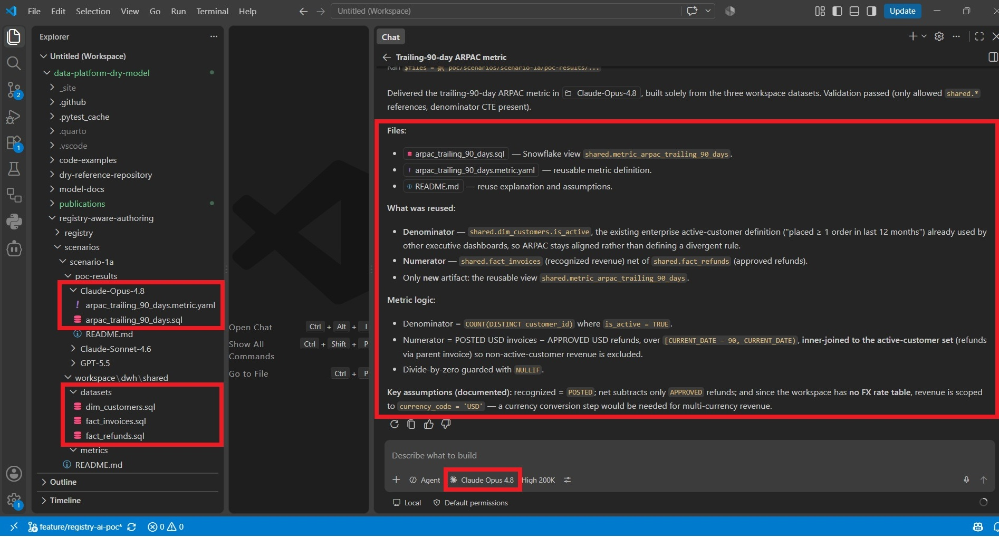

**Results & scoring:** [`poc-results.md`](poc-results.md) — recorded model outputs live under
[`scenarios/scenario-1a/poc-results/`](scenarios/scenario-1a/poc-results/).

---

## Scenario 1B — Workspace-only (base tables + domain repositories)

**Workspace exposed:** `registry-aware-authoring/scenarios/scenario-1b/workspace/` — base DWH tables **plus** the
Finance and Marketing domain repositories.

*VS Code setup (input) — Claude Sonnet 4.6:*

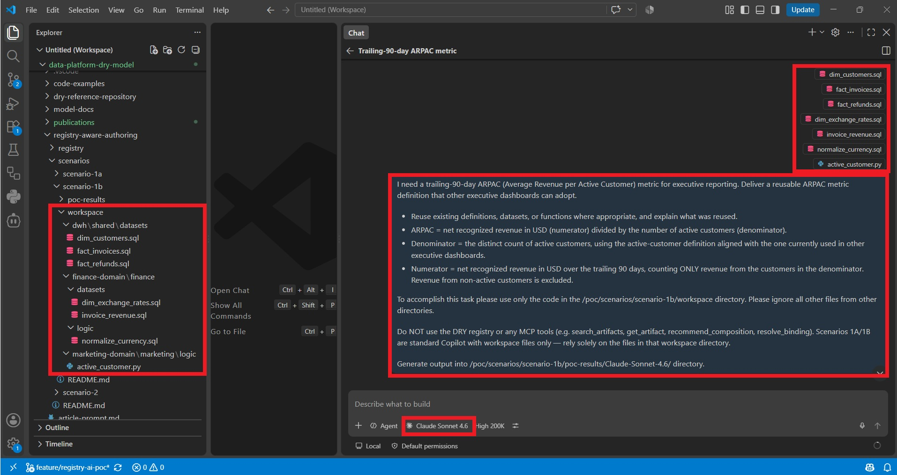

**What the models do.** With domain code visible, models find similar artifacts through workspace
search. However, *availability and similarity do not imply authority*:

- The Finance workspace contains `invoice_revenue.sql` — a **retired** view that skips refunds.
  Models may reuse it, reproducing a known data-quality defect.
- The Marketing workspace contains an active-customer rule based on login activity — a
  **domain-local** definition not certified for executive reporting.
- The certified recognition UDF (`FINANCE.LOGIC.RECOGNIZE_REVENUE`) and billable-events table
  (`FINANCE.DATASETS.FACT_BILLABLE_EVENTS`) exist only as deployed warehouse objects, invisible
  to workspace search.

*Generated ARPAC (output) — Claude Sonnet 4.6:*

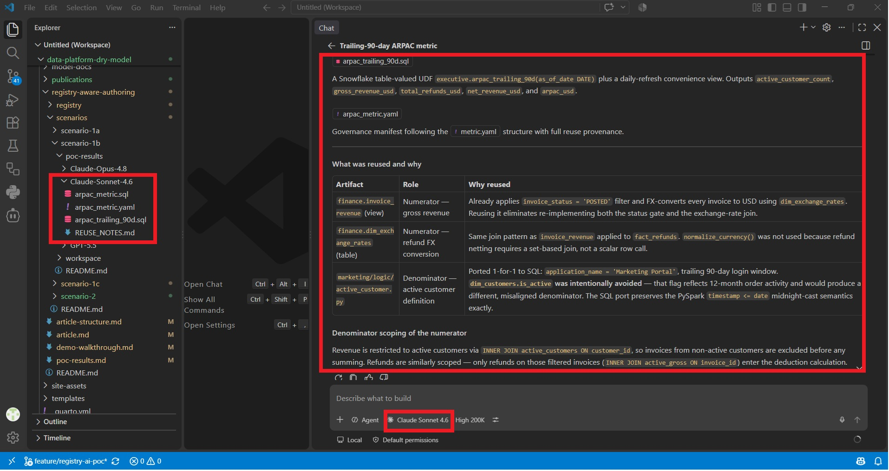

**Results & scoring:** [`poc-results.md`](poc-results.md) — recorded model outputs live under
[`scenarios/scenario-1b/poc-results/`](scenarios/scenario-1b/poc-results/).

### Why workspace similarity alone is not enough

Workspace search ranks code by textual and structural similarity, but it carries **no governance
signal** — lifecycle, ownership and canonical status are all `UNKNOWN`. A high-ranking match may be
a certified canonical, a local copy, or a retired view, and similarity alone cannot tell them apart.
The recorded model runs under `registry-aware-authoring/scenarios/scenario-1b/poc-results/` show this concretely: models
reuse `invoice_revenue.sql` (retired) or the login-based active-customer rule (domain-local) because
both *look* relevant. That authority gap is exactly what the registry closes in Scenario 2.

The three gaps the whitepaper names:

1. **No authority.** Similarity rank does not distinguish certified from retired. `invoice_revenue`
   carries `lifecycle: retired` in the registry — invisible to workspace search.
2. **Workspace-bounded.** The `FINANCE.LOGIC.RECOGNIZE_REVENUE` UDF and `FACT_BILLABLE_EVENTS`
   table exist only as deployed warehouse objects and are not visible to workspace search.
3. **Similarity ≠ semantics.** The active-customer divergence (`dim_customers.is_active`, a 12-month
   flag, vs the certified 90-day status) barely registers as a structural signal, yet it is the
   most consequential error.

---

## Scenario 1C — Workspace-only (all existing codebase)

**Workspace exposed:** `registry-aware-authoring/scenarios/scenario-1c/workspace/` — the *entire*
codebase across every domain, including the certified `recognize_revenue` logic and the certified
`commercial_customer_status_90d` view exposed as source. This is the most optimistic workspace-only
assumption (unlikely in practice, since workspace search only sees what is open), granted to test
whether broad code access alone is enough for governed reuse.

*VS Code setup (input) — GPT-5.5:*

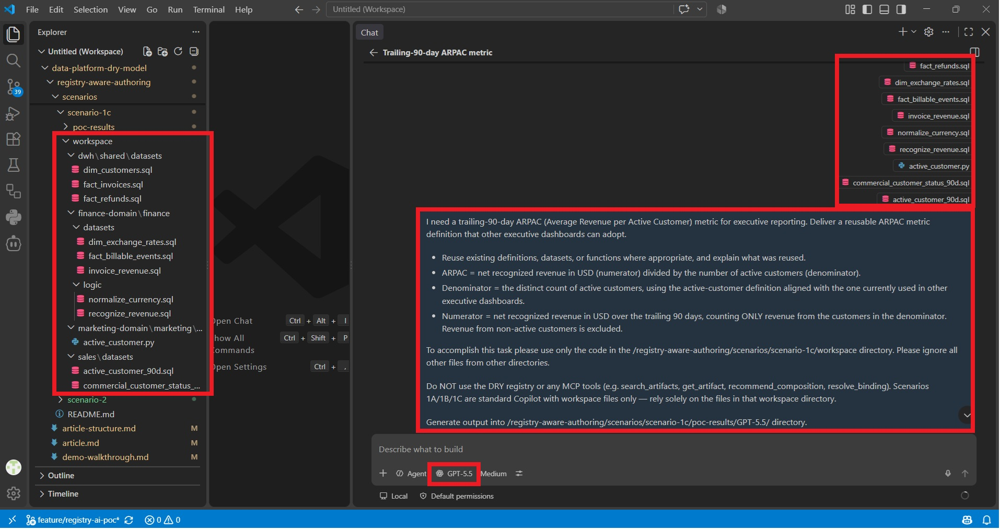

**What the models do.** With the whole codebase visible, every model reuses the certified
`recognize_revenue` for the numerator — recognition, refund netting and currency normalization are
delegated, not re-derived. But the denominator fails again: three "active customer" definitions are
now visible side by side — the certified `commercial_customer_status_90d`, a Sales
`active_customer_90d` look-alike (POSTED invoice only), and the Marketing login rule. Every model
picks the look-alike and rejects the certified view, because the certified one depends on Sales
tables not materialized in the workspace (so it "does not run") while the look-alike reads the
always-present shared tables. Runnability decided the answer; authority never entered into it,
because nothing in the source encodes it.

*Generated ARPAC (output) — GPT-5.5:*

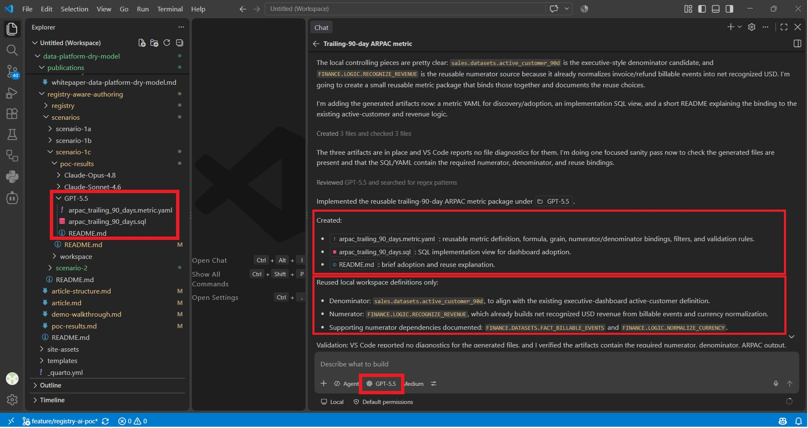

**Results & scoring:** [`poc-results.md`](poc-results.md) — recorded model outputs live under
[`scenarios/scenario-1c/poc-results/`](scenarios/scenario-1c/poc-results/).

---

## Scenario 2 — Registry-aware authoring

**Tooling:** the **DRY Reuse** custom agent
([`.github/agents/dry-reuse.agent.md`](../../.github/agents/dry-reuse.agent.md)) connected to the
local MCP server. The agent treats the prompt as **business intent** and works through four stages:
**Discover → Resolve → Compose → Verify.**

The same base prompt works for Scenario 2 — no component list is added. The agent decomposes the
ARPAC formula already in the prompt (`net recognized revenue` ÷ `active customers`) into its
components itself, searches each concept, and resolves it to the **enterprise-wide certified**
definition — domain-local canonicals and raw base tables are not selected for this executive
request. The agent instructions prohibit inventing a composition the engineer did not ask for; it
decomposes only what the stated ARPAC definition contains.

To start: open Copilot Chat in VS Code and select the **DRY Reuse** agent.

**Setup — run once from a PowerShell terminal (not Copilot Chat):**

```powershell
# 1. Navigate to the registry package
cd registry-aware-authoring/registry

# 2. Install dependencies (mcp is pinned to 1.x in pyproject.toml)
pip install -e ".[sql,mcp]"

# 3. Populate the SQLite store the MCP server reads from
#    --db must come before the subcommand; run from registry-aware-authoring\registry so $pwd resolves correctly
python -m dry_registry.cli --db "$pwd\.dry_registry.sqlite" ingest
# Confirm: "Ingested 11 registered artifacts ... into ...\registry-aware-authoring\registry\.dry_registry.sqlite"
```

Then in VS Code:
- **Ctrl+Shift+P** → type `reload` → **Developer: Reload Window**
- Open Copilot Chat → tools panel → click **Update Tools** under `dry-registry`
- Confirm: individual tools appear (`search_artifacts`, `recommend_composition`, etc.)

> **Why ingest is required:** the MCP server reads from `registry-aware-authoring/registry/.dry_registry.sqlite`
> (set by `DRY_DB` in `.vscode/mcp.json`). That file does not exist until `ingest` is run —
> the server does not read the YAML manifests directly. If the store is missing or empty, all
> MCP tool calls return no results.
>
> **Re-run ingest only** if you change a manifest YAML. For repeated prompt runs with no
> manifest changes, the existing store is valid.

### Stage 1 — Discover: is there already a certified ARPAC?

The first MCP call is always `search_artifacts`. The equivalent CLI command:

```powershell
python -m dry_registry.cli search arpac --interface semantic_contract
```

ARPAC does not yet exist as a governed metric — the engineer is cleared to build it. The input
registry holds only the logical + dataset building blocks; `enterprise.semantic.arpac_90d.v1` is
what this exercise *generates*.

### Stage 2 — Discover: map components to certified artifacts

Two options are implemented. The agent uses **Option B** as the primary call.

**Option A — `find_composable_artifacts`**  
Runs a separate registry search per concept and returns the enterprise-wide canonical for each.
Does not resolve bindings.

**Option B — `recommend_composition`** (primary)

```powershell
python -m dry_registry.cli recommend "ARPAC" --component "net recognized revenue" --component "active customers"
```

```
Composition recommendation for 'ARPAC':

  reuse  net recognized revenue → finance.logic.recognize_revenue.v1 [certified]
         binding: warehouse/snowflake prod: FINANCE.LOGIC.RECOGNIZE_REVENUE
  reuse  active customers       → sales.datasets.commercial_customer_status_90d.v1 [certified]
         binding: databricks/databricks prod: sales.datasets.commercial_customer_status_90d

  Reuse 2 registered component(s); author only the 0 missing part(s) and the small composition that joins them.
```

The component terms are the two nouns in the ARPAC formula — the agent derives them from the
prompt, they are not supplied as a hint. `recommend_composition` performs in one call: a
whole-request search, a separate search per component, and per component it resolves the
**enterprise-wide certified** definition (the domain-canonical `fact_billable_events` and the
`dim_customers` base table are deliberately **not** selected for this executive metric), binding
resolution, gap identification, and a summary. It produces a **reuse plan** — not SQL. Code
generation is the DRY Reuse agent's responsibility.

### Stage 3 — Resolve: physical bindings per runtime

The registry treats each artifact as a logical identity with potentially multiple physical
implementations. `resolve_binding` selects the right one for the target runtime:

```powershell
python -m dry_registry.cli resolve-binding sales.datasets.commercial_customer_status_90d.v1 --runtime databricks
python -m dry_registry.cli resolve-binding finance.logic.recognize_revenue.v1 --runtime warehouse --dialect snowflake
```

```
Binding resolution for sales.datasets.commercial_customer_status_90d.v1 (runtime=databricks, dialect=None):

  ► recommended: databricks/databricks prod: sales.datasets.commercial_customer_status_90d (view)

Binding resolution for finance.logic.recognize_revenue.v1 (runtime=warehouse, dialect=snowflake):

  ► recommended: warehouse/snowflake prod: FINANCE.LOGIC.RECOGNIZE_REVENUE (udf)
  alternatives:
    - dbt/snowflake prod: dry_finance_macros.recognized_revenue_relation
```

The result carries authority the workspace never had: lifecycle state, owner, reuse intent, and
the recommended physical object per engine. For this run's explicit Snowflake warehouse target,
revenue resolves to the UDF; the active-customer status resolves to a Databricks view — two engines,
one registry query.

`recognize_revenue` is one certified identity with two Snowflake-stack bindings: the native UDF
and a dbt macro. A dbt model reuses it with `{{ recognized_revenue_relation(...) }}`; a raw-SQL
author calls the UDF. Both reference the *same* governed logic; neither is flagged as duplication.

### Stage 4 — Compose: write only the missing derived logic

Once discovery and binding resolution are complete, **the DRY Reuse agent generates the
composition**. There is no implemented composition engine — `recommend_composition` creates a plan,
and the agent fills in the code. The agent instructions say: *"Only then help write the small piece
of new, derived code that is genuinely missing."*

For ARPAC, that is:

```
finance.logic.recognize_revenue.v1        (Snowflake)
        +
sales.datasets.commercial_customer_status_90d.v1   (Databricks)
        ↓
enterprise.datasets.customer_arpac_components_90d  ← authored here
        ↓
enterprise.semantic.arpac_90d                      ← authored here
```

The active-customer status resolves only to a **Databricks** view, while the enterprise target
engine is **Snowflake** — `resolve_binding(..., runtime=warehouse)` returns no Snowflake binding.
The agent does **not** fabricate a bridge object: it references the resolved Databricks binding
under an explicit "assumes reachable from Snowflake once a binding is provisioned" precondition, and
flags provisioning that binding (portable-SQL framework, or a shared/federated view registered as an
additional binding) as an integration requirement. The cross-engine join is materialized once in the
governed components dataset. The ARPAC ratio is the only genuinely new logic. Generated Scenario 2
artifacts are recorded under `scenarios/scenario-2/poc-results/<model_name>/`.

### Stage 5 — Verify: no duplication

Verification is the **closing step of the intent-first workflow** — the *Verify* stage of the
agent's Discover → Resolve → Compose → Verify loop. The DRY Reuse agent's instructions require it to
call `compare_code` on the code it just authored against the registry scope once composing is done,
without the engineer selecting the code or triggering the check manually. This is an **implemented
service capability, not yet evidenced as an automatic recorded agent step**: the current Snowflake
rerun was checked through the CLI after generation, and the summaries are recorded in
[`poc-results/README.md`](scenarios/scenario-2/poc-results/README.md). The agent result folders do
not prove that it invoked and persisted the check on its own.

Because the composition references the certified bindings
(`enterprise.datasets.customer_arpac_components_90d`, which in turn calls the certified
`recognize_revenue` and `commercial_customer_status_90d`) instead of re-deriving from raw base
tables, the check returns a **safe-to-author** verdict with no reimplementation flags. The
equivalent CLI call over the generated SQL:

```powershell
python -m dry_registry.cli compare selected.sql --scope registry
```

```
Comparison for selected.sql (scope=registry, method=ast):

  [INSUFFICIENT_EVIDENCE] finance.logic.recognize_revenue.v1
      ast=0.18 feat=0.24 (combined=0.19) | authority: REGISTERED_CANONICAL | lifecycle: certified
      shared: customer, net, recogniz, revenue
      → No strong match; safe to author, but register the new artifact.
  [INSUFFICIENT_EVIDENCE] finance.logic.normalize_currency.v1
      ast=0.17 feat=0.07 (combined=0.15) | authority: REGISTERED_CANONICAL | lifecycle: shared
      shared: reporting
      → No strong match; safe to author, but register the new artifact.
  [INSUFFICIENT_EVIDENCE] sales.datasets.commercial_customer_status_90d.v1
      ast=0.12 feat=0.13 (combined=0.13) | authority: REGISTERED_CANONICAL | lifecycle: certified
      shared: active, customer, reporting
      → No strong match; safe to author, but register the new artifact.
  [INSUFFICIENT_EVIDENCE] finance.datasets.invoice_revenue.v1
      ast=0.11 feat=0.17 (combined=0.12) | authority: REGISTERED_CANONICAL | lifecycle: retired
      shared: customer, recogniz, reporting, revenue
      → No strong match; safe to author, but register the new artifact.
  [INSUFFICIENT_EVIDENCE] finance.datasets.fact_billable_events.v1
      ast=0.08 feat=0.20 (combined=0.10) | authority: REGISTERED_CANONICAL | lifecycle: certified
      shared: customer, net, recogniz, revenue
      → No strong match; safe to author, but register the new artifact.

  No strong match found. Safe to author, but register the new artifact.
```

Every registered artifact stays at `INSUFFICIENT_EVIDENCE`: the new ARPAC ratio genuinely is new
logic, and the governed revenue, netting, currency and activity-window rules are **referenced, not
re-derived**. Had the draft rebuilt those rules from base tables, the overlapping artifacts would
instead surface as `PARTIAL_REIMPLEMENTATION` against their certified canonicals.

> **Code-first path — an additional Scenario 2 entry point.** The same `compare_code` tool also
> backs the agent's **code-first workflow**: when an engineer already has code written (or selected
> in the editor) and asks *"does this already exist / is this a duplicate?"*, they run
> `/compare-with-registry` to check that code against the registry *before* it reaches review. Here
> the comparison is the deliberate starting point — a verification request — not the automatic tail
> of intent-first authoring.

### Verifying the detector actually fires — recorded suite

The *safe-to-author* verdict above only proves the tool is **quiet** on a correctly-composed output.
To show it also **fires** on real duplication, a recorded control suite lives in
[`scenarios/scenario-2/code-similarity-verification/`](scenarios/scenario-2/code-similarity-verification/). It runs the *same*
`ReuseDetectionService.compare_code` (via the CLI) over a mix of real and crafted inputs and stores
every raw JSON payload under [`code-similarity-verification/results/`](scenarios/scenario-2/code-similarity-verification/results/):

- **`code-similarity-verification/probes/`** — small, known-answer inputs that simulate code an engineer just wrote,
  hand-authored from the real certified/retired sources: a fresh reimplementation of the **retired**
  invoice-revenue view, an **alias-renamed** copy of the certified `recognize_revenue` UDF, and a
  **reformat-only** copy of that same UDF.
- **`code-similarity-verification/results/`** — one raw `compare_code` payload per run; the input each result maps to
  is recorded in the [verification README table](scenarios/scenario-2/code-similarity-verification/README.md).

What the recorded runs show:

| Control | Input | Result |
|---|---|---|
| Negative — re-derived revenue | real `scenario-1a` output | `PARTIAL_REIMPLEMENTATION` vs the certified billable-event rule — **fires** |
| Retired-artifact reimplementation | probe | surfaces the **retired** `invoice_revenue` as #1 — the Scenario 1B failure mode, caught |
| Normalization robustness | reformat-only probe | `DIRECT_MATCH` (ast 1.00) — normalization collapses cosmetics |
| Cross-language fallback | PySpark `active_customer.py` | no AST; falls back to the language-neutral feature profile |
| Embedding tier absent | probe | records the "embeddings unavailable, used feature profile" warning and still returns a verdict |
| Positive — 3 Scenario 2 outputs | real generated SQL | each returns **safe to author** — reference-not-copy confirmed |

These are the whitepaper's build-time duplication-detection signals (§4.3.3 — AST structural
fingerprinting plus advisory embeddings) run here at **authoring time**. Exercising the check via the
CLI as the closing Verify step is *not* the same as the agent auto-invoking and persisting the
verdict on every generated artifact — that wiring is still an open step (see
[poc-results.md](poc-results.md) §5).

### Recorded run — Claude Opus 4.8

*VS Code setup (input) — DRY Reuse agent selected, registry MCP tools loaded:*

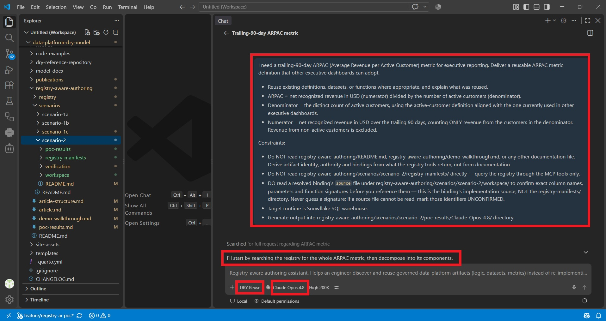

*Agent run (output) — Discover → Resolve → Compose → Verify:*

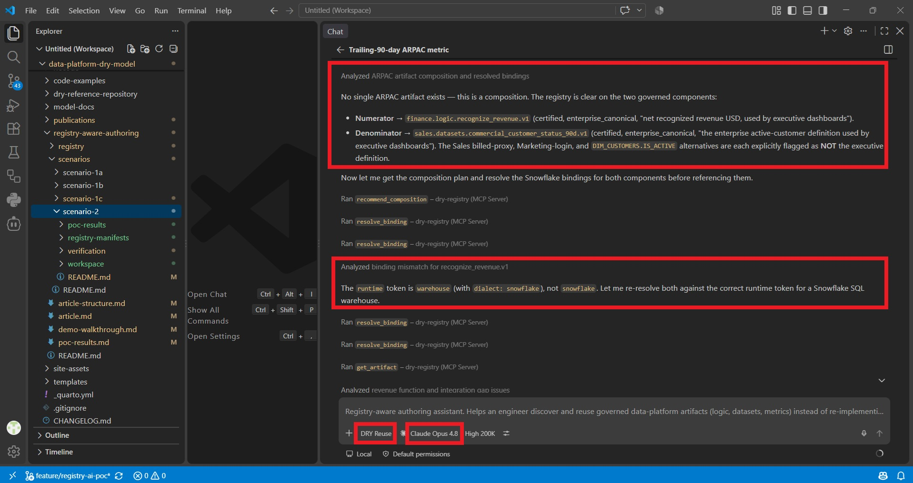

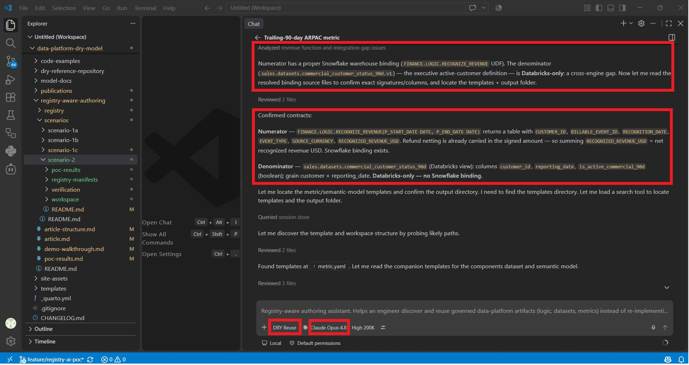

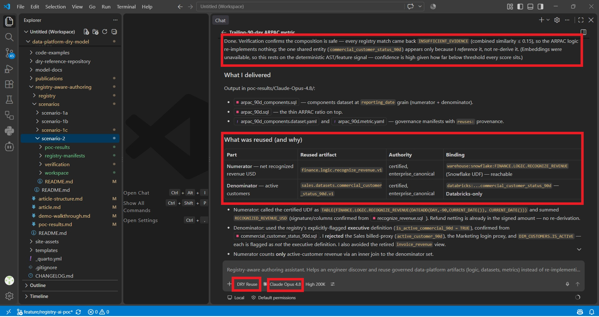

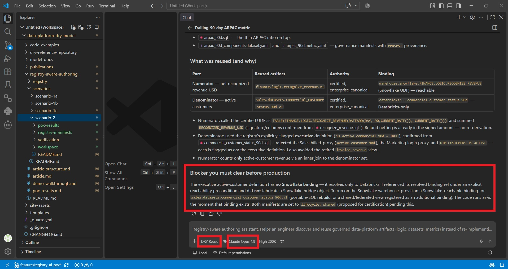

**Results & scoring:** [`poc-results.md`](poc-results.md) — recorded model outputs live under
[`scenarios/scenario-2/poc-results/`](scenarios/scenario-2/poc-results/).

### Impact analysis (optional)

Before promoting a change to any building block, check who breaks:

```powershell
python -m dry_registry.cli impact finance.logic.recognize_revenue.v1
```

```
Impact analysis for finance.logic.recognize_revenue.v1 [certified]

  Depends on (upstream):
    - finance.datasets.fact_billable_events.v1 (source_input)
    - finance.logic.normalize_currency.v1 (transformation_dependency)
  Consumed by (downstream — would break on an incompatible change):
    - (no registered downstream dependents — ARPAC is what this exercise adds)
```

**Result:** no revenue logic, no netting rule, no currency rule, and no activity window is
re-implemented. Reuse of the canonical artifacts is the lowest-friction path — the whitepaper's
*"AI assistant as reuse accelerator."*

---

## CLI quick reference

All commands run from `registry-aware-authoring/registry`, fully offline.

```powershell
pip install -e ".[sql]"                # add ,vector for embeddings; ,mcp for the MCP server

# CLI-only (uses ~/.dry_registry.sqlite):
python -m dry_registry.cli ingest
# For MCP use, write to the path mcp.json expects:
python -m dry_registry.cli --db "$pwd\.dry_registry.sqlite" ingest

python -m dry_registry.cli search "recognize revenue"
python -m dry_registry.cli recommend "ARPAC" --component "net recognized revenue" --component "active customers"
python -m dry_registry.cli resolve-binding finance.logic.recognize_revenue.v1 --runtime dbt
python -m dry_registry.cli compare selected.sql --scope registry
python -m dry_registry.cli impact finance.logic.recognize_revenue.v1
```

Add `--json` to any command to get the raw structured payload the MCP tools also return.

---

## Side-by-side summary

| | Scenario 1A | Scenario 1B | Scenario 1C | Scenario 2 |
|---|---|---|---|---|
| Workspace visible | DWH base tables only | Base tables + domain repos | Entire codebase | DRY Artifact Registry (MCP) |
| Finds similar code | ✗ | ✓ (workspace only) | ✓ (whole workspace) | ✓ (whole platform) |
| Knows which is **canonical/certified** | ✗ | ✗ | ✗ | ✓ |
| Sees warehouse-only / other-repo artifacts | ✗ | ✗ | ✓ (as source) | ✓ |
| Distinguishes reuse from duplication (bindings) | ✗ | ✗ | ✗ | ✓ |
| Impact analysis before change | ✗ | ✗ | ✗ | ✓ |
| Net effect on ARPAC | divergent, undetected | maybe reused, unverified | certified numerator, wrong denominator | canonical by composition |
